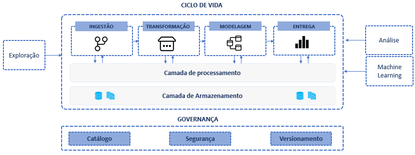

# Princípios
A diversidade de fontes, a disponibilidade de meios para coleta de dados e o volume de informações disponíveis representam grandes desafios e ótimas oportunidades para as empresas. Criar uma arquitetura de dados adaptável às necessidades e alinhada aos padrões de mercado pode trazer grandes vantagens competitivas.

Projetar uma arquitetura de dados envolve identificar os elementos necessários, as interfaces, as entradas e as saídas de cada fase do ciclo de vida. 

Algumas características como: independência, decisões reversíveis, escalabilidade, nos dão bons indicativos de uma arquitetura robusta, capaz de se adaptar com o tempo. 

Nesse contexto, não depender de um fabricante, modelo ou produto é altamente desejável e está no centro do conceito de plataforma de dados moderna. Mesmo que hoje algumas tecnologias sejam consideradas estado da arte, no futuro não muito distante isso pode mudar, além disso, com o aumento da maturidade da empresa novos casos de uso podem demandar evolução ou substituição de componentes.

Estabelecer princípios nos ajuda a entender o que faz mais sentido para o contexto atual e futuro da empresa, pensar em termos que estabelecem as características mais importantes facilitam o processo de decisão e as escolhas passam a ser mais direcionadas a propósito e menos a preferencias pessoais.

Os princípios são definições de aspectos desejáveis, não impõe restrições, tratam sempre de recomendações que na prática, quando bem implementados se tornam os diferenciais das soluções gerenciadas por plataformas como databricks, azure, gcp, aws.

A seguir a lista com um resumo dos princípios que devem ser considerados pelo Sebrae durante a avaliação e implementação das arquiteturas de plataformas de dados. Vamos levantar questões sobre o que pode ser considerado como melhores práticas em projetos de plataformas de dados. 

## Tabela 1. Lista de princípios. 
_Os princípios serão listados com códigos para referenciar na tabelas de recomendações de cada fase._

Cód | Nome | Conceito principal
--- | ---- | ------------------
P01 | Separação das responsabilidades | Cada componente possui um papel bem definido e especializado (sem sobreposições de funcionalidades).
P02 | Independência de componentes | Os componentes podem ser substituídos, escalonados ou desativados de forma isolada sem comprometer o funcionamento da plataforma.
P03 | Independência de linguagem | Os profissionais deve ser capazes de exercer as atividades nos projetos de dados usando as liguagens que possuem maior proeficiência.
P04 | Independência de formatos de dados | Os dados devem estar armazenados em formatos abertos, conhecidos pelas diversas tecnologias de processamento e análise de dados.
P05 | Adaptável ao contexto | A arquitetura de ver flexível para se adequar às naturezas de casos de uso e tipos de usuários com níveis de conhecimento e necessidades diferentes.
P06 | Multicloud | A empresa deve ser capaz de realizar a implantação da arquitetura em diferentes clouds públicas e estar pronta para migração entre clouds se for necessário.
P07 | Escalabilidade | Os componentes devem ser capazes de se adaptar a demanda de conexões, processamento e volumes de dados, aumentando ou diminuindo a quantidade de recursos alocados.
P08 | Descentralização | As decisões de governaça podem ser hibridas/federadas e o consumo dos dados descentralizado, ao mesmo tempo que a governança se mantém centralizada.
P09 | Decisões reversíveis | As escolhas podem ser revisadas e desfeitas, sem que comprometa a continuidade do funcionamento, arquitetura deve ser capaz de absorver mudanças.
P10 | Simplicidade | Os componentes devem ser fáceis de usar, ter interface amigável, APIs para automação de tarefas, e opções de low-code para facilitar a execução de tarefas comuns, massantes ou repetitivas.

## Próximos passos

- [01-2-01-Separação das responsabilidades](https://github.com/leandrobarbieri/sebrae-guia-arquitetura-dados/blob/main/01-fundamentos/01-2-Princ%C3%ADpios/01-Separa%C3%A7%C3%A3o%20das%20responsabilidades.md)
- [01-2-02-Independência de componentes](https://github.com/leandrobarbieri/sebrae-guia-arquitetura-dados/blob/main/01-fundamentos/01-2-Princ%C3%ADpios/02-Independ%C3%AAncia%20de%20componentes.md)
- [01-2-02-Independência de linguagem](https://github.com/leandrobarbieri/sebrae-guia-arquitetura-dados/blob/main/01-fundamentos/01-2-Princ%C3%ADpios/03-Independ%C3%AAncia%20de%20linguagem.md)
- [01-2-04-Independência de formatos de dados](https://github.com/leandrobarbieri/sebrae-guia-arquitetura-dados/blob/main/01-fundamentos/01-2-Princ%C3%ADpios/04-Independ%C3%AAncia%20de%20formatos%20de%20dados.md)
- [01-2-05-Adaptável ao contexto](https://github.com/leandrobarbieri/sebrae-guia-arquitetura-dados/blob/main/01-fundamentos/01-2-Princ%C3%ADpios/05-Adapt%C3%A1vel%20ao%20contexto.md)
- [01-2-06-Multicloud](https://github.com/leandrobarbieri/sebrae-guia-arquitetura-dados/blob/main/01-fundamentos/01-2-Princ%C3%ADpios/06-Multicloud.md)
- [01-2-07-Escalabilidade](https://github.com/leandrobarbieri/sebrae-guia-arquitetura-dados/blob/main/01-fundamentos/01-2-Princ%C3%ADpios/07-Escalabilidade.md)
- [01-2-08-Descentralização](https://github.com/leandrobarbieri/sebrae-guia-arquitetura-dados/blob/main/01-fundamentos/01-2-Princ%C3%ADpios/08-Descentraliza%C3%A7%C3%A3o.md)
- [01-2-09-Decisões reversíveis](https://github.com/leandrobarbieri/sebrae-guia-arquitetura-dados/blob/main/01-fundamentos/01-2-Princ%C3%ADpios/09-Decis%C3%B5es%20revers%C3%ADveis.md)
- [01-2-10-Simplicidade](https://github.com/leandrobarbieri/sebrae-guia-arquitetura-dados/blob/main/01-fundamentos/01-2-Princ%C3%ADpios/10-Simplicidade.md)
- [01-3-01-Conceitos](https://github.com/leandrobarbieri/sebrae-guia-arquitetura-dados/blob/main/01-fundamentos/01-3-Conceitos/01-Conceitos.md)
- [01-3-02-Referências](https://github.com/leandrobarbieri/sebrae-guia-arquitetura-dados/blob/main/01-fundamentos/01-3-Conceitos/02-Refer%C3%AAncias.md)