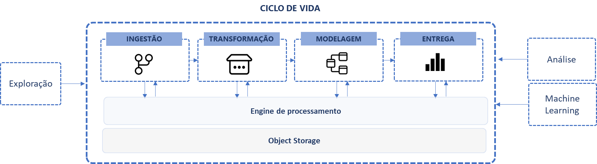
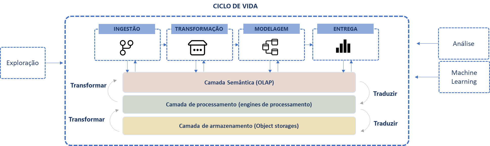

# Introdução
Aqueles que acompanharam as tendências e transformações na área de dados podem ter a impressão de que novas ferramentas e padrões de arquitetura estão surgindo a cada instante, de fato o ritimo de inovação aumentou nos últimos anos e podemos constatar nas publicações do MAD (Machine Learning, Artificial Intelligence & Data) landscape divulgado nos últimos ano por Matt Turck ([2023](https://mattturck.com/mad2023/),  [2021](https://mattturck.com/data2021/), [2020](https://mattturck.com/data2020/), [2019](https://mattturck.com/data2019/), [2018](https://mattturck.com/bigdata2018/)). Novos formatos de armazenamento de dados, capazes de lidar com a evolução de schema e aquivos semi-estruturados; novas tecnologias de object storages distribuídos, capazes de escalar o volume sem restrições; novas engines de processamento dados, capazes de manipular volumes cada vez maiores; soluções especializadas em transformação de dados, data warehouses modernos como Bigquery, Azure Synapse, Databricks lakehouse, Snowflake, que trazem conceitos de ACID para dados armazenados em data lakes; padrões como Data Mesh que trazem novos paradigmas para organização e governança; ferramentas de visualização de dados interativas com caracteristicas de low-code, que ajudam a democratizar o consumo; inclusão de práticas de Devops no contexto de dados, dando origem a funções como MLOps, DataOps; novos frameworks de machine learning que adicionam inteligência às aplicações, etc. São tantas inovações que corremos o risco de perder o foco no objetivo da arquitetura de dados e do propósito de enriquecer dados brutos, transformar, modelar e criar conjuntos de dados com qualidade e disponíveis para serem usados na busca padrões estatísticos que validam as hipóteses dos analistas de negócio. 

O fato é que a área de tecnologia com um todo vêm passando por transformação e a área de dados não poderia ser diferente. Essa rápida mudança ocasionada principalmente pelo aumento do volume de dados disponíveis fez com que novas tecnologias surgissem para lidar com desafios antes eram economicamente ou tecnicamente inviáveis. Soluções de bigdata e machine learning mudaram o panorama das arquiteturas das plataformas de dados e também redefiniram o escopo de atuação dos profissionais. Hoje, as equipes de dados são mais especializadas e lidam com desafios muito mais complexos. O que antes era atribuição de analistas de BI como por exemplo: criar pipelines, fazer transformações, modelagem e entrega, vemos como parte de funções de engenheiros de dados, engenheiros de machine learning, arquitetos de dados, analistas de dados, cientistas de dados, entre outros. Essa mudança está diretamente associada ao aumento da complexidade dos desafios dos projetos de dados, além disso, também é influenciada pelos bons resultados obtidos por empresas que estão mais avançadas na cultura analítica.

Esse ecosistema de soluções que constumamos chamar de plataforma de dados modernas é o que viabiliza esse novo cenário. Mas o que faz uma plataforma ser considerada moderna? Essa é uma questão que o guia vai buscar explorar através de conceitos, exemplos e recomendações. Vamos discutir os aspectos que permitem que uma plataforma seja considerada "moderna", como por exemplo: estar preparada para múltiplos casos de uso, ser distribuída, ser capaz de se adequar a demanda de volume de dados e processamento, ter camadas independentes para que possa evoluir e se adaptar, entre outros vários princípios. 

Parte do sucesso de empresas como uber, ifood, nubank, picpay (todas empresas com modelos de negócio baseados em tecnologia), está relacionado com a forma como os dados são utilizados e como o avanço na área de IA alavancou seus resultados. Seus produtos foram capazes de alcançar a convergência entre 3 fatores: disponibilidade de dados, capacidade de processamento e evolução dos frameworks de machine learning. Algorítimos de ML sem dados suficiente ou muitos dados sem algorítmos modernos não teriam ao mesmo resultado.

Nessa jornada de dados podemos pensar em uma de pirâmide de necessidades onde IA/ML está no topo, uma boa prática para alcançar níveis de maturidade maiores é estabelecer e consolidar uma infraestrutura de dados e cultura analítica antes de avançar no desenvolvimento de modelos preditivos.

Podemos estabelecer em alto nível as seguintes fases na jornada de dados:

Fase | Desafio | Detalhes
---- | ------- | -----------
Necessidades básicas | Coleta de dados: Os pipelines de dados coletam o que a empresa precisa dentre o que está disponível? O processo de ELT/ETL está confiável? Existe um padrão para armazenar os dados? Os dados são facilmente acessíveis? | Nessa fase, são estabelecidos os pipelines, os modelos de dados analíticos. Do ponto de vista de análises descritivas os dados estão sendo preparados e disponibilizaddos. No ponto de vista de projetos de IA/ML, as features para treinamento estão sendo enriquecidas.
Dados disponíveis | Experimentação: com os dados disponíveis é possível ter um bom entendimento do negócio? | As primeiras análises de impacto, testes A/B e modelos IA/ML mais simples de classificação/regressão (logistc regression, random florest, etc) começam a ser usados para criar um baseline.
Arquitetura estabelecida | Pipelines rodando, dados organizados, conhecimento sobre o negócio disponível através de ferramentas analíticas e modelos ML simples. | Nesta fase os primeiros MVPs começam ser implantados

O primeiro passo para estabelecer uma arquitetura de dados adequada ao contexto da empresa é a definição clara de critérios e princípios que sustentem as escolhas arquiteturais, isso servirá de base para justificar a necessidade de cada componente e também para alinhar a expectativas sobre o que é mais importante e não se perder na busca pela tecnologia da moda.

Mas apesar da grande quantidade de opções, quando pensamos em plataformas de dados em clouds públicas, vemos a convergência de alguns padrões e tipos de tecnologias como object storages, engines de processamento de dados distribuído, virtualização de dados, lakehouses. Não significa que existe uma única forma de fazer, ou uma plataforma definitiva, completa, que resolva todo os cenários. Ainda existe  a necessidade de identificar as melhores opções com melhor custo benefício que melhor se adaptam a realidade da empresa.

## Objetivos do Guia
Este guia de arquitetura de dados busca apresentar um detalhamento das melhores práticas estabelecidas em arquiteturas de dados modernas, além disso, apresenta estratégias de implantação e recomendações de tecnologias, sempre com o propósito de encontrar o que melhor se adequa ao modelo federado do Sebrae, considerando a independência das unidades, sem perder de vista a importância de ter uma governança centralizada.

O guia também tem o objetivo de servir como meio para disseminar conhecimento entre os times envolvidos em atividades de engenharia de dados e servir de inspiração ou referência para dar os primeiros passos na direção de criar, evoluir ou justificar decisões de arquitetura em plataformas de dados. Este documento não tem o objetivo de estabelecer regras, ou servir como única referência, ele busca ser um material de apoio que traz uma visão de momento, do que poderia ser um bom caminho para estabelecer uma arquitetura, robusta, adaptável, escalável, reversível e simples.

## Estrutura do Guia
O guia é composto com quatro partes principais. A [**Parte I**](leandrobarbieri/sebrae-guia-arquitetura-dados/02-ciclo-de-vida/02-0-Introdução.md) busca delinear os objetivos, conceitos e princípios de arquitetura de dados como: separação de responsabilidades, independência de formatos e linguagem, simplicidade e escalabilidade entre outros. Na **Parte II** vamos apresentar o ciclo de vida dos dados como espinha dorsal para ancorar e dar sentido para os componentes da arquitetura. Serão abordadas as relações de dependência, entradas, saídas, limites, responsabilidades, tipos de tecnologias e ao final um estudo de caso com o ciclo completo. Na *Parte III* vamos falar de arquitetura e propor diagramas que exemplificam como os componentes se relacionam. Serão discutidos os métodos para estruturação e storage "medallion", são apresentados os benefícios e vantagens das arquiteturas de data warehouse, data lake, lakehouse e data mesh. Além disso serão apresentados comparativos e recomendações de quando usar. Na *Parte V* vamos falar sobre tópicos relacionados a governaça e como  boas práticas de segurança, metadados e catálogo, versionamento de código em projetos de dados, gerenciamento de riscos elevam a maturidade e adicionam valor a plataforma de dados. 

# Princípios
A diversidade de fontes, a disponibilidade de meios para coleta de dados e o volume de informações disponíveis representam grandes desafios e ótimas oportunidades para as empresas. Criar uma arquitetura de dados adaptável às necessidades e alinhada aos padrões de mercado pode trazer grandes vantagens competitivas.

Projetar uma arquitetura de dados envolve identificar os elementos necessários, as interfaces, as entradas e as saídas de cada fase do ciclo de vida. 

Algumas características como: independência, decisões reversíveis, escalabilidade, nos dão bons indicativos de uma arquitetura robusta, capaz de se adaptar com o tempo. 

Nesse contexto, não depender de um fabricante, modelo ou produto é altamente desejável e está no centro do conceito de plataforma de dados moderna. Mesmo que hoje algumas tecnologias sejam consideradas estado da arte, no futuro não muito distante isso pode mudar, além disso, com o aumento da maturidade da empresa novos casos de uso podem demandar evolução ou substituição de componentes.

Estabelecer princípios nos ajuda a entender o que faz mais sentido para o contexto atual e futuro da empresa, pensar em termos que estabelecem as características mais importantes facilitam o processo de decisão e as escolhas passam a ser mais direcionadas a propósito e menos a preferencias pessoais.

Os princípios são definições de aspectos desejáveis, não impõe restrições, tratam sempre de recomendações que na prática, quando bem implementados se tornam os diferenciais das soluções gerenciadas por plataformas como databricks, azure, gcp, aws.

A seguir a lista com um resumo dos princípios que devem ser considerados pelo Sebrae durante a avaliação e implementação das arquiteturas de plataformas de dados. Vamos levantar questões sobre o que pode ser considerado como melhores práticas em projetos de plataformas de dados. 

## Tabela 1. Lista de princípios. 
_Os princípios serão listados com códigos para referenciar na tabelas de recomendações de cada fase._

Cód | Nome | Conceito principal
--- | ---- | ------------------
P01 | Separação das responsabilidades | Cada componente possui um papel bem definido e especializado (sem sobreposições de funcionalidades).
P02 | Independência de componentes | Os componentes podem ser substituídos, escalonados ou desativados de forma isolada sem comprometer o funcionamento da plataforma.
P03 | Independência de linguagem | Os profissionais deve ser capazes de exercer as atividades nos projetos de dados usando as liguagens que possuem maior proeficiência.
P04 | Independência de formatos de dados | Os dados devem estar armazenados em formatos abertos, conhecidos pelas diversas tecnologias de processamento e análise de dados.
P05 | Adaptável ao contexto | A arquitetura de ver flexível para se adequar às naturezas de casos de uso e tipos de usuários com níveis de conhecimento e necessidades diferentes.
P06 | Multicloud | A empresa deve ser capaz de realizar a implantação da arquitetura em diferentes clouds públicas e estar pronta para migração entre clouds se for necessário.
P07 | Escalabilidade | Os componentes devem ser capazes de se adaptar a demanda de conexões, processamento e volumes de dados, aumentando ou diminuindo a quantidade de recursos alocados.
P08 | Descentralização | As decisões de governaça podem ser hibridas/federadas e o consumo dos dados descentralizado, ao mesmo tempo que a governança se mantém centralizada.
P09 | Decisições reversíveis | As escolhas podem ser revisadas e desfeitas, sem que comprometa a continuidade do funcionamento, arquitetura deve ser capaz de absorver mudanças.
P10 | Simplicidade | Os componentes devem ser fáceis de usar, ter interface amigável, APIs para automação de tarefas, e opções de low-code para facilitar a execução de tarefas comuns, massantes ou repetitivas.

## Próximos passos

- [01-2-01-Separação das responsabilidades](https://github.com/leandrobarbieri/sebrae-guia-arquitetura-dados/blob/main/01-2-01-Separa%C3%A7%C3%A3o%20das%20responsabilidades.md)
- [01-2-02-Independência de componentes](https://github.com/leandrobarbieri/sebrae-guia-arquitetura-dados/blob/main/01-fundamentos/01-2-02-Independência%20de%20componentes.md)
- [01-2-04-Independência de formatos de dados](https://github.com/leandrobarbieri/sebrae-guia-arquitetura-dados/blob/main/01-fundamentos/01-2-04-Independência%20de%20formatos%20de%20dados.md)
- [01-2-05-Adaptável ao contexto](https://github.com/leandrobarbieri/sebrae-guia-arquitetura-dados/blob/main/01-fundamentos/01-2-05-Adaptável%20ao%20contexto.md)
- [01-2-06-Multicloud](https://github.com/leandrobarbieri/sebrae-guia-arquitetura-dados/blob/main/01-fundamentos/01-2-06-Multicloud.md)
- [01-2-07-Escalabilidade](https://github.com/leandrobarbieri/sebrae-guia-arquitetura-dados/blob/main/01-fundamentos/01-2-07-Escalabilidade.md)
- [01-2-08-Descentralização](https://github.com/leandrobarbieri/sebrae-guia-arquitetura-dados/blob/main/01-fundamentos/01-2-08-Descentralização.md)
- [01-2-09-Decisições reversíveis](https://github.com/leandrobarbieri/sebrae-guia-arquitetura-dados/blob/main/01-fundamentos/01-2-09-Decisições%20reversíveis.md)
- [01-2-10-Simplicidade](https://github.com/leandrobarbieri/sebrae-guia-arquitetura-dados/blob/main/01-fundamentos/01-2-10-Simplicidade.md)

## P01 - Separação das responsabilidades
>"_Cada componente possui um papel bem definido e especializado (sem sobreposições de funcionalidades)._"

Assim como na engenharia de software, a separação de responsabilidades em arquiteturas de dados traz benefícios como:

1. **Clareza no entendimento** de como o processo funciona, pois cada componente tem suas entradas e saídas bem definidas.
2. **Simplificação da manutenção** pois as configurações possuem um escopo reduzido e mais bem definido.
3. **Aumento da confiabilidade**, pois as soluções são mais especializadas.
4. **Modularização**, que permite a substituição de um componente sem afetar a solução como um todo, afetando apenas uma parte.

Esses benefícios são fundamentais para o desenvolvimento de sistemas robustos e escaláveis. A separação de responsabilidades ajuda a evitar a complexidade desnecessária e facilita a compreensão, toda a arquitetura mais e fácil de manter.

Em bancos de dados tradicionais, não há uma separação clara entre os componentes que armazenam os dados e aqueles que os processam. Isso significa que, quando precisamos escalar os recursos do banco apenas para processar, temos que escalar a instância inteira. Se precisássemos reduzir os recursos para o processamento e aumentar apenas o armazenamento dos dados, não seria possível nessa arquitetura, pois um componente depende do outro e são escalados em conjunto.

Além disso, quando não há separação entre engine e storage, a única forma de acessar os dados é passando pelo engine exclusivo de processamento do banco. Em uma arquitetura moderna, o engine de processamento fica responsável apenas por processar e o storage apenas por persistir e acessar. Dessa forma, você pode usar diferentes engines, pode inclusive desativar a engine e continuar com o storage ativado. Com isso, surge a possibilidade de usar diversas ferramentas para processar os mesmos dados, pois os dados existem de forma independente do engine de banco de dados.

Esse é um exemplo de separação de responsabilidades relacionada à tecnologia. Esse princípio também está associado ao ciclo de vida dos dados. Cada fase possui seu escopo, responsabilidades, objetivos, entradas e saídas. Essas fronteiras que separam as responsabilidades das fases simplificam o entendimento e nos ajudam a identificar o que cada fase representa e precisa fazer para ser concluída.

A clara separação de responsabilidades entre os elementos cria uma fronteira entre as fases do ciclo de vida dos dados, facilitando o monitoramento e a governança. Essa separação também nos permite criar uma matriz de responsabilidades, com grupos de atribuições e controles de acesso, evitando conflitos e "bolas divididas". Essas fronteiras bem definidas abrem espaço e preparam a arquitetura para o uso de padrões de gestão, como ISO (9000, 27001), e frameworks como ITIL por exemplo.

## P02 - Idenpendência de componentes
> "_Os componentes podem ser substituídos, escalonados ou desativados de forma isolada sem comprometer o funcionamento da plataforma._"

A independência entre os componentes, principalmente entre a camada de storage e as engines de processamento (separação entre armazenamento e computação) é um princípio que traz benefícios como redução de custos, escalabilidade e flexibilidade para mudanças. Esse princício está presente nas stack de dados modernas e vem sendo o grande diferencial em comparação a modelos antigos baseados em data warehouse tradicionais.

Além da independência entre o storage e as engines de processamento presente nos data warehouses/lakehouses, temos a idenpendência entre tecnologias de armazenamento de dados OLAP, que criam a camanda semântica para diferentes ferramentas de análise de BI que consomem. 

#### Exemplo
Nas arquiteturas de Lakehouse e Data Warehouses modernos, como Azure Synapse, BigQuery, Databricks, o storage é desacoplado da computação. Na prática o engine de processamento roda em clusters diferentes, dessa forma a arquiterura fica escalável e suporta muito mais usuários concorrentes ou volumes de dados maiores, se adatando ao caso de uso e tipo de demanda. Esse é um exemplo de como o o desacoplamento traz versatilidade. 

Outro exemplo é quando a camada OLAP (semântica) está definida de forma independente das ferramentas de visualização. Quando uma métricas é usada a mesma representação e significado é aplicado em todas as visualizações, independentemente da ferramenta de BI usada.

#### Benefícios

1. **Dimensionamento de forma independente em momentos distintos**: Ao fazer um treinamento de um modelo de machine learning que demanda muito processamento pra calcular as matrizes, você pode aumentar a quantidade de nós de processamento e manter a mesma quantidade e recursos no storage, ou ao executar um pipeline de dados para fazer uma ingestão massiva em batch, você pode aumentar os recursos do object storage enquanto mantém o cluster de processamento com os mesmos recursos já que a ingestão demandará menos transformações.

2. **Ser substituídos conforme a convenência**: Em uma determinada situação, a empresa decide mudar a ferramenta de orquestração, se os dados estão armazenados fora da ferramenta, se o processamento é feito por uma engine independente e os scripts com as regras de negócio estão versionados em um repositório, a troca de um orquestrador pode ser feita sem comprometer a arquitetura.

3. **Evoluir a medida que novas tecnologias surgem:** É semelhante ao exemplo acima. A substituição, ou as atualizações podem ser feitas sem compromenter ou afetar outros componentes, pois estão isolados e com interfaces bem definidas.

4. **Problemas ficam isolados**: Se por exemplo, o data warehouse está com um problema de performace, os usuários que consomem o modelo semântico (cubo olap) não são afetados.

5. **A arquitetura seja mais simples de ser entendida**: Apenas as partes que interessam a cada perfil são disponibilizadas, por exemplo. O usuário de negócio não precisa ter que lidar com o formato, o espaço em disco, pipeline de transformação.

6. **Permite "espalhar" a arquitetura em pequenos componentes mais gerenciaveis**: Se acontecer um problema em um componete com muitas features como um banco de dados relacional tradicional, a causa pode ser storage, processamento, formato, índice, controle de acesso, códigos (trigger, procedures, views). São muitas frentes de trabalho para identificar e corrigir. Agora se der problema em uma DAG do orquestrador você sabe exatamente qual componente falhou, pois são independes.

## P03 - Independência de linguagem
>_Os profissionais deve ser capazes de exercer as atividades nos projetos de dados usando as liguagens que possuem maior proeficiência_

As linguagens de programação, de consulta ou de prompt são os meios pelos quais os profissionais exercem sua proeficiencia para realizar as tarefas e implementar os pipelines, as transformações, o deploy das soluções, as análises e até o storytelling na entrega. 

A plataforma que não cria barreiras para a utilização das principais linguagens se beneficiam, pois direcionam o foco do profissional ao código das regras de negócio das etapas do pipeline. Tecnologias como virtualização de dados criam essa camada de abstração de linguagens. A virtualização de dados padroza a forma de interagir com tecnologias diferentes usando uma mesma linguagem. Exemplo com uma solução como Microsoft Polybase o analista de dados pode usar SQL-ANSI para consultar uma base NoSQL no Mongo DB, ou com Python, ele pode fazer webscrapping em um página Web ao mesmo tempo que se conecta ao um banco relacional ou a um arquivo parquet.

Cada profissional possui suas habilidades, e cada linguagem tem suas características. Na área de dados em geral as linguagens mais comuns são sql, python/r e bash.

#### Exemplos
O **SQL** é considerado a liguagem franca da área de dados. Essa linguagem passou pelo teste do tempo, surgiu na década de 70 e até hoje é amplamente usada. Trata-se de uma liguagem madura, muito conhecida e que ganhou ainda mais relevancia quando foi adotada por soluções de data warehouse e lakehouse modernos como SparkSQL, BigQuery, Snowflake. Um dos fatores do sucesso está na forma declarativa, que abstrai o algorítimo de execução da consulta e que facilita muito a explicabilidade dos comandos.

O **python** é uma linguagem com um conjunto amplo de bibliotecas de manipulação de dados (numpy, pandas, polars) de visualização de dados (matplotlib, seaborn, plotly, etc) e machine learning (sklear, tensorflow, pytorch), gera um código limpo devido sua sintax bem construída. Muitas das principais soluções de código aberto que se destacam na área de dados suportam python, ou tem APIs em python (Apache Airflow, Kafka, Dremio, MinIO, PySpark, Superset, etc). Essa é a linguagem que faz a ponte entre as áreas de Engenharia de Dados e Ciência de Dados. 

A linguagem de script **Bash**, permite trabalhar com a linha de commando linux. Assim como python, as principais soluções da área de dados possuem CLI que permitem automatizar tarefas e aumentar a produtividade, principalmente nas fases de implantação. Está muito associada às atividades de manutenção e sustentação da plataforma de dados.

Esse princípio deve ser sempre considerado sob a perpectiva da eficiencia da liguagem. O principal benefício é a produtividade e a possiblidade de absorver mudanças ao longo do tempo, seja pela evolução do próprio mercado, seja porque novas bilbiotecas surguiram em outras linguagens.

## P04 - Independência de formatos de dados
>_Os dados devem estar armazenados em formatos abertos, conhecidos pelas diversas tecnologias de processamento e análise de dados._

Busque evitar situações onde os dados só podem ser acessados por meio de um sistema de um fabricante específico. Isso pode se tornar um grande gerador de custos ao restrigir a uma opção de licenciamento. O uso de formatos abertos ajuda a evitar isso. Eles simplificam a integração com sistemas existentes e abrem um ecossistema de parceiros que já integraram suas ferramentas com estes formatos. Além disso, se você usar formatos de código aberto, em conjunto com liguagens como Python, R, Spark ou ANSI SQL para acesso a dados, verá que será mais fácil encontrar pessoas preparadas para trabalhar nos projetos de dados e as possíveis migrações de e para uma outra plataforma serão mais tranquilas.

O fato é que a idenpendência de formatos através do uso de padrões abertos, facilita o acesso aos dados a partir de multiplas ferramentas e permite atender casos de uso diferentes. Buscar padrões de mercado como json, csv, txt, parquet (delta, hudi, iceberg) com um ecosistema de ferramentas de analise de dados, bibliotecas de linguagens de programação, engines de processamento e frameworks de machine learning abertos, dará a liberdade suficiente para todos usem os dados, independentemente do perfil. 

Utilizar diversos tipos de fomatos em conjunto com object storages, abre espaço para trabalhar com os tipos não-estruturados. Por exemplo, o dado é armazenado em um object storage (que aceita qualquer formato) de um lakehouse, depois é transformado, enriquecido e usado em varios contextos, desde vídeos, imagens a texto semi-estruturado. Usado com frequencia por cientistas de dados em projetos de IA/ML.

Utilizar formatos abertos simplificam a infraestrutura de conectores necessários para obter os dados, também amplia as possibilidades de como usar sem criar uma dependência de um fabricante. O mesmo dado em parquet que o analista de dados faz a query criando suas regras de negócio pode ser o dados que o cientista de dados usa para treinar seu modelo usando um framework de IA/ML. Formatos open-source permitem que várias ferramentas de processamento e análise possam usar os mesmos dados sem ter que fazer cópias ou conversões.

## P05 - Adaptável ao contexto de uso
>_A arquitetura de ver flexível para se adequar às naturezas de casos de uso e tipos de usuários com níveis de conhecimento e necessidades diferentes_

A arquitetura da plataforma de dados deve ser adaptável e flexível para atender diferentes casos de uso de projetos de dados. Atender os workloads de analistas de negócio, analistas de dados,  cientista de dados e engenheiros de dados através de ferramentas específicas e tipos de dados com níveis de transformações diferentes, disponíveis em estado bruto, tratados, modelados. 

Deve haver compatibildade com frameworks de ML, linguagens de consulta ou ferramentas de BI, e todas devem consumir o mesmo repositório de dados compartilhado.

#### Exemplos
Os dados quando estão armazenados em camadas diferentes, com níveis de tratamento diferentes, no estado bruto, tratado ou modelado, isso permite por exemplo que um analista de negócio utilize os dados modelados, o analista de BI use os dados tratados e os cientistas de dados usem os dados brutos. O mesmo dataset pode ser usado em scritps Python, SQL ou em ferramentas de BI.

# P06 - Multicloud
>_A empresa deve ser capaz de realizar a implantação da arquitetura em diferentes clouds públicas e estar pronta para migração entre clouds se for necessário._

Esse princípio busca estabelecer como objetivo a escolha de componentes que não dependem de um provedor de nuvem específico, que ampliam as possibilidades atuais e futuras de migração, atualização e evolução da plataforma em uma estratégia de longo prazo. É importante ter um provedor de referência e se beneficiar das integrações entre seus produtos, mas não podemos deixar de considerar a escolha de componentes específicos que criar o lock-in de fornecedor. 

A abordagem de desenvolver soluções de dados usando os serviços nativos de uma cloud preferida é muito comum mas cria uma série de desafios de longo prazo:

Desafio | Descrição
------- | ---------
Multiplas versões de código | Necessidade de manter multiplas repositórios de código para uma mesma aplicação para conseguir rodar em serviços nativos de uma cloud
Multiplos builds de infraestrutura | Diferentes versões de scripts de builds para gerenciar a infraestrutura da cloud específica
Multiplas habilidades | necessidade de ter multiplas competências para conseguir suportar serviços em clouds específicas

Para alcançar uma arquitetura multicloud busque sempre usar: formatos de dados abertos, storages e engines de processamento que existem em todas as clouds, e desenvolva os projetos de dados usando padrões estabelecidos como data warehouses, lakehouses.

Crie a infraestrutura como código usando abstrações com ferramentas como o terraform, solução de código de aberto para deploy de infraestrutura na nuvem, compatível com vários provedores.

Como os provedores de nuvem ofereceram uma interface por linha de comando para automação de tarefas e gestão da infraestrutura, é possível orquestrar o deploy de servicos de forma automatizada, a questão que surge nesse contexto multicloud, é que vários comandos diferentes implementados por cada provedor de nuvem, surge a necessidade de uma abstração capaz de traduzir o comando em cada comando específico de cada nuvem.

#### Exemplo
Um bom exemplo é o apache airflow, uma solução open-source para orquestração de pipelines. Essa solução pode ser usada como ferramenta de ELT/ETL, como orquestrador de dados ou de machine learning e pode ser implantada tanto on-premise, hibrida ou gerenciada como produtos das principais clouds. No Google ela se chama "Google Composer", na Microsoft está como feature do "Data Factory" e na AWS é o produto  "Managed Workflows para Apache Airflow". Ou seja, um pipeline criado em Airflow, poderia rodar nas principais clouds sem muitos ajustes. 

Cloud | Ferramenta Orquestração/ETL | Versão Airflow Gerenciado
----- | ---------- | --------------
Google | Cloud Data Fusion | [Composer](https://cloud.google.com/composer/docs/concepts/overview?hl=pt-br)
Microsoft | Data Factory | [Data Factory Managed Airflow](https://learn.microsoft.com/pt-br/azure/data-factory/concept-managed-airflow)
AWS | AWS Glue | [Data Factory Managed Airflow](https://docs.aws.amazon.com/pt_br/mwaa/latest/userguide/what-is-mwaa.html)

O Databricks é outra ferramenta multicloud que permite rodar uma plataoforma de dados completa nas principais clouds públicas.

#### Benefícios
Uma arquitetura moderna e multi-cloud traz os benefícios de ser capaz de atender mudanças geográficas (caso decidam descontinuar algum datacenter em uma determinada região), geopolítica e regulatória (caso alguma restrição legal obrigue a mudar para outra região) e de mercado caso haja mudança de preço no catálogo de serviços. 

Pensar em uma plataforma multicloud direciona as ações no sentido de ter uma arquitetura mais aberta, formatos abertos, portáveis, com APIs comuns a várias engines de processamento. Essa independencia de cloud aumenta a qualidade dos produtos, pois diminui a necessidade de refatorar código em casos de mudanças futuras.

Outro benefício é que ao trabalhar o contexto multicloud faz com que tenhamos que criar a infraestrutura como código (IaC) o que permite criar pipelines de CI/CD que trazem eficiência e permitem maior controle sobre as mudanças.

# P07 - Escalabilidade
> _"Os componentes devem ser capazes de se adaptar a demanda de conexões, processamento e volumes de dados, aumentando ou diminuindo a quantidade de recursos alocados."_

Os componentes devem ter escalabilidade tanto para adaptar-se ao aumento de demanda quando para reduzir o uso dos recursos para gerar oportunidades de redução de custos quando possível. No mundo ideal a arquitetura deve ser elástica e se adaptar automaticamente à demanda, inclusive, quando possível desligando os recursos quando não estão sendo usados. Falhas ou pouca atenção a esse princício pode resultar em custos elevados para a sustentação da arquitetura.

A arquitetura deve permitir que a capacidade seja ajustada à demanda mantendo a performance mesmo que em casos de uso específicos o projeto de dados demande muitas conexões, volume de consultas ou quantidade de dados. 

Essa característica de elasticidade é o atributo que define sistemas que são capazes de fazer escalabilidade automática tanto para mais, quanto para menos. Essa característica é muito importante para garantir performance sem intervenção manual, aumentando assim robustez da solução. O objetivo é sempre a busca pela eficiência, atender a demanda com menor custo. 

#### Benefícios
Se a arquitetura não tem essa capacidade de escalonar ou de reduzir de acordo com a demanda, erros no dimensiomento de capacidade podem gerar custos excessivos em recursos subutilizados, ou quando escassos causar problemas de performance. Adotar componentes auto-escaláveis permite que apenas a quantidade necessária será provisionada, otimizando o uso dos recursos ao mesmo tempo que mantém a performance.

## P08 - Descentralização
>_As decisões de governaça podem ser hibridas/federadas e o consumo dos dados descentralizado, ao mesmo tempo que a governança se mantém centralizada._

A arquitetura deve ser descentralizada a ponto de poder crescer de forma independente, sem perder a possibilidade de compartilhamento das camadas de storage, controle de acesso e catálogo. 

Essa abordagem federada pode trazer agilidade nas tomadas de decisões pois cada participante por ter sua própria stack de dados, facilitando assim a adoção e a evolução de cada unidade em ritmos diferentes. 

Outra perspecetiva da descentralização é a do consumo. A arquitetira deve permitir a análise de dados descentralizada, com o incentivo ao self-service BI. Mas ao mesmo tempo é necessário mater o desenvolvimento dos datasets endossados pela empresa, evitando ao máximo a proliferação de dados fisicamente duplicados.

#### Exemplo
Uma unidade pode construir uma stack de dados usando um conjunto de tecnologias abertas, enquanto outra unidade usa outro conjunto de tecnologias, mas mantém os mesmos princípios, garantindo que seja possível que essas diferntes plataformas compartilharem a mesma infraestrutura, por exemplo, usando o mesmo catálogo e storage distribuído, ao mesmo tempo que diferentes ferramentas de processamento, orquestração e análise são usadas para implementar o ciclo de vida dos dados. A descentralização da arquitetura não implica necessariamente em falta de governança desde que a plataforma tenha padrão abertos. Criar uma arquitetura

Deve-se manter governança centralizada.

#### Benefícios
A descentralização pode trazer agilidade nas escolhas, flexibilidade para cada unidade escolher como quer evoluir sua arquitetura e redução de custos, quando permite evoluir de acordo com o momento e o nível de maturidade atual da unidade.

## P09 - Decisições reversíveis
> "_As escolhas podem ser revisadas e desfeitas, sem que comprometa a continuidade do funcionamento, arquitetura deve ser capaz de absorver mudanças._"

Ao chegar a uma arquitetura viável, é importante que ela seja vista sempre como algo mutável, algo que está em constante evolução. 

Como as mudanças são previsíveis e a evolução das staks de dados é constante e até recomendável devido evolução técnica dos componentes, toda decisão arquitetural deve buscar a flexibilidade e poder ser revertida sempre que for necessário. A viabilidade disso é normalmente influenciada pelo grau de acoplamento entre os componentes. Esse é um princípio da engenharia de software que é muito importante nesse contexto de arquitetura de dados. 

#### Exemplo
Durante a aplicação de uma nova versão de um produto, ou testes de uma nova ferramenta, ser capaz de fazer pequenas mudanças e garantir que são reversíveis, permite que atualizações tecnológicas ou updates sejam feitos com mais regularidade em caso de falha não afetem os clientes.

# P10 - Simplicidade
>_Os componentes devem ser fáceis de usar, ter interface amigável, APIs para automação de tarefas e opções de low-code para facilitar a execução de tarefas comuns, massantes ou repetitivas._

A arquitetura deve dar origem a uma plataforma fácil de ser implantada e gerenciada. Tecnologias relacionadas a área de dados estão mudando em um ritimo acelerado, as escolhas arquiteturais não podem gerar bloqueios para mudanças, ao mesmo tempo gerenciar, implantar e monitorar uma plataforma com muitos componentes pode se tranformar em um desafio complexo. Avaliar soluções que trazem a simplicidade para manter e para desenvolver projetos de dados é um princípio importante. 

A simnplicidade também deve vir do ferramental que facilita as tarefas mais comuns dos profissionais de dados, como tratamento, limpeza e consumo. Uma ideia comum na área de dados levanta questão de que um analista de dados ou cientista de dados consome 70 a 80% do tempo limpando preparando os dados. Na prática isso apenas revela a dificuldade de trabalhar com as ferramentas da plataforma. As manipulações e limpezas mais comuns podem ser apoiadas por features low-code que facilitam e agilizam essas tarefas.

É importante avaliar opções de Software-as-Service, onde grande parte das integrações entre os compomentes é gerenciada pelo provedor e os soluções fazem parte de uma mesma stack. 

#### Exemplo
Uma ideia comum na área de dados levanta questão de que um analista de dados ou cientista de dados consome 70 a 80% do tempo limpando preparando os dados. Na prática isso apenas revela a dificuldade de trabalhar com as ferramentas da plataforma. As manipulações e limpezas mais comuns podem ser apoiadas por features low-code que facilitam e agilizam essas tarefas. 

#### Benefícios
Ter melhor usabilidade e fornecer aos seus usuários a melhor experiência possível para realizar tarefas com segurança, eficácia e eficiência. Além disso reduz os custos de treinamentos e capacitações.

# Referências

Reis, Joe; Housley, Matt. Fundamentals of Data Engineering. O'Reilly

[The Evolution of The Data Engineer: A Look at The Past, Present & Future](https://airbyte.com/blog/data-engineering-past-present-and-future)

[Arquitetura de data lakehouse: estrutura bem arquitetada do Databricks
](https://docs.databricks.com/pt/lakehouse-architecture/index.html)

[AWS Well-Architected Framework](https://docs.aws.amazon.com/wellarchitected/latest/framework/welcome.html)

[MAD 2023](https://mattturck.com/landscape/mad2023.pdf)

[A História do SQL](https://learnsql.com.br/blog/a-historia-do-sql-como-tudo-comecou/)

[Por que o Python é a Linguagem mais adotada na área de Data Science ?](https://www.insightlab.ufc.br/por-que-o-python-e-a-linguagem-mais-adotada-na-area-de-data-science/)

[The AI Hierarchy of Needs](https://hackernoon.com/the-ai-hierarchy-of-needs-18f111fcc007)

[Multi-cloud Architecture for Portable Data and AI Processing in Financial Services](https://www.databricks.com/blog/multi-cloud-architecture-portable-data-and-ai-processing-financial-services)

[The Rise of the Semantic Layer: Metrics On-The-Fly](https://airbyte.com/blog/the-rise-of-the-semantic-layer-metrics-on-the-fly)

[ List of categories that are the key pillars to today’s Modern Data Stack.](https://www.moderndatastack.xyz/categories)

