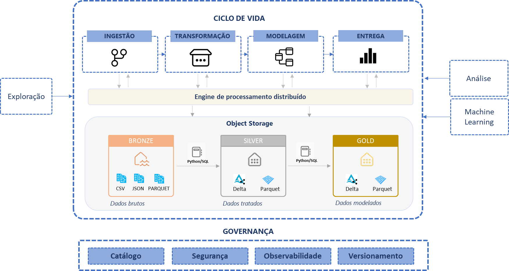
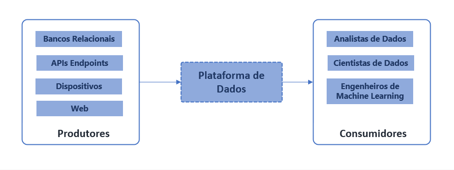

# Introdução do ciclo de vida
As fases do ciclo de vida refletem o esforço para obter os dados das diversas fontes para criar um pipeline de dados capaz de adicionar valor e qualidade, transformando dados brutos em conjuntos de dados enriquecidos, modelados e prontos para serem consumidos.

É semelhante a produção de um produto qualquer que transforma materia prima em produto acabado. Os dados são a matéria prima e os conjuntos de dados analíticos e modelos de machine learning são os produtos acabados.

O ciclo de vida dos dados deve ser desenvolvido considerando os diversos perfis de consumo. Cada fase define um objetivo específico e atribui sentido para os componentes e as relações de dependência, entradas, saídas, limites, responsabilidades, tecnologias utilizadas.

Vamos trazer detalhes sobre quais artefatos serão gerados, tipos de tecnologias utilizadas, entradas, saídas e recomendações do que deve ser feito em cada fase. 

Podemos considerar o ciclo padrão com 4 fases principais: Ingestão, Transformação, Modelagem e Entrega. E 2 fases externas, a exploração, que antecede o ciclo e a análise/modelagem estatística, que utiliza dados entregues.
  

## Padrão Medallion
Antes de começarmos o detalhamento de cada fase do ciclo de vida, vamos conhecer o padrão "medallion". Ele vem se tornando uma espécie método para organização, limpeza e padronização de dados em Lakehouses. A sua lógica de separação em camadas, que adiciona qualidade a medida que o dado é movido entre as elas no object storage faz dele um reflexo do ciclo de vida dos dados, desde a exploração inicial até o consumo. 

A ideia de camada bronze, prata e ouro remete ao incremento de qualidade e valor adicionado para o negócio. 

As camadas deste método adicionam qualidade através de validações, checagens, padronizações, enriquecimento com regras de negócio. Além disso, criam as fronteiras de segurança necessárias para entrega dos dados a públicos específicos, de acordo com o caso de uso.

  

### Bronze
Essa é a camada da dados brutos, é o ponto de entrada dos dados que vêm das fontes originais. Todo tipo de dado deve ser possível armazenar aqui, seja ele estruturado, semi-estruturado, não estruturado. Não são feitas transformações e o formato original é mantido. Essa camada tem o objetivo de receber os dados ingeridos os mais rápido possível para liberar a fonte de dados original do fluxo de dados de consumo.

### Silver
Essa é uma camada de validação. As primeiras checagens de qualidade são feitas. Os dados são refinados, transformações como deduplicação, limpeza de valores nulos, ofuscação entre outras. Nesta camada a preocupação principal deve estar em deixar o dado consistente e completo. Regras de negócio que modificam as representação dos dados não devem ser incluídas aqui. Essa camada pode ser muito consumida por cientistas de dados e busca de validação de hipóteses, pois os dados ainda não foram alterados para atender casos de usos específos.

### Gold
Aqui os dados estão sendo preparados para consumo. Geralmente é onde acontece a modelagem. Nessa camada os dados são modificados para atender casos de uso específicos. Entre ações que ocorrem nesta camada estão, agregações, dê-paras com dados externos, expressões com cálculos, joins, unions, e vários outras operações que modificam e preparam para responder questões de negócio. Pode haver mais de uma camada gold por exemplo, otimizada para ciêntistas de dados, ou a camada gold pode estar fora do datalake e ser entregue através de um data warehouse.

### Canadas adicionais
Não há problema em ter camadas adicionais, isso sempre vai depender do projeto, pode haver situações que uma camada adicional, raw ou landing por exemplo, precisa ser criada para receber os dados para depois ingerir na bronze. Também pode haver necessidade de uma camada para dados sensíveis ou para um caso de uso muito específico. O importante é manter a filosofia do padrão, separar as reponsabilidades e adicionar qualidade aos dados a cada camada de transformação.

Separar em diferentes camadas otimiza o processamento de dados e permite atender diferentes casos de uso, onde cada camada esteja alinhada com as necessidades de um perfild de usuário

As camadas também servem como contexto de segurança

### Checklist de transformação de dados
Antes de mover os dados entre as camadas veja:
- Qual é o volume de dados que será movido?
- Qual é a complexidade das transformações?
- Qual é a frenquência?

Fazer essas perguntas te ajudará a selecionar as melhores alternativas de ferramentas e abodagens. Por exemplo, para mover um grande volume de daos sem fazer transformações complexas, podemos usar conectores nativos de um orquestrador, para mover os dados e aplicar regras de negócio ou realizar transformações, podemos usar um engine de processamento.

### Perfil dos profissionais e áreas de conhecimento

Profissionais que dominam todas os componentes da arquitetura são difíceis de encontrar, cada pessoa envolvida pode ter mais proeficiencia em uma parte do ciclo de vida dos dados. O mais importante é identificar os tipos de atividades e os tipos de profissionais dentro da mesma função e equilibrar o time e cobrir todos os gaps de conhecimento.

Área de Conhecimento | Tipo 1 | Tipo 2 | Tipo 3
---------- | ------ | ------ | -------
Engenharia de dados | Perfil mais técnico, responsável por manter, gerenciar e evoluir a plataforma usando produtos gerenciados em ecosistemas de clouds públicas. Ele implanta o lakehouse/data warehouse, desenvolve os pipelines de ingestão de dados, serve os analistas de dados com conjuntos de dados tratados | Perfil de engenheiros que constrõem soluções customizadas, escalavés, conhece muito infraestrutura como código (terraform), orquestração de containers e devops. Esse tipo se dedica a aprimorar e automatizar aplicações baseadas em dados, trabalha em conjunto com os engenheiros de software para que as aplicações já nascam orientada a dados e que a qualidade seja uma preocupação desde do desenvolvimento. | Perfil de engenharia de dados voltado para desenvolver e implatar infraestrutura pra rodar modelos de ML em produção. Conhece práticas de Devops e o ciclo de vida de modelos (experimentação, treinamento, avaliação, implantação, re-treino) e frameworks de ML. Também conhecido com engenheiro de machine learning.
Cientista de Dados/Analista de Dados | Perfil de mais focado em realizar analise e validar hipóteses. Busca sempre identificar oportunidades nos dados, mais orientado ao negócio, entende o que está acontecendo através de análises descritivas, prescritivas. Faz a modelagem semântica e aplica regas de negócio para enriquecer os dados | Perfil mais orientado ao desenvolvimento. Possui forte conhecimento em programação, utiliza dados em um estado mais bruto, sem muitas transformações que afetem o estado original. Busca validar hipóteses, trabalha com modelos estatísticos e frameworks de machine learning supervisionados de classificação, clusters e recomendações. | Profissional com conhecimentos avançados de estatística e modelos não supervisionados como de NLP, visão computacional. Conhecem algorítimos avançados de redes neurais e deep learning.

 
Olhando de fora, podemos ver a plataforma de dados como hub que conecta os produtores (sistemas, dispositivos) aos consumidores de dados (engenheiros, analistas, cientistas) e que através do ciclo de vida dos dados, decisões mais embasadas e descobertas de padrões estatísticos sejam possíveis.

