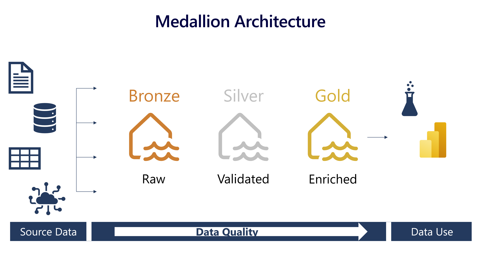

# Introdução do ciclo de vida
As fases do ciclo de vida refletem o esforço para obter os dados das diversas fontes para criar um pipeline de dados capaz de adicionar valor e qualidade, transformando dados brutos em conjuntos de dados enriquecidos, modelados e prontos para serem consumidos.

O ciclo de vida dos dados deve ser desenvolvido considerando os diversos perfis de consumo. Cada fase define um objetivo específico e atribui sentido para os componentes e as relações de dependência, entradas, saídas, limites, responsabilidades, tecnologias utilizadas.

Vamos trazer detalhes sobre quais artefatos serão gerados, tipos de tecnologias utilizadas, entradas, saídas e recomendações do que deve ser feito.
  

## Padrão Medallion
O padrão medallion vem se tornando uma especie método para organização, limpeza e padronização de dados em Lakehouses. Recomendado para organizar os dados, adicionando qualidade a medida que é movido entre as camadas do object storage.

A ideia de bronze, prata e ouro remete ao incremento de qualidade e valor para o negócio. Além disso, as camadas refletem o ciclo de vida desde a exploração inicial até o consumo. 

As camadas trazem qualidade através de validações, enriquecimento através de regras de negócio, performance através de modelagem e segurança a partir das fronteiras entre as camadas

### Bronze
Essa é a camada da dados brutos, é o ponto de entrada dos dados que vêm das fontes originais. Todo tipo de dado deve ser possível armazenar aqui, estruturado, semi-estruturado, não estruturado. Não são feitas transformações e o formato original é mantido. Essa camada tem o objetivo de receber os dados ingeridos os mais rápido possível para liberar a fonte de dados original do fluxo de dados de consumo.

### Silver
Essa é uma camada de validação. As primeiras checagens de qualidade são feitas. Os dados são refinados, transformações como deduplicação, limpeza de valores nulos, ofuscação entre outras. Nesta camada a preocupação principal deve estar em deixar o dado consistente e completo. Regras de negócio que modificam as representação dos dados não devem ser incluídas aqui. Essa camada pode ser muito consumida por cientistas de dados e busca de validação de hipóteses, pois os dados ainda não foram alterados para atender casos de usos específos.

### Gold
Aqui os dados estão sendo preparados para consumo. Agora os dados são modificados para atender casos de uso específicos. Entre ações que ocorrem nesta camada estão, agregações, dê-paras com dados externos, expressões com cálculos, joins, unions, e vários outras operações que modificam e preparam para responder questões de negócio. Pode haver mais de uma camada gold por exemplo, otimizada para ciêntistas de dados, ou a camada gold pode estar fora do datalake e ser entregue através de um data warehouse.

### Canadas adicionais
Não há problema em ter camadas adicionais, isso sempre vai depender do projeto, pode haver situaçõe que uma camada adicional raw ou landing precisa ser criada para receber os dados para depois ingerir na bronze. Pode haver necessidade de uma camada para dados sensíveis ou para um caso de uso muito específico. O importante é manter a filosofia do padrão, e separar as reponsabilidades e e adicionar qualidade aos dados.

Separar em diferentes camadas otimiza o processamento de dados e permite atender diferentes casos de uso, onde cada camada esteja alinhada com as necessidades de um perfild de usuário

As camadas também servem como contexto de segurança

### Checklist
Antes de mover os dados veja:
- Qual é o volume de dados que será movido?
- Qual é a complexidade das transformações?
- Qual é a frenquência?

Fazer essas perguntas te ajudará a selecionar as melhores alternativas de ferramentas e abodagens. Por exemplo, para mover sem transformação podemos usar um orquestrador, para mover e aplicar regras de negócio e checagens podemos usar um engine de processamento.

https://learn.microsoft.com/en-us/training/modules/describe-medallion-architecture/3-implement-medallion-archecture-fabric

https://aws.amazon.com/pt/blogs/architecture/overview-and-architecture-building-customer-data-platform-on-aws/

