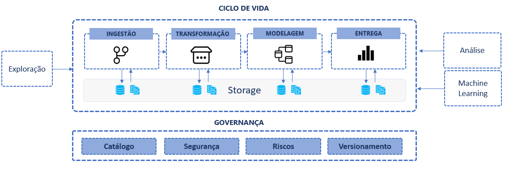

As fases de transformação de dados em informação

A plataforma de dados entrega dados tratados como um produto. 

Seguir um ciclo de vida definido com os consumidores em mente, e os dados precisam ser claramente definidos com esquemas gerenciados, descrições e assim por diante.

Também é importante fornecer dados  consistentes com significados para que os consumidores possam entender facilmente e combinar corretamente diferentes conjuntos de dados. Além disso, todos os dados devem ser facilmente descobertos e acessíveis aos consumidores por meio de um catálogo central com metadados e linhagem de dados devidamente selecionados.

  

