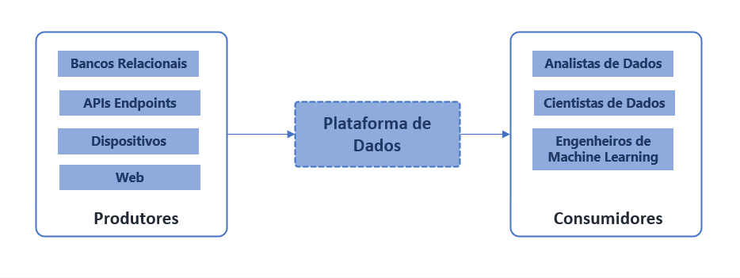

Em resumo essa parte irá tratar sobre tudo que acontece entre buscar, armazenar, tratar, preparar dados para consumo de analistas e cientistas de dados.

Dividir em fases nos ajuda a entender o processo de transformação de dados em informação.

Também ajuda a escolher os componentes necessários

  

### SQL, Python ou Bash?
Cada uma tem um caso de uso e uma tarefa que é mais indicada. Exemplo: sql para transformar, modelar, python para extrair dados de formatos e de fontes diferentes, ou para usar as APIs das aplicações, Bash para automatizar tarefas de implantação ou configurações de ambiente.

Profissionais que dominam todas os componentes para entregar o ciclo de vida completo são difíceis de encontrar, cada pessoa envolvida por ter mais proeficiencia em uma parte do ciclo. É importante identificar os tipos de atividades e os tipos de profissionais dentro da mesma função para equilibrar o time e cobrir o ciclo de vida.

Área de Conhecimento | Tipo 1 | Tipo 2 | Tipo 3
---------- | ------ | ------ | -------
Engenharia | Perfil mais técnico que mantém, gerencia e evolui a plataforma usando produtos gerenciados em ecosistemas de clouds públicas para criar data warehouse, pipelines de ingestão de dados servir analistas de dados, analistas de BI e machine learning | Perfil de engenheiros que constrõem soluções customizadas, escalavés, conhece muito infraestrutura como código, orquestração de containers. Se dedica a aprimorar e automatizar aplicações baseadas em dados. | Perfil de engenharia de dados voltado para desenvolver e implatar infraestrutura pra rodar modelos de ML em produção. Conhece práticas de Devops e o ciclo de vida de modelos (experimentação, treinamento, avaliação, implantação, re-treino) e frameworks de ML.
Cientista de Dados/Analista de Dados | Perfil de analise, busca identificar oportunidade nos dados, mais focado no negócio e orientado a entender o que está acontecendo através de análises descritivas, prescritiva. Faz a modelagem semântica e aplica regas de negócio para enriquecer os dados | Perfil mais orientado ao desenvolvimento com forte conhecimento em programação, utiliza dados em um estado mais bruto, sem muitas transformações que afetem o estado original. Busca validar hipóteses, trabalha com modelos estatísticos de frameworks de ML mais tradicionais supervisionados. Orientados a previsões e recomendações. | Profissional com conhecimentos avançados de estatística e modelos não supervisionados como de NLP, visão computacional que usam redes neurais.

A plataforma de dados pode ser vista com o hub que conecta os produtores (sistemas, dispositivos) aos consumidores de dados (engenheiros, analistas, cientistas) e viabilizar o ciclo de vida.

