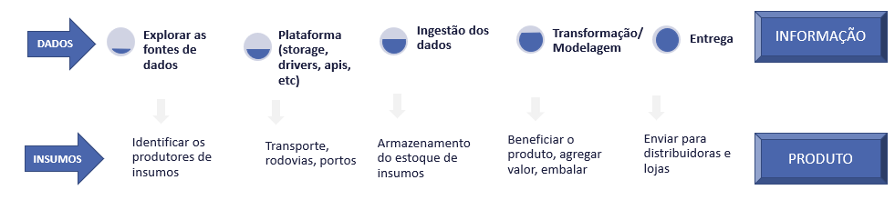

# Pipelines de dados
Transformação de dados em informação
É todo o ciclo de vida do dado, desde a transformação dos dados brutos, até a entrega da informação para o negócio

Uma analogia
Com o desenvolvimento de produtos para o mercado consumidor em geral

## Diferenças entre os tipos de pipelines
### Pipeline Devops
### Pipeline Machine Learning
### Pipeline de Dados

# Como cada um deve atuar 
Função | Atividades | Tecnologias envolvidas
------ | ---------- | -----------------------
Engenheiro de dado | Perfil mais técnico, focado no processo de ingestão de dados (extract e load) e desenvolvimento do pipeline | SQL, Python, Data Warehouse, Data Lake, Spark, Containers, etc..
Analista de Dados | Consumidor indireto do pipeline, produz análises com ferramentas de  BI avançada e faz a modelagem OLAP para atender requisitos de negócio | SQL, modelagem de dados, storytelling, estatística, conhecimento da área de negócio
Analista de Negócio | Apoia na fase de exploração de dados e modelagem semântica. Consome os relatório e dashboards com dados gerados pelo pipeline. Fazer querys ad-hoc e produz dashboards customizados | Conhecimento da área de negócio e ferramentas de visualização de dados
Cientista de dados/ML | Utiliza os dados brutos gerados nas primeiras fases do pipeline para validar hipóteses e gerar modelos preditivos que podem ser utilizados como parte do eriquecimento dos dados no pipeline. | Python, SQL, R, Estatística, Framework de Machine Learning

## Abordagens de ingestão

### Full Snapshots
Essa estratégia mode todos os dados e adiciona em uma partição imutável. O problema dessa estratégia é a grande duplicação de dados, o que não chega a ser um problema quanto ao custo de armazenamento, que hoje é baixo. Além disso a análise de dados é mais dificil, processar alguns anos pode demorar muito dependendo do volume.

### Slowly Changing Dimensions
Essa abordagem armazena os dados de forma mais eficiente, pois versiona os registros atualizados. O benefício é que a análise fica mais simples e rápida, e identificar e remover dados individuais, por exemplo a pedido da LGPD, também. O lado complicado dessa abordagem é que as mudanças nas fontes de dados precisam ser monitoradas e detactadas e assim que possível as atualizações realizadas.

### Append-only
Essa abordagem adiciona aos storages apenas os dados novos ou atualizados. 

## Orquestração
A orquestração é o processo de execução das fazes do pipeline e envolve o acionamento, agendamento e monitoramento das várias tecnologias envolvidas no processo.

Para a orquestração de pipelines de dados o Apache Airflow é um dos mais populares por ser multicloud, baseado em python e ter um vasto conjunto de conectores. Mas como ele é mais indicado para a orquestração, em geral o Airflow é usado em conjunto com uma engine de processamento como Apache Spark para transoformação e validação dos dados. Outra escolha popular é o Data Build Tool (DBT) pois ele faz a transformação usando SQL o facilta o processo de ETL criado por analistas de dados. Quando se fala de orquestração de soluções de clouds públicas em geral as opções são AWS Batch, Google Dataflow, Azure Data factory. Todas essas opções de orquestração são capazes de acionar, diferentes tecnologias, de forma agendada, sequenciar a execução, monitorar os resultados.
