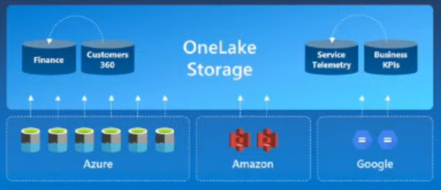

# O que é
> Abordar aqui asrelações de dependência, entradas, saídas, limites, responsabilidades, tipos de tecnologias

O que é um storage de dados analíticos, formatos de arquivos, object storages, armazenamento distribuido, etc

# Porque
Benefícios de se usar tecnologias de storage dedicados a análise de dados

# replicação de dados

# tipos 
> blob, object, etc

# Hot Warm Cold
https://www.ctera.com/company/blog/differences-hot-warm-cold-file-storage/

# Object storages vantagens e desvantagens
Features mais importantes, porque usar como storage de dados analíticos
Melores praticas para organizar as pastas em buckets/containers

# Features

Feature | Tipo 1 | Tipo 2 
-------| -------- | -----------
blob | x | x 
object | - | x 

#### Criar um storage com armazenamento centralizado, remover copias, usar compartilhamento, virturalização para não ter que mover. Ex: OneLake

#### organizar os dados do storage em domínios

#### o armazenamento deve ser hibrido permitir incorporar dados de storages remotos na solução centralizada 
para evitar a replicação de dados sem controle, devemos avaliar a opão de não mover. Em um modelo federado, cada unidade pode apresentar seus dados como recurso e o repositório central pode incorporar ao storage unificado. Se os dados já existem e estão em outras nuvens, eles devem ser acessados em um modelo hibrido como se eles estivesse no storage (shared datasets/ shortcuts). Isso evita a necessidade de sincronização de pipelines

