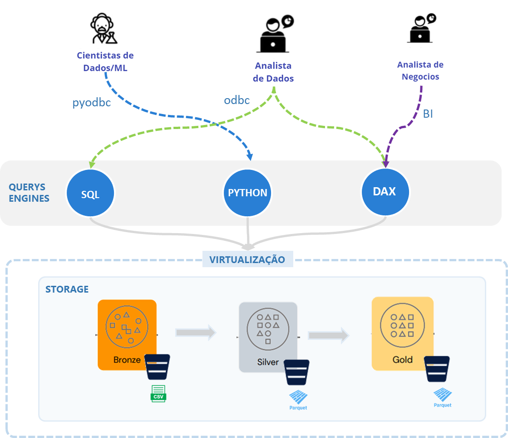

# virtualização de dados e conceito de serverless
> descrever os benefícios como não precisar mover os dados, principalmente em uma arquitetura mesh baseada em domínios, centralizar o acesso aos dados em um unico ponto (oquestrador não precisa ter acesso a todas as fontes, apenas a maquina que virtualiza) 

Integração de bases de dados
SQL executa querys em Oracle, MongoDB, S3 Object storages com usando apenas com T-SQL

Virtualiza a origem
Permitindo o acesso indireto à fonte sem ter que configurar drivers, conectores, regras no client

Simplifica as consultas
Padroniza a linguagem de consulta, independentemente da fonte as querys são em T-SQL

Integração
Permite fazer querys hibridas, com parte do dados externos e parte dos dados no SQL Server

Acesso aos mesmos dados sem necessidade de importar/duplicar para a engine de processamento

Storage unificado de dados agrupados por domínios

# Recomendações

## não armazenar dados semi-estruturados em base relacionalç
