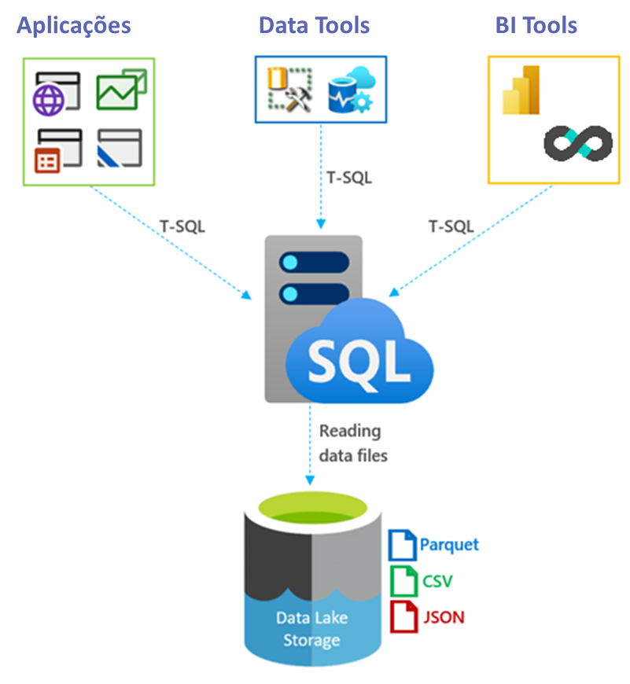

# O que?
> Abordar aqui asrelações de dependência, entradas, saídas, limites, responsabilidades, tipos de tecnologias

> o que acontece nessa fase, entradas e saídas, objetivos. Delinear entradas, saídas limites e fronteiras

Um ponto crítico para ter uma arquitetura de dados moderna é saber dazer a modelagem

# Fronteira entre a camada de qualidade e camada semântica
A transformação ocorrida na fase anterior não depende de contexto de utilizaçaõ dos dados as transformações buscam trazer integridade e limpeza
Qualidade dos dados
Deduplicação
Parse de atributos
Padronização de formatos
Monitoramento de falhas e incrementos

A fase de modelagem já dependente de caso de uso, altera a essencia do dado de certa forma limita o uso mas enriquece com:
Agregações
Joins / Unions
Dê-para
Métricas e indicadores

Deixam os dados prontos para consumo das ferramentas de visualização

# Porque
> Importancia de separar a transfornação da modelagem (a primeira cria um produto com dados tratados mas sem regras de negócio, essa com regras e dados modificados para atender casos de uso)

# Como
> tipos de tratamentos e transformações. Modelagem: relacionamentos, joins, semântica, dimensões, fatos, etc

# Exemplos
> das operações acima, de modelagem multidimensional e OLAP. Melhores práticas para modelos oplap (tabular)

sc typ2 delta 
https://docs.delta.io/latest/delta-update.html#id2

# camada semantica
Conceito de desacoplamento da camada semantica empresa Transform comprada pelo dbt 
dbt Semantic Layer, Enabling Greater Consistency Across Analytics Tools

https://github.com/dbt-labs/metricflow

https://www.getdbt.com/blog/dbt-acquisition-transform

https://www.prnewswire.com/news-releases/dbt-labs-launches-the-dbt-semantic-layer-enabling-greater-consistency-across-analytics-tools-301652226.html

>What Transform introduced to all of us was the incredible potential of semantic capabilities that are decoupled from a single business intelligence tool – or, “headless semantic layer”. In this world, metrics and entities are no longer locked into a single BI tool, they can be accessed by all downstream tools. 

# Recomendações
R1 | Desacoplar a camada semântica das ferramentas de BI | Uso de ferramendas de BI diferentes com a mesma metrica, propagação de mudanças, melhor consistencia, confinça que todos estão usando a mesma logica dos indicadores, concistencia entre ferramentas de BI

Logical processing layer
This layer is responsible for transforming data into a consumable state by applying business rules for data validation, identity resolution, segmentation, normalization, profile aggregation, and machine learning (ML) processing. This layer comprises custom application logic. The compute resources for this layer are designed to scale independently from storage to handle large data volumes; support schema-on-read, support partitioned data and diverse data formats; and orchestrate event-based data processing pipelines.