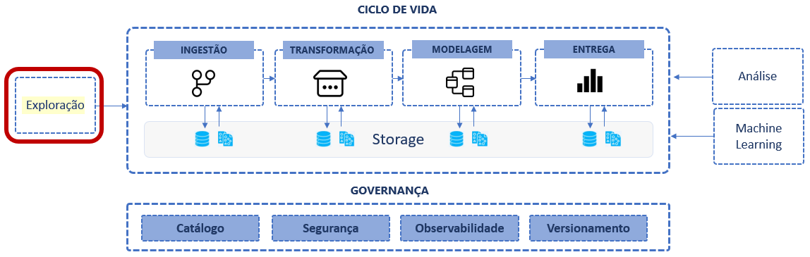

# Fase: Exploração de dados
Essa é a primeira fase do ciclo de vida, é a fase que antecede a construção do pipeline de dados, nesse momento estão sendo avaliadas as possibilidades de obtenção dos dados, as fontes disponíveis, os formatos e os dados necessários. Essa fase se resume em como obter as matérias primas para a jornada de análise de dados.

É uma fase muito importante pois busca enteder onde os dados estão, como ele são gerados, e identificar o que é realmente necessário ser extraído e lapidado. O mapeamento deve se preocupar em não gerar duplicidade, identificar a cadência que são gerados e com que frequencia podem ser lidos durante a fase de inegestão.
 
Essa uma fase que requer conhecimento técnico em múltiplas tecnologias de bancos de dados além de um profundo conhecimento de regras de negócio. A execução dessa etapa do ciclo é realizada por engenheiros de dados em conjunto com analistas de negócio e se caracteriza pela entrega de uma análise de viabilidade, que vai explicitar as características dos dados como formatos, volumes e variedade.

Durante a exploração, faça analises descritivas, avalie as distribuições das variáveis numéricas, veja os tipos de atributos categóricos e o nível de qualidade dos dados na fonte. Para lidar com questões como diferentes contas de acesso a base de dados ou API, disponibilidade de drivers e conectores e diferentes tipos de tecnologias de armazenamento de dados, utilize ferramentas de virtualização de dados para simplificar o acesso ao ambiente. A virtualização de dados pode ajudar a padronizar a linguagem utilizada para obter os dados, além de abstrair os diferentes formatos das fontes de dados de origem.

### SQL, Python, R ou Bash?
Ao iniciar a fase de exploração surge a questão, qual tecnologia de liguagem de consulta utilizar? Dependendo do momento e do desafio técnico nessa fase, pode ser mais indicada uma linguagem específica. Cada caso de uso vai ajudar a determinar. Por exemplo: podemos recomendar SQL para realizar transformações e modelagem; Python  para realizar a extração dos dados de formatos e de fontes diferentes, ou para fazer requisições a APIs de aplicações e lidar com dados em json; podemos usar bash para automatizar tarefas de implantação, interagir com o sistema de arquivos ou S.O e realizar configurações de ambiente.

## Tipos de Fontes
Quais são os tipos de fontes de dados que podemos encontrar e quais são os desafios para realizar a exploração dos dados.

### **Arquivos de dados semi/não-estruturados:** 
Podem ser originados por uma exportação manual de um sistema, pode ter sido gerado manualmente, podem estar como arquivos de log, imagens, áudio ou qualquer objeto digital que possa ser processado, csv, excel, json, txt, xml, etc. Os arquivos são muito usados para exportação de dados entre sistemas que não estão integrados. Também é muito frequente quando estamos trabalhando com a exploração de dados governamentais. Cada tipo tem suas particularidades e tenologias diferentes para serem processados. Alguns como Excel e CSV são mais estruturados, outros como TXT, imagens, audios precisam de bibliotecas específicas e técnicas de machine learning para extrair informações úteis e os padrões estatísticos nos dados.

### **APIs:** 
As APIs são os meios mais comuns de integração de dados entre sistemas, além disso oferentem meios para extração de dados. Mais especificamente as APIs REST, baseadas no protocolo HTTP. Cada API possui um conjunto de endpoints para interação e os formatos para autenticação. As APIs são são mecanismos para proteger a base de dados de origem, expondo apenas o minimo necessário para compartilhamento de dados.
Na teoria as APIs facilitam a ontenção de dados para análise, mas na prática, trabalhar com APIs apresentam vários desafios e conhecimento técnico para desenvolver rotinas de requisições eficientes de extração de dados em escala. Em geral os dados são obtidos através de requisições http em um formato json. Muitas aplicações fornecem clients que abstraem parte da complexidade de acesso.

### **Webhooks**: 
São similares às APIs, porém orientadas a eventos. Quando um evento ocorre na fonte de dados ele dispara uma chamada HTTP para um endpoint desenvolvido no lado do consumidor (destino). Neste modelo a conexão não parte do consumidor e sim da fonte, que envia os dados. É o oposto do fluxo de requisição/resposta de uma API. Webhooks são como APIs reversas.

### **Bancos de dados OLTP**: 
São os bancos de dados relacionais tradicionalmente usados para armazenar dados operacionais dos sistemas corporativos. Eles possuiem dados estruturados e se apresentam como uma das principais fontes de dados. Alguns exemplos são as bases do sistema SAS, CorporeRM, LEME, etc. As tecnologias e formatos de armzenamento são otimizados para realizar atualização dos registros nas tabelas e não para consultas em escala. Uma boa prática é realizar a replicação de dados para reduzir a concorrência entre as cargas de trabalho operacionais e as extração de dados para análise. Para realizar a exploração e extração de dados de forma eficiente é importante identificar os índices das tabelas e usá-los sempre que for possível.

### **Bancos NoSQL**: 
Apesar dos bancos relacionais serem os mais comuns ele não são a solução única para tudo, os bancos NoSQL (not only SQL) são uma opção quando precisamos de escala e distribuição, nesse paradigma de armazenamento, a redução de contraints e possibilidade de acomodar a evolução de schema trazem outros benefícios em detrimento da perda de uma consistência robusta. 
Entre os tipos principais estão os:

Tipos | Descrição
----- | ---------
**key-value** | Usado em soluções de cache para dar velocidade e suportar alta demanda por consultas
**document** | Parecido com key-value, armazena cada registro (linhas) como um documento json pertencente a uma coleção (tabela). Os registros/documentos podem ser diferente entre eles. Todos os dados relacionados estão contidos no mesmo json, com o mesmo dado repedido em vários documentos. Não há definição rígida de schema e eles podem evoluir a medida que a aplicação é modificada. Aqui temos que ter atenção por que essa evolução de schemapode ser a origem de falhas nos pipelines nas fases de ingestão.
**wide-column** | É um tipo de banco otimizado para lidar com grandes volumes de dados com alta performance. São altamente escaláveis, suportam petabytes e milhões de requests mas não tem boa performance para suportar querys complexas. Neste tipo de banco as querys de devem ser simples, os dados devem ser levados para o lakehouse para realizar as querys mais complexas.

### **Bancos de dados analíticos**: 
Estas fontes são as bases de dados OLAP. Elas não se limitam os conhecidos CUBOS, esse tipo de tecnologia pode ser atribuído a qualquer tecnologia de banco que suporte querys analíticas, interativas e em laga escala. Apesar destas bases teoricamente já conterem os dados "prontos" para análise, elas também podem ser uma fonte de dados para a contrução de um novo pipeline em um ETL reverso, onde os dados prontos em um banco OLAP são usados como entrada para a base de dados de um outro sistema, por exemplo um CRM com dados consolidados e enriquecidos de um cliente.

## Entradas
Ao acessar os dados é importante ter como referência os contatos do responsáveis pelas fontes de dados, criar boa relação ter interações constantes, durante e depois da construção dos pipelines. Entre eles estão, engenheiros de software, administradoresde bancos de dados, gestor do sistema de origem. Essa relação permite que quando alguma coisa acontecer com o sistema, como uma mudança no schema, ou uma falha em um servidor de banco de dados você será avisado e terá um espaço para discutir e entender os impactos em conjunto e dessa forma manter um contrato com os fornecedores de dados que definem as regras de firewall, drivers de conexão, usuários, senhas e tokens de acesso que serão usados que com que frequência as bases serão acessadas.

## Saídas
Scritps com querys que descrevem os dados explorados, notebooks com análises de distribuição das variáveis numéricas e categóricas, gráficos das pricipais entidades, análise de percentual de valores nulos, avaliação dos outliers. Ao término desta fase temos uma boa idei do escopo da fase de ingestão de dados.

## Limites
 Essa fase se limita a validar a disponibilidade das fontes e gerar uma lista de entidades e atributos disponíveis. Não são feitas manipulações, cargas ou qualquer movimentação de dados.
 
## Responsabilidades
 Engenheiros de dados em cojunto com analistas de negócio e desenvolvedores de software.
 
## Tipos de tecnologias
SQL clients, Jupyter notebooks, drivers, python, bash, sql, VSCode, Git.

### Continuar ...

> trazer exemplos de codigo para leitura de tipos diferentes, fontes diferentes, conversão de formatos; Webscapping, api, csv, json, delta

