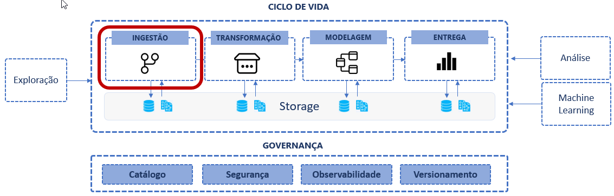
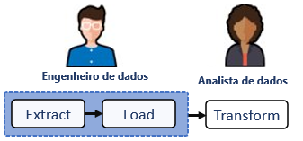

# Fase: Ingestão

Tradicionalmente as tecnologias de ingestão são responsáveis por buscar e armazenar os dados em data warehouse ou data lakes através de processos de ELT/ETL. Essa fase se caracteriza por ser o único momento que a fonte de dados original é lida. Geralmente não são realizadas operações de processamento que alterem as características originais dos dados, tanto a granularidade quando as eventuais concistências ou problemas de qualidade são mantidos. As etapas subsequentes do ciclo de vida serão responsáveis por lidar com essas questões de  limpeza, padronização, organização e aplicação de regras de negócio. Neste momento, o objetivo é apenas apenas trazer os dados de origem o mais rápido possível para dentro do storage de dados analíticos com ele estão. Em geral os dados são persistidos de forma incremental (APPEND/UPSERT) ou sobrescrita (FULL) nas tabelas de destino nos data warehouses.



Esse processo pode acontecer de várias formas, pode ser orientado a eventos (streaming de dados), onde o dado é enviado a medida que é produzido, ou pode ser através de um processo batch, onde um bloco de dados é enviado em um momento específico. A ingestão também pode variar quanto ao sentido do fluxo de dados. Podemos ter uma ingestão de dados do tipo push, onde o sistema de origem envia os dados para o object storage (landing zone) sem a necessidade de solicitação do lado consumidor. Ou podemos ter ingestão do tipo pull, onde o pipeline se conecta a fonte e busca os dados direto na fonte sem que ela tenha controle sobre quando os dados serão extraídos. Além disso podemos ter diferentes estratégias de atualização, podemos ter uma atualização full, onde os dados do storage são substituídos pelos novos dados, incremental, onde apenas dados novos ou atualizados são inseridos. 

Essa é uma fase muito importante, onde os principais desafios técnicos surgem.

Questões que precisam ser levantadas nessa fase são:

Questão | Ação
------- | -----
Os dados precisam ser carregados e processados em tempo real? | Se sim, o pipeline precisa criar um fluxo de dados e armazenar os eventos em bancos de dados de stream.
Qual é a latência máxima aceita para a atualização? | Dependendo da latência otimizações  precisam ser feitas para reduzir o tempo de processamento
Os dados serão usados para geração de dashboards pré-processados? | Se sim, a previsibilidade permite planejar melhor os horários de atualização
Serão realizadas consultas ad-hoc, sob demanda? | Se sim, a tecnologia do Lakehouse/Data Warehouse precisam estar dimensionadas, ou terem políticas de cotas
Os dados serão usados para treinamento de modelos de machine learning? | Se sim, precisa criar estratégias de versionamento dos dados usandos em cada experimento para ter reprodutibilidade nos treinamentos.


## Padrões de Ingestão de Dados

#### ETL, ELT/EtLT
Aparentemente a diferença entre esses dois padrões está somente na ordem que acontece a transformação. ETL faz a transformação antes de carregar, ou seja, modifica os dados antes de importar para o storage, já o padrão ELT, carrega no storage os dados como são, para só depois modificá-los.

Antes de detalhar as diferenças vamos entender as fases. A fase "E-extract" busca os dados das fontes originais e disponibiliza para carga realização das transformações. A fase "L-load" carrega dados brutos (no caso do ELT) ou carrega dados tranformados (no caso de ETL). Na fase "T-transform" é o momento em que dados de sistemas diferentes são combinados, limpezas, mudanças de formatos, novos atributos, regras de negócio são realizados e disponibilizados para consumo.

A fases de "extract" e "load" em conjunto também são conhecidas como fase de "ingestão" de dados e caracterizam bem os focos de atuação de engenharia de dados e analistas de dados. 

#### ETL (Extrac, Transform, Load)
ETL é o padrão mais conhecido e foi adotado durante muito tempo em uma época em que o armazenamento era mais caro e portanto era necessário transformar os dados em algum nível de granularidade antes de ser carregado para ocupar menos espaço em disco. Esse padrão ainda é usado, mas atualmente o modelo ELT vem ganhando destaque como padrão de ingestão de dados em plataformas modernas onde o armazenamento é mais eficiente e barato e os engenheiros podem realizar a extração e carga para um ambiente separado para só depois, sob demanda, realizar as transformações. 

#### ELT/EtLT
Esse padrão ELT, ainda permite criar uma separação clara entre as atividades de ingestão (extract/load) geralmente feita por engenheiros de dados das atividades de transformação que podem ser desenvolvidas por analistas de dados.



Esse padrão simplifica, traz velocidade para a extração e oferece a possibilidade de desenvolver projetos de dados utilizando dados brutos, como em projetos de ciencia de dados com machine learning. Hoje o padrão ELT é o mais indicado e vem ser tornando o dominante em novos projetos.

Existe ainda um subpadrão do ELT chamado **EtLT**. O **t** minúsculo significa que é aceitável fazer algum tipo (mínimo) de transformação como: deduplicar linhas de tabelas, fazer um parse de tipos, mascarar dados sensíveis, antes mesmo de carregar. Essas transformações não alteram as caraterísticas da entidade, mantém a granularidade original e não inclui regras de negócio.

Fazer a extração e a carga antes de qualquer tipo de transformação reduz a necessidade de prever exatamente quais análises serão feitas com os dados. A transformação pode ser feita quando houver clareza e soubermos exatamente como o dado será usado.

#### ETL reverso
Ainda existe o ETL reverso, que é o processo de usar os dados do resultates dos pipelines de dados prontos, para enviar para enriquecer base de dados operacionais, trazendo uma visão "cross-process" que ajudam a adionar valor com dados complementares. Esse tipo de pipeline aproxima os engenheiros de dados dos engenheiros de software possibilitando uma colaboração efetiva. Um bom exemplo é uma aplicação de CRM que recebe dados consolidados com estatísticas de clientes que vieram de diversas fontes, para fazer uma segmentação mais qualificada.


## Tipos de ingestão de dados

### Streaming
É uma tecnologia de processamento de dados baseado em eventos. Os dados são enviados em um fluxo de pequenos eventos, para bancos de dados de filas pub/subs. São efecientes, pois executam rápido por lidarem com pequenos datasets são bons para demandas de análises em tempo real.

Os bancos de dados de streaming são projetados especificamente para processar um fluxo constante de dados. Ao contrário dos bancos de dados tradicionais, que armazenam dados em lotes antes do processamento, bancos de dados de streaming processam os dados assim que são gerados, permitindo realizar análises em tempo real. Casos de uso mais comuns são aqueles que exigem baixa latência como: recomendação de anúncios, detecção de fraudes, monitoramento de dispositivos, aplicações de entrega ou carros por aplicativo. Em conjunto com esse tipo de banco são usadas ferramentas especializadas de ETL em streaming e análise de streaming.

Após o processamento e transformação, em geral os dados são inseridos em data warehouses ou data lakes. Em geral são append-only e são acumulados na sequência que chegam e são ordenados por um timestamp

As principais diferenças entre os bancos de dados tradicionais e de streaming são:

Tipo | Descrição
----- | ------
Tradicionais: | Grandes quantidades de dados são armazenadas em lote
Streaming | São projetados para inserir pequenos volumes de dados incrementalmente e fornecer acesso de baixa latência


### Batch
Representa o processo de realizar a transferência de grandes volumes dados de uma só vez, em um momento específico do dia. Um processamento em batch carrega, milhões ou bilhões de registros de um arquivo em uma tabela de destino para realizar a atualização dos dados. Muitas vezes o processamento em batch é a única alternativa técnica para lidar com alguns tipos de fontes de dados.

O processamento em batch é o mais usado, apesar do ganho de popularidade das estratégias de ingestão em streaming a melhor estratégia é usar ambos os métodos considerando, o volume de dados, a complexidade das transformações e os requisitos dos casos de uso como necessidades de análises em tempo real.


## Estratégias de atualização

### Full Snapshots
Essa estratégia mode todos os dados e adiciona em uma partição imutável. O problema dessa estratégia é a grande duplicação de dados, o que não chega a ser um problema quanto ao custo de armazenamento, que hoje é baixo. Além disso a análise de dados é mais dificil, processar alguns anos pode demorar muito dependendo do volume.

### Slowly Changing Dimensions
Essa abordagem armazena os dados de forma mais eficiente, pois versiona os registros atualizados. O benefício é que a análise fica mais simples e rápida, e identificar e remover dados individuais, por exemplo a pedido da LGPD, também. O lado complicado dessa abordagem é que as mudanças nas fontes de dados precisam ser monitoradas e detactadas e assim que possível as atualizações realizadas.

### Insert-only
Esse padrão de ingestão de dados cria um novo registro acada processamento ao invés de fazer a atualização. Cada inserção uma coluna com a data/hora é incluída no registro. Por exemplo, cada vêz que um cliente muda de endereço uma nova linha com o endereço é inserida junto com a anterior, dessa forma todo o log de alterações é mantido no banco de dados analítico e o dado atual pode ser obtido buscando pela data de inserção mais recente. Use somente onde tiver necessidade, avalie se esse histório pode ser mantido na tabela de fatos pois essa estratégia pode trazer algumas desvantagens como gerar tabelas muito grandes quando há atualizações frequentes, além de demandar processamento adicional para buscar a versão atual através da ultima data de atualização.

Os dados são inseridos por exemplo 
<br> 
```
INSERT INTO [destino] VALUES (...) 
SELECT * FROM [fonte];
```

### Upserts
É uma operação de ingestão que combina as operações de inserção e atualização na base de destino em uma única instrução. Ou seja insere o do no destino se não existir e atualiza os campos caso exista uma correspondência dos dados de origem com o destino. É importante avaliar essa estratégia com cuidado, pois ela é mais lenta do que uma inserção simples pois requer uma operação de avaliação se a chave da fonte de dados existema no destino.

Exemplo de upsert em SQL
```
MERGE INTO destino AS d
USING fonte AS f
ON d.chave = f.chave
WHEN MATCHED THEN
    UPDATE SET d.col1 = f.col1, d.col2 = f.col2
WHEN NOT MATCHED THEN
    INSERT (chave, col1, col2) VALUES (f.chave, f.col1, f.col2);
```

### Conectividade
A conexão com a fonte de dados pode trazer vários desafios. Quando a fonte de dados é um banco relacional, desafios com a criação de regras de firewall, configuração de drivers, conectores odbc surgem. Quandos os dados estão em formatos semi-estruturados temos que lidar bibliotecas python/R específicas de cada formato, com a falta de um schema bem definido. Quando os dados estão em páginas WEB temos que lidar com a falta de controle sobre as mudanças que podem ser feitas pelo proprietário da pagina no DOM. Quando estamos lendo dados de uma API, temos que pensar na quantidade de requisições que pode ser feita, com as limitações que estabelecem um cota de requisições à API.


Tipo | Recomendação
---- | ------------
Dados estruturados | Usar drivers nativos, se possível, usar ferramenta de vitualização de dados para abstrair a complexidade de regras de firewall e drivers de conexão
Dados semi-estruturados | Buscar as fontes de metadados que definem os schemas, armazenar em storages que acomodam evolução de schema (schema evolution)
Dados da Web | Extrair os dados e armazenar locamente, caso algo mude na fonte uma visão parcial dos dados estará disponível
Dados de APIs | Criar processos que extraem os dados aos poucos e armazenam localmente. Se uma requisição bucar um dado com data de atualização recente, busca do repositório local, se o dado for antigo, busca da API.


## Exemplos de códigos de ingestão
Lista de referência de exemplos de códigos comuns usandos para criação de etapas de ingestão de dados:


Comando | SQL | PySpark
------- | --- | -------
Criar uma tabela | `CREATE TABLE IF NOT EXISTS default.tabela (id INT, tipo STRING) USING DELTA` | `df.write.format("delta").saveAsTable("default.tabela")` <br><br> `DeltaTable.create(spark).tableName("default.tabela").addColumn("id", "INT").addColumn("tipo", "STRING").execute()`
Criar tabela particionada | `CREATE TABLE default.tabela (id INT, tipo STRING) <br> USING DELTA <br> PARTITIONED BY (tipo)` | `DeltaTable.create(spark).tableName("default.tabela").addColumn("id", "INT").addColumn("tipo", "STRING").partitionedBy("tipo").execute()`
Ler uma tabela | `SELECT * FROM TABELA` | `spark.read.format("delta").load("/tmp/delta/tabela")`
Ler uma versão anterior de um registro | `SELECT * FROM delta./tmp/delta/tabela VERSION AS OF 123` | `df2 = spark.read.format("delta").option("versionAsOf", 123).load("/tmp/delta/tabela")`
Inserir dados | **Adicionar**:<br> `INSERT INTO default.people10m SELECT * FROM tabela`<br><br>**Sobrescrever**:<br> `INSERT OVERWRITE TABLE default.people10m SELECT * FROM tabela` | **Adicionar**:<br> `df.write.format("delta").mode("append").saveAsTable("default.tabela")`<br><br>**Sobrescrever**:<br> `df.write.format("delta").mode("overwrite").saveAsTable("default.tabela")`
Inserir novos e atulizar existentes (Upsert)| `MERGE INTO destino USING origem ON (destino.col1=origem.col1) WHEN MATCHED AND destino.col2 <> origem.col2 THEN UPDATE SET destino.col2=origem.col2 WHEN NOT MATCHED THEN INSERT (col1,col2) VALUES (origem.col1,origem.col2)` |  `deltaTable.alias('origem').merge(df.alias('destino'), "origem.col1 = destino.col1").whenNotMatchedInsertAll().whenMatchedUpdateAll("origem.col1 < destino.col1").execute()`


### Entradas
Relatórios e análises exploratórias com a relação de entidades que devem ser extraídas e transformadas no projeto, com os formatos e volumetrias identificadas.

### Saídas
Dados inseridos na camada bronze no lakehouse, ou nas tabelas stage do data warehouse.

### Limites
Essa etapa se limita a copiar, atualizar, processar, limpar os dados das diversas de dados disponíveis e necessárias. Não é responsável por adicionar regras de negóicio complexas, fazer modelagem, estabelecer relacionamentos ou adionar metadados ou semântica aos datasets.
 
### Responsabilidades
Engenheiros de dados em geral são os profissionais reponsáveis pela etapa
  
### Tipos de tecnologias
Ferramentas de ETL, orquestração, SQL, PySpark