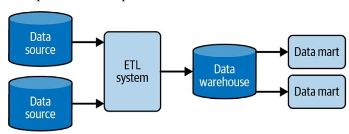

# Ingestão

Tradicionalmente as tecnologias de ingestão buscam e armazenam os dados em data warehouse e data lakes através de processos de ELT/ETL. A Fase de extração apenas coleta dos dados como eles estão na fonte original, sem alterar a granularidade, a fase transformação se preocupa com a limpeza, padronização, organização e aplicação de regras de negócio, e a fase de carga é responsável por persistir de forma incrementar ou sobrescrita nas tabelas de destino nos data warehouses.




A fase de ingestão é responsável por mover os dados da fonte de origem para o storage de dados analíticos. Esse processo por acontecer de várias formas, pode ser orientado a eventos (streaming de dados), onde o dado é enviado a medida que é produzido, pode ser através de um processo batch, onde um bloco de dados é enviado em um momento específico. A ingestão pode variar também no sentido do fluxo de dados. Podemos ter uma gestão de dados do tipo push, onde o sistema de origem envia os dados. Ou podemos ter ingestão pull, onde o pipeline se conecta a fonte e busca os dados. Além disso podemos ter diferentes estratégias de atualização, podemos ter uma atualização full, onde os dados do storage são substituídos pelos novos dados, incremental, onde apenas dados novos ou atualizados são inseridos. Essa é uma fase muito importante, onde os principais desafios técnicos surgem.


## Padrões de Ingestão de Dados
#### ELT vs ETL
#### ETL reverso
Processo de usar os dados do DW de volta nas aplicações com dados consolidados e multiplas fontes com uma visão cross-process que ajudam a enriquecer as aplicações com dados complementares.


## Tipos de ingestão de dados
> diferenças, tipos de tecnologias, quando usar e quando não usar

### Streaming
É uma técnologia de processamento de dados baseado em eventos. Os dados são enviados em um fluxo de pequenos eventos, para bancos de dados de filas, ou pub/subs. São efecientes, pois executam rápido por lidarem com pequenos datasets são bons para demandas de análises em tempo real.

Os bancos de dados de streaming são projetados especificamente para processar um fluxo constante de dados em tempo real. Ao contrário dos bancos de dados tradicionais, que armazenam dados em lotes antes do processamento, bancos de dados de streaming processam os dados assim que são gerados, permitindo realziar análises em tempo real. Casos de uso mais comuns são aqueles que exigem baixa latência como: recomendação de anúncios, detecção de fraudes, monitoramento de dispositivos, aplicações de entrega ou carros por aplicativo. Em conjunto com esse tipo de banco são usadas ferramentas especializadas de ETL em streaming e análise de streaming.

Após o processamento e transformação, em geral os dados são inseridos em data warehouses ou data lakes.

As principais diferenças entre os bancos de dados tradicionais e de streaming são:

Tradicionais: 
- Grandes quantidades de dados são armazenadas em lote

Streaming
- são projetados para inserir pequenos volumes de dados incrementalmente e fornecer acesso de baixa latência


### Batch
Representa o processo de realizar a transferência de grandes volumes dados de uma só vez, em um momento específico do dia. Um processamento em batch carrega, milhões ou bilhões de registros de um arquivo em uma tabela de destino para realizar a atualização dos dados. Muitas vezes o processamento em batch é a única alternativa técnica para lidar com alguns tipos de fontes de dados.

O processamento em batch é o mais usado, apesar do ganho de popularidade das estratégias de ingestão em streaming a melhor estratégia é usar ambos os métodos considerando, o volume de dados, a complexidade das transformações e os requisitos dos casos de uso como necessidades de análises em tempo real.


## Estratégias de atualização
Full, Incremental, pull, push
Com usar cdc para estrategias incrementais


## Formatos e conectividade
padronização de formatos, conectividade, drivers, regras de rede, landing para receber, software agentes , etc..; 
Breve introdução dos formatos csv, parquet, delta tables, quando usar vantagens e desvantagens, qual é mais rapido, qual é menor, códigos de conversão entre formatos; Com ou sem schema – schemaless schemaonread ou write, mudança de schema

#### Conectividade
A conexão com a fonte de dados pode trazer vários desafios. Quando a fonte de dados é um banco relacional, desafios com a criação de regras de firewall, configuração de drivers, conectores odbc surgem. Quandos os dados estão em formatos semi-estruturados temos que lidar bibliotecas python/R específicas de cada formato, com a falta de um schema bem definido. Quando os dados estão em páginas WEB temos que lidar com a falta de controle sobre as mudanças que podem ser feitas pelo proprietário da pagina no DOM. Quando estamos lendo dados de uma API, temos que pensar na quantidade de requisições que pode ser feita, com as limitações que estabelecem um cota de requisições à API.

Tipo | Recomendação
---- | ------------
Dados estruturados | Usar drivers nativos, se possível, usar ferramenta de vitualização de dados para abstrair a complexidade de regras de firewall e drivers de conexão
Dados semi-estruturados | Buscar as fontes de metadados que definem os schemas, armazenar em storages que acomodam evolução de schema (schema evolution)
Dados da Web | Extrair os dados e armazenar locamente, caso algo mude na fonte uma visão parcial dos dados estará disponível
Dados de APIs | Criar processos que extraem os dados aos poucos e armazenam localmente. Se uma requisição bucar um dado com data de atualização recente, busca do repositório local, se o dado for antigo, busca da API.


## Exemplos de códigos de ingestão
> criar uma tabela
https://docs.delta.io/latest/delta-batch.html#write-to-a-table&language-sql

```
SQL APPEND
INSERT INTO default.people10m SELECT * FROM morePeople

SQL OVERWRITE
INSERT OVERWRITE TABLE default.people10m SELECT * FROM morePeople

Python
df.write \
  .format("delta") \
  .mode("overwrite") \
  .option("replaceWhere", "birthDate >= '2017-01-01' AND birthDate <= '2017-01-31'") \
  .save("/tmp/delta/people10m")
```

Você sabe o que é Upsert? Upsert é uma operação de banco de dados que tenta inserir um registro e, caso o registro exista, o registro é atualizado, caso não exista, o registro é inserido como um novo registro.


- duplicação de dados aumenta o custo, manutenção e gerenciamento da segurança. Não deve haver silos de dado, a arquitetura do storage deve ser aberta para que o dado seja compartilhado sem que seja movido, ou gerad uma cópia


#### o que é
> Abordar aqui as relações de dependência, entradas, saídas, limites, responsabilidades, tipos de tecnologias

> benefícios de ter um pipeline com ingestão de dados eficiente (isolamento, concorrência, etc..)

> como uma ingestão é feita, tipos de conexões (api, drivers, agentes, etc), oquestração, formatos


