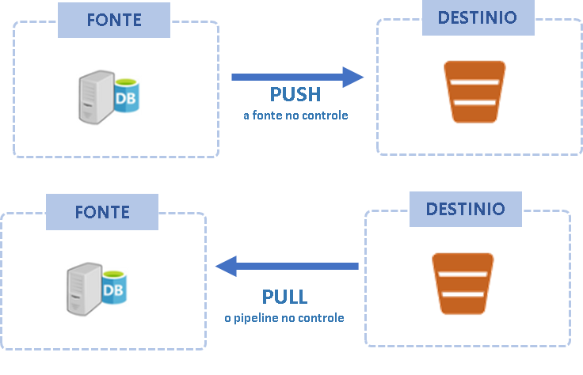
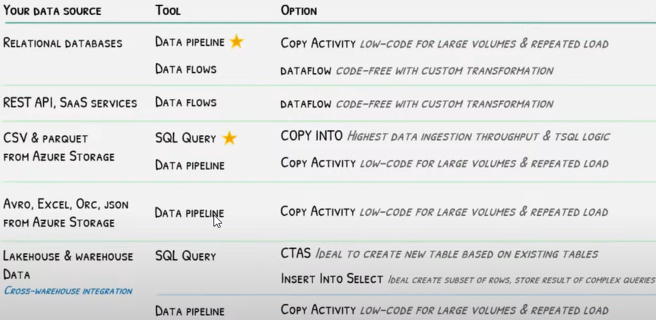

# Fase: Ingestão
Nesta fase vamos detalhar os padrões e os métodos de ingestão de dados de vários formatos, origens e os tipos de tecnologias relacionadas.

A ingestão de dados é o processo de mover os dados de um lugar para outro, tradicionalmente as tecnologias de ingestão são responsáveis por buscar das fontes originais e armazenar os dados em data warehouse ou data lakes através de processos de ELT/ETL. Essa fase se caracteriza por ser um dos poucos momentos que a fonte de dados original é lida. Esse é um dos ponto de maior gargalo do ciclo de vida dos dados. Muitas vezes limitações são impostas pela fonte de dados tanto quanto ao formato quanto ao tipo de tecnologia. 

Por isso, o objetivo principal dessa fase é fazer a coleta da forma efiente. Geralmente durante a ingestão não são realizadas operações de processamento que alterem as características originais dos dados, tanto a granularidade quando eventuais problemas de qualidade não são tratados durante a ingestão. As operações de ajustes nos dados são feitas em etapas subsequentes do ciclo de vida. Questões como a limpeza, padronização, organização e aplicação de regras de negócio são feitas depois que os dados estão ingeridos na plataforma analítica. 

Neste momento, o objetivo é apenas apenas trazer os dados de origem o mais rápido possível para dentro do storage de dados analíticos com ele estão. Em geral os dados são persistidos de forma incremental (APPEND/UPSERT) ou sobrescrita (FULL) nas nos bucket do data lake ou em tabelas de destino nos data warehouses.

É importante diferenciar a fase de ingestão das fases de modelagem e integração de dados, enquanto a ingestão apenas busca mover os dados do ambiente operacional para o ambiente analítico, a integração de dados busca combinar dados de diferentes fontes em um conjunto de dados. Essas fases serão detalhadas mais a diante no ciclo de vida.


O processo de ingestão pode acontecer de várias formas, pode ser orientado a eventos (streaming de dados), onde o dado é enviado a medida que é produzido, ou pode ser através de um processo batch, onde um bloco de dados é enviado em um momento específico. A ingestão também pode variar quanto ao sentido do fluxo de dados. Podemos ter uma ingestão de dados do tipo push, onde o sistema de origem envia os dados para o object storage (landing zone) sem a necessidade de solicitação do lado consumidor. Ou podemos ter ingestão do tipo pull, onde o pipeline se conecta a fonte e busca os dados direto na fonte sem que ela tenha controle sobre quando os dados serão extraídos. Além disso podemos ter diferentes estratégias de atualização, como atualização full, onde os dados do storage são substituídos pelos novos dados, incremental, onde apenas dados novos ou atualizados são inseridos. 

Essa é uma fase muito importante, onde os principais desafios técnicos surgem.

Questões que precisam ser levantadas nessa fase são:

Questão | Ação
------- | -----
Qual é o caso de uso para os dados que estão sendo ingeridos? | Dependendo da necessidade, formato, periodicidade, e tipo de transformação irão mudar
Os dados que será feito a ingestão já existem no banco de dados analítico? Será que não estou criando sobreposições? | Manter um mapemento e a organização dos repositórios de dados
Qual é a frequencia aceitável? Os dados precisam ser carregados e processados em tempo real? | Se sim, o pipeline precisa criar um fluxo de dados e armazenar os eventos em bancos de dados de stream, ou trabalhar com micro-batchs, caso contrário o processamento em batch precisa ter a performance suficiente para acomodar a frequencia desejada
Qual é a latência máxima aceita para a atualização? | Dependendo da latência otimizações  precisam ser feitas para reduzir o tempo de processamento
Os dados serão usados para geração de dashboards pré-processados? | Se sim, temos que ter previsibilidade e planejar bem os horários de atualização
Serão realizadas consultas ad-hoc, sob demanda? | Se sim, a tecnologia do Lakehouse/Data Warehouse precisam estar dimensionadas, ou terem políticas de cotas para consumo dos recursos e governança
Os dados serão usados para treinamento de modelos de machine learning? | Se sim, precisa criar estratégias de versionamento dos dados usandos em cada experimento para ter reprodutibilidade nos treinamentos.


<br>


## Padrões de Ingestão de Dados

### ETL, ELT/EtLT
Aparentemente a diferença entre esses dois padrões está somente na ordem que acontece a transformação. ETL faz a transformação antes de carregar, ou seja, modifica os dados antes de importar para o storage, já o padrão ELT, carrega no storage os dados como são, para só depois modificá-los.

Antes de detalhar as diferenças vamos entender as fases. A fase "E-extract" busca os dados das fontes originais e disponibiliza para carga realização das transformações. A fase "L-load" carrega dados brutos (no caso do ELT) ou carrega dados tranformados (no caso de ETL). Na fase "T-transform" é o momento em que dados de sistemas diferentes são combinados, limpezas, mudanças de formatos, novos atributos, regras de negócio são realizados e disponibilizados para consumo.

A fases de "extract" e "load" em conjunto também são conhecidas como fase de "ingestão" de dados e caracterizam bem os focos de atuação de engenharia de dados e analistas de dados. 


### ETL (Extrac, Transform, Load)
ETL é o padrão mais conhecido e foi adotado durante muito tempo em uma época em que o armazenamento era mais caro e portanto era necessário transformar os dados em algum nível de granularidade antes de ser carregado para ocupar menos espaço em disco. Sistemas de ETL em geral estão associados a ingestão de dados de sistemas on-premises e utilizam um processamento centralizado, monilítico não distribuído.

Esse padrão ainda é usado, mas atualmente o modelo ELT vem ganhando destaque como padrão de ingestão de dados em plataformas modernas onde o armazenamento é mais eficiente, barato e os engenheiros podem utilizar tecnologias de processamento distribuído. 

### ELT/EtLT
Neste padrão a carga é feita antes de qualquer transformação. O prossamento fica dentro do ambiente analítico, gerando menos contenção na origem e permitindo realizar as transformações sob demanda, de acordo com o caso de uso.

O ELT, traz uma separação clara entre as atividades de ingestão (extract/load), geralmente feita por engenheiros de dados, das atividades de transformação que podem ser desenvolvidas por analistas de dados.


Esse padrão simplifica, traz velocidade para a extração e oferece a possibilidade de desenvolver projetos de dados utilizando dados brutos, como em projetos de ciencia de dados com machine learning. Hoje o padrão ELT é o mais indicado e vem ser tornando o dominante em novos projetos.

Existe ainda um subpadrão do ELT chamado **EtLT**. O **t** minúsculo significa que é aceitável fazer algum tipo (mínimo) de transformação como: deduplicar linhas de tabelas, fazer um parse de tipos, mascarar dados sensíveis, antes mesmo de carregar. Essas transformações não alteram as caraterísticas da entidade, mantém a granularidade original e não inclui regras de negócio.

Fazer a extração e a carga antes de qualquer tipo de transformação reduz a necessidade de prever exatamente quais análises serão feitas com os dados. A transformação pode ser feita quando houver clareza e soubermos exatamente como o dado será usado.

#### ETL reverso
Ainda existe o ETL reverso, que é o processo de usar os dados do resultates dos pipelines de dados prontos, para enviar para enriquecer base de dados operacionais, trazendo uma visão "cross-process" que ajudam a adionar valor com dados complementares. Esse tipo de pipeline aproxima os engenheiros de dados dos engenheiros de software possibilitando uma colaboração efetiva. Um bom exemplo é uma aplicação de CRM que recebe dados consolidados com estatísticas de clientes que vieram de diversas fontes, para fazer uma segmentação mais qualificada.


## Tipos de ingestão de dados

### Streaming
É uma tecnologia de processamento de dados baseado em eventos. Os dados são enviados em um fluxo de pequenos eventos, para bancos de dados de filas pub/subs. São efecientes, pois executam rápido por lidarem com pequenos datasets são bons para demandas de análises em tempo real.

Os bancos de dados de streaming são projetados especificamente para processar um fluxo constante de dados. Ao contrário dos bancos de dados tradicionais, que armazenam dados em lotes antes do processamento, bancos de dados de streaming processam os dados assim que são gerados, permitindo realizar análises em tempo real. Casos de uso mais comuns são aqueles que exigem baixa latência como: recomendação de anúncios, detecção de fraudes, monitoramento de dispositivos, aplicações de entrega ou carros por aplicativo. Em conjunto com esse tipo de banco são usadas ferramentas especializadas de ETL em streaming e análise de streaming.

Após o processamento e transformação, em geral os dados são inseridos em data warehouses ou data lakes. Em geral são append-only e são acumulados na sequência que chegam e são ordenados por um timestamp

As principais diferenças entre os bancos de dados tradicionais e de streaming são:

Tipo | Descrição
----- | ------
Tradicionais: | Grandes quantidades de dados são armazenadas em lote
Streaming | São projetados para inserir pequenos volumes de dados incrementalmente e fornecer acesso de baixa latência


### Batch
Representa o processo de realizar a transferência de grandes volumes dados de uma só vez, em um intervalo de tempo ou em um momento específico do dia. Um processamento em batch, em geral lê e carrega, milhões ou bilhões de registros e escreve um arquivo ou uma tabela de destino em uma única execução. Muitas vezes o processamento em batch é a melhor ou única alternativa técnica para lidar com alguns tipos de fontes de dados.

A cadência de execução de processos em batch pode ser baseada em um intervalo de tempo (mais comum) ou baseado no volume de dados acumulado para processamento, por exemplo número de linhas, tamanho em bytes. 

O processamento em batch é muito utilizado, apesar do ganho de popularidade das estratégias de ingestão em streaming a melhor estratégia é avaliar ambos os métodos considerando, o volume de dados, a complexidade das transformações e os requisitos dos casos de uso como necessidades de análises em tempo real.

É sempre importante que em bancos de dados analíticos como BigQuery as transções são otimizados para trabalhar em batch. Inserir poucas linhas em bancos relacionais tradicionais são tarefas relativamente simples e otimizadas, porém, inserir poucas linhas em uma operção em batch em um banco colunar como BigQuery não é um boa prática.


## Estratégias de atualização
A escolha da estratégia de atualização envolver avaliar a opção de capturar todos os dados da fonte ou apenas o diferencial desde a última carga.


#### Truncate e Reload
Esse é um padrão simples que não atualiza os dados, apenas sobrescreve com os dados mais atualizados obtidos da fonte. Nesse caso, os dados do banco analítico são removidos e o processo de ingestão faz uma carga full da fonde de dados gerando uma nova versão da tabela.

### Full Snapshots
Essa estratégia extrai todos os dados da fonte e os adiciona em uma partição imutável, atualizando todos os registros para a última versão em cada execução.

 A questão dessa estratégia é a grande duplicação de dados, o que não chega a ser um problema quanto ao custo de armazenamento, que hoje é baixo, mas se não gerenciar pode se tornar.

Use essas estratégia quando:
- O volume de dados na origem é pequeno.
- O sistema de origem não mantém um campo de carimbo de data/hora que identifique se os dados foram adicionados, atualizados ou excluídos.

### Insert-only
Esse padrão de ingestão de dados cria um novo registro acada processamento ao invés de fazer a atualização. Cada inserção uma coluna com a data/hora é incluída no registro. Por exemplo, cada vêz que um cliente muda de endereço uma nova linha com o endereço é inserida junto com a anterior, dessa forma todo o log de alterações é mantido no banco de dados analítico e o dado atual pode ser obtido buscando pela data de inserção mais recente. Use somente onde tiver necessidade, avalie se esse histório pode ser mantido na tabela de fatos pois essa estratégia pode trazer algumas desvantagens como gerar tabelas muito grandes quando há atualizações frequentes, além de demandar processamento adicional para buscar a versão atual através da ultima data de atualização.

Use essas estratégia quando:
- O volume de dados na origem é grande.
- O sistema de origem não mantém um campo de carimbo de data/hora que identifique se os dados foram adicionados, atualizados ou excluídos.


Os dados são inseridos por exemplo 
<br> 
```
INSERT INTO [destino] VALUES (...) 
SELECT * FROM [fonte];
```

### Upserts
É uma operação de ingestão que combina as operações de inserção e atualização na base de destino em uma única instrução. Ou seja insere o do no destino se não existir e atualiza os campos caso exista uma correspondência dos dados de origem com o destino. É importante avaliar essa estratégia com cuidado, pois ela é mais lenta do que uma inserção simples pois requer uma operação de avaliação se a chave da fonte de dados existema no destino.

Exemplo de upsert em SQL
```
MERGE INTO destino AS d
USING fonte AS f
ON d.chave = f.chave
WHEN MATCHED THEN
    UPDATE SET d.col1 = f.col1, d.col2 = f.col2
WHEN NOT MATCHED THEN
    INSERT (chave, col1, col2) VALUES (f.chave, f.col1, f.col2);
```

### Slowly Changing Dimensions
Essa abordagem armazena os dados de forma mais eficiente, pois versiona os registros atualizados. O benefício é que a análise fica mais simples e rápida, e identificar e remover dados individuais, por exemplo a pedido da LGPD, também. O lado complicado dessa abordagem é que as mudanças nas fontes de dados precisam ser monitoradas e detactadas e assim que possível as atualizações realizadas.

Use essas estratégia quando:
- O sistema de origem mantém um campo de carimbo de data/hora que identifica se os dados foram adicionados, atualizados ou excluídos.

### Push vs Pull
A estratégia de PUSH inverte o modelo tradicional de requisitar os dados diretamente na origem, na estratatégia de push a fonte os dados envia para o destino, ou seja, nesse padrão a fonte tem o total controle sob a contenção dos seus recursos, enviando na frequencia, horário e formatos desejados. Já a estratégia de PULL a fonte de dados é lida pela solução de ingestão de dados e tem controle sob o processo.

O método de intgestão push, pode ser implementado através da exportação de arquivos (gerado pelo próprio sistema de origem) e envio para um object storage, na camada landing. Essa acaba sendo mais interessante sempre que o sistema de origem não pode dar acesso externo aos dados por questões de segurança. Além disso os desenvolvedores do sistema têm autonomia e a responsabilidade de fazer o processo de extração.




### Conectividade e schemas
A conexão com a fonte de dados pode trazer vários desafios. Quando a fonte de dados é um banco relacional, desafios com a criação de regras de firewall, configuração de drivers, conectores odbc surgem. Quandos os dados estão em formatos semi-estruturados temos que lidar bibliotecas python/R específicas de cada formato, com a falta de um schema bem definido. Quando os dados estão em páginas WEB temos que lidar com a falta de controle sobre as mudanças que podem ser feitas pelo proprietário da pagina no DOM. Quando estamos lendo dados de uma API, temos que pensar na quantidade de requisições que pode ser feita, com as limitações que estabelecem um cota de requisições à API.

Outro desafio técnico é entender e lidar com os diferentes schemas das fontes de dados, não apenas dos bancos de dados, mas também das APIs, cada aplicação organiza os dados de uma forma diferente, é necessário estar familiarizados com as estruturas e trabalhar com sinergia com os engenheiros de software para se apropriar do conhecimento e recomendar melhorias para aumentar a qualidade dos dados onde eles são produzidos, na origem.

Mudanças nos schemas das fontes de dados como, adicionar ou remover coluna, mudar o tipo, renomear coluna, criar novas tabelas, são frequentes é uma boa prática ter um processo de acompanhamento acapaz de identificar e acomodar as alterações antes que elas gerem problemas ou falhas nos pipelines. Sempre que possível os consumidores como cientistas de dados, analistas de dados, devem ser informados das mudanças no schema das tabelas.


Tipo | Recomendação
---- | ------------
Dados estruturados | Usar drivers nativos, se possível, usar ferramenta de vitualização de dados para abstrair a complexidade de regras de firewall e drivers de conexão
Dados semi-estruturados | Buscar as fontes de metadados que definem os schemas, armazenar em storages que acomodam evolução de schema (schema evolution)
Dados da Web | Extrair os dados e armazenar locamente, caso algo mude na fonte uma visão parcial dos dados estará disponível
Dados de APIs | Criar processos que extraem os dados aos poucos e armazenam localmente. Se uma requisição bucar um dado com data de atualização recente, busca do repositório local, se o dado for antigo, busca da API.


### Métodos de ingestão de dados
 Essas são formas mai comuns de se obter os dados.

#### Acesso direto ao banco de dados
Esse é um método comum para acesso a base de dados relacionais.  Os dados são obtidos via driver ODBC ou JDBC, por uma conexão direta com a rede corporativa. Esse método requer a configuração do driver na ferramenta de ingestão. Tanto ODBC quanto JDBC são similares, eles são uma camada de tradução para a interface do banco de dados de origem. Mas o JDBC é uma opção de driver que tem maior portabilidade entre arquiteturas de sistemas operacionais, enquanto ODBC depende das empresas proprietárias manterem as versões compatíveis com as plataformas de SO. 

Esse método é usado a muito tempo, mas encontra certa limitação quando precisamos trabalhar com dados semi-estruturados, pois os dados são transmitidos como linhas. Esse método pode contar com object storages para armazenar dados em qualquer formato. 


#### Change Data Capture - CDC
Esse é um método de ingestão que utilizada o log dos bancos de dados relacionais para fazer atualizações incrementais utilizando o diferencial entre as cargas (log-based) de ingestão, ou utilizando um atributo na tabela de origem, que armazena a data/hora da atualização do registro.

Uma limitação desse método baseado em coluna de ultima atualização é que não temos como saber o que mudou desde o momento da última carga, apenas a última atualização é lida. 

Já no método baseado em log do banco, podemos obter todas as atualizações realizadas em um registro. Mas o uso dessa método precisa considerar o consumo de recursos do banco de dados de origem, antes de usar CDC baseado em log faça testes antes de colocar em produção.

Considere rodar as cargas em horários específicos e utilize bancos de dados replicados para realizar a leitura do CDC.


#### Acesso aos dados via API
Esse é um tipo de fonte que ganha cada vez mais importância em aplicações modernas são a principal forma de expor os dados para consumo. A questão é que não existe um padrão para definição de APIs e é necessário um esforço maior para entender a documentação manter o código específico para conexão de cada tipo de API. Algumas aplicações entregam como parte do produto SDKs em várias liguagens de programação, com abstrações para reduzir a complexidade e facilitar o consumo de suas APIs. Existem também nas plataformas de ingestão conectores para algumas aplicaçoes que são oferecidas como SaaS. Busque sempre utilizá-las para fazer a conexão da forma mais abstraída possível.


#### Data Sharing
O recurso de data sharing presente nas plataformas de dados modernas (databricks, google, aws, azure, snowflake), possibilitam  realizar a leitura de dados e fazer a ingestão de forma segura e simplificada, através do acesso direto do arquivo de dados via web. 

Dessa forma podemos integrar essas fontes obtidas via data sharing aos dados do Lakehouse/Data warehouse. Na verdade os dados lidos via data share não estão fisicamente armazenados no storage, se o proprietário remover os dados na origem eles não poderão ser acessados. Avalie persistir as tabelas que estão mapeadas via data sharing. 


#### Shell
Outro método de exportação de dados são os scripts shell, seja diretamente ou através de containers e que executam scripts em outras liguagens. Um uso comum da interface shell é a orquestração das atividades envolvidas no processo de ingestão. Um script shell pode ler dados de um banco, gerar um arquivo, compactar, fazer o upload em um object storage e startar um processo de ingestão em um data warehouse. A maioria das ferramentas possuem o CLI com uma interface detalhada de comandos shell que permitem a automação de tarefas.

Estes métodos de ingestão em geral armazenam os dados em object storages, que como vimos são boas opções receber dados eterogeneos de fontes e tipos diferentes, vindos de bancos relacionais, APIs ou via data sharing entre empresas diferentes.

#### Webhooks
É como uma API reversa. Ao invés da origem receber a requisição para acessar os dados, ela envia as requisições aos endpoints desenvolvidos pelo lado que está consumindo os dados. Cabe ao consumidor desenvolver a API para receber a chamada de quem está provendo os dados. Esse método permite que a origem tenha controle total sob fonte de dados e que não seja acessada diretamente. Esse é um método dificil de manter e não muito eficiente.

#### Webscraping
É um método para obter dados a partir da leitura do DOM de páginas web. Os scripts de webscraping extraem os dados dos elementos HTML e geram conjuntos de dados estruturados. Esse é um método frágil, pois não temos controle sobre as mudanças que podem ocorrer na página. Devemos avaliar se realmente não existe outra forma de obter os dados. Scripts de webscraping podem gerar trafego exessivo nas páginas, além disso, temos que verificar se é permitido fazer a extração dos dados. Algumas páginas possuem um arquivo "robots.txt" com as regras para extração de dados via scraping. Para acessar use /robots.txt no final da url do site. 


Exemplo: https://www.uol.com.br/robots.txt
```
# robots.txt
#
User-agent: *
Allow: /
Disallow: /carros/dev/
```
Disallow: /carros/dev/: Proíbe os robôs de acessarem qualquer URL que comece com /carros/dev/


## Exemplos de códigos de ingestão
Lista de referência de exemplos de códigos comuns usandos para criação de etapas de ingestão de dados:


Comando | SQL | PySpark
------- | --- | -------
Criar uma tabela | `CREATE TABLE IF NOT EXISTS default.tabela (id INT, tipo STRING) USING DELTA` | `df.write.format("delta").saveAsTable("default.tabela")` <br><br> `DeltaTable.create(spark).tableName("default.tabela").addColumn("id", "INT").addColumn("tipo", "STRING").execute()`
Criar tabela particionada | `CREATE TABLE default.tabela (id INT, tipo STRING) <br> USING DELTA <br> PARTITIONED BY (tipo)` | `DeltaTable.create(spark).tableName("default.tabela").addColumn("id", "INT").addColumn("tipo", "STRING").partitionedBy("tipo").execute()`
Ler uma tabela | `SELECT * FROM TABELA` | `spark.read.format("delta").load("/tmp/delta/tabela")`
Ler uma versão anterior de um registro | `SELECT * FROM delta./tmp/delta/tabela VERSION AS OF 123` | `df2 = spark.read.format("delta").option("versionAsOf", 123).load("/tmp/delta/tabela")`
Inserir dados | **Adicionar**:<br> `INSERT INTO default.people10m SELECT * FROM tabela`<br><br>**Sobrescrever**:<br> `INSERT OVERWRITE TABLE default.people10m SELECT * FROM tabela` | **Adicionar**:<br> `df.write.format("delta").mode("append").saveAsTable("default.tabela")`<br><br>**Sobrescrever**:<br> `df.write.format("delta").mode("overwrite").saveAsTable("default.tabela")`
Inserir novos e atulizar existentes (Upsert)| `MERGE INTO destino USING origem ON (destino.col1=origem.col1) WHEN MATCHED AND destino.col2 <> origem.col2 THEN UPDATE SET destino.col2=origem.col2 WHEN NOT MATCHED THEN INSERT (col1,col2) VALUES (origem.col1,origem.col2)` |  `deltaTable.alias('origem').merge(df.alias('destino'), "origem.col1 = destino.col1").whenNotMatchedInsertAll().whenMatchedUpdateAll("origem.col1 < destino.col1").execute()`


### Orquestração
A ingestão geralmente é início de um complexto processo de orquestração que vai transformar dados brutos e informações organizadas e enriquecidas para análise do negócio. A orquestração é esse processo de coordenar as atividades entre as diversas etapas do pipeline de dados. As atividades em um pipeline são senquenciadas, agendadas, e uma série de restrições e dependências podem ser incluídas entre as etapas para garantir consistência e reprodutibilidade.

As ferramentas de orquestração são capazes de acionar diferentes tecnologias, e possuem uma variedade grande de conectores. Considere incluir na plataforma de dados soluções de orquestrações flexíveis, que se integrem com as principais tecnologias atuais.

### Tipos de Fontes x Ferramentas para Ingestão




### Entradas
Relatórios e análises exploratórias com a relação de entidades que devem ser extraídas e transformadas no projeto, com os formatos e volumetrias identificadas.

### Saídas
Dados inseridos na camada bronze no lakehouse, ou nas tabelas stage do data warehouse.


### Limites
Essa etapa se limita a copiar, atualizar, processar, limpar os dados das diversas de dados disponíveis e necessárias. Não é responsável por adicionar regras de negóicio complexas, fazer modelagem, estabelecer relacionamentos ou adionar metadados ou semântica aos datasets. Apesar disso, é uma fase que consome uma parte significativa do esforço de um projeto, o grau de complexidade pode variar muito, de acordo com os formatos, métodos, volume e tecnologias envolvidas. O mais importante é conseguir identificar e implementar o método mais eficiente e garantir que o fluxo de dados entre a oritem e o destino seja consistente.
 
### Responsabilidades
Engenheiros de dados em geral são os profissionais reponsáveis pela etapa, eles devem trabalhar muito próximos dos engenheiros de software para entender as particularidades das fontes de dados para conseguir desenvolver o melhor método de ingestão e com cientistas de dados para mantè-los atualizados sobre os dados brutos que podem ser trabalhados por eles.
  
### Tipos de tecnologias
Ferramentas de ETL, orquestração, SQL, PySpark

