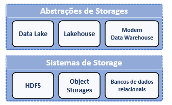
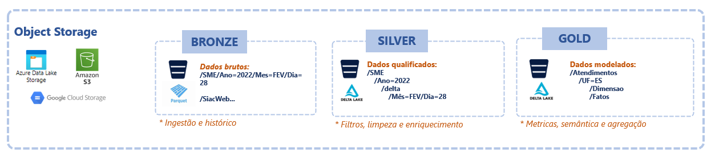

# Fase: Storage
Os storages de dados desempenham um papel central no ciclo de vida de engenharia de dados. Ele é a fundação da arquitetura de uma plataforma, é nele que os dados serão persistidos, transformados e servidos. Os componentes de processamento, as linguagens de consulta, as ferramentas de virtualização de dados irão interagir com o storage o tempo todo para ler e escrever durante no ciclo de vida.

 

# Tipos de Storages de Dados
Os storages de dados podem ser entendidos quanto aos sistemas de storage em si ou quanto às suas abstrações que facilitam a aplicação prática da tecnologia.

No final do dia os engenheiros de dados não acessam diretamente os sistemas de arquivos do storage, as abstrações e os recursos que auxiliam realizar as operações de leitura e escrita de forma mais eficiente.

Sob sistemas de arquivos distribuídos como HDFS, Object Storages ou bancos relacionais MPP são criados os data lakes, lakehouses e os modern data warehouses com os recursos adionais como controles de acesso, políticas de retenção, catalogação, indexação, etc.

Atualemente datalakes ou um lakehouses se baseam em object storages distribuídos (hdfs, amazon s3, azure blob storage) que utilizam  tecnologias abertas e padrões de serialização, formatos de arquivos (parquet, delta, hudi, iceberg) e tipos de compactação abertos. 

Essa abertura, permite que plataformas diferentes compartilhem dados com segurança sem que haja necessidade de configurações de firewall, vpn, vlan e todas as questões de segurança e infraestrutura entre domínios. Arquiteturas de dados modernas hoje são capazes fazer querys diretamente e datasets externos como se fossem parte do storage sem ter necessidade de copiar os dados graças e essa padronização e abertura.

# Object storages
Atualmente os principais storages para dados analíticos são os object storages, entre os mais usados estão o Amazon S3, Azure Blob Storage, Google Cloud Storage. Todos eles tem o benefício de serem baratos e muito flexíveis pois antedem vários tipos de caso de e são capazes de armazenar qualquer tipo de arquivo, e ao mesmo tempo serem integrados com tecnologias de Lakehouse. 

Além disso, operam de forma distribuída e escalável, características essas encontradas nas tecnologias de plataformas de dados modernas como spark, e data warehouses modernos baseados em serviço na cloud.

Um object storage funciona como se fosse um sistema de arquivos, que podemos armazenar qualquer tipo de objeto (txt, csv, json, imagens, vídeos, audio). Uma característica específica é a de não ter um árvore de diretório de arquivos centralizada, cada objeto mantém seus próprios metadados e isso faz com que não haja limitação para a quantidade de arquivos que podem ser gerenciados por um object storage. Outra característica importante é que os objetos armazenados são imutáveis, não podem ser modificados, apenas inseridos, substituídos ou sobrescritos sob a mesma chave que o identifica. Tudo isso aliado ao fato de serem distribuídos e escaláveis verticalmente e horizontalmente, faz dos object storages uma solução que entrega a capacidade de ler e escrever grandes volumes de dados de forma muito eficiente.

Nas arquiteruras modermas temos a separação entre o processamento e o armazenamento dos dados, nesse contexto os object storages entregam a flexibilidade que as diversas tecnologias para processar os dados precisam. Hoje os object storages vêm provando que são ideais para as cargas de trabalho com volume e varidade. Ou seja, eles são capazes de acomodar a demanda de armazenamento de tecnologias de big data que processam dados em escala de petabytes com um ótima performance de escrita e leitura em processamentos em batch.

Existe uma questão quanto a cargas de trabalho que envolvem atualizações frequentes. Object storages em geral não são bons com operações em arquivos pequenos. Eles trabalham melhor com arquivos grandes e baixas taxas de operações por segundo.

Outra questão é o versionamento dos objetos, como eles são imutáveis podemos manter várias versões para a mesma chave de objeto, geralmente cada versão armazena o objeto "full" e não apenas o diferencial entre as versões, esse espaço adicional necessário pode aumentar o custo e precisa ser gerenciado através de políticas de versionamento para remoção automática (quando uma certa quantidade de versões é alcançada ou um determinado tempo passar)

Mas existem formatos e tecnologias que surgiram para lidar com essas questões de atualização em object storages e estão resolvendo bem essas limitações. Veremos com mais detalhes quando entrarmos no assunto formatos em object storages.

## Organização em buckets/containers
Apesar de parecer que os arquivos em um object storage possuem uma estrutura de diretórios, na verdade não existe. Todos os metadados incluisive o caminho completo do arquivo está contido nele mesmo, dessa forma não existe dependências que limitam o volume de arquivos que podem existir, aliado a isso, o fato de terem uma arquitetura distribuída, os object storage são virtualmente ilimitados.

Um fator muito importante para ter um object store funcional é a padronização das camadas (exemplo: bronze/raw, silver/enriched, gold/curated) e a nomenclatura das "pastas' para organizar o data lake e não correr o risco de perder o controle sobre onde os dados estão armazenados.

## Estrutura hierarquia de pastas
Para manter o data lake organizado, crie uma hierarquia lógica de pastas que reflita a estrutura dos dados. Organize as pastas por domínio, projeto, fonte de dados ou qualquer outra categoria relevante. Evite pastas com muitos arquivos soltos.

Veja uma relação de camadas e as sugestões de padrões de nomenclatura:

Camanda | Característica | Exemplo
------- | -------------- | -------
Landing/Transient | Essa camada é usada em processos de ingestão do tipo push, que recebe os dados em formato nativo (qualquer formato) e de imediato são movidos para bronze. Nessa camada as pastas devem ter os nomes das fontes de dados originais. | ./landing/sas;  ./landing/leme; ./lading/bizagi;
Bronze/Raw | Nessa camada os dados estão com o schema original, mas com um formato padrinizado e organizado por nome das fontes e as datas (ano, mês/ dia) da data de processamento. | ./bronze/sas/ano=2024/mes=jan/dia=20240131
Silver/Trusted | Nessa camada os dados estão padronizados com um formato único por tipo mas ainda são classificados pela fonte | ./silver/sas/delta/ano=2024/mes=jan/dia=20240131; silver/sas/parquet/ano=2024/mes=jan/dia=20240131; 
Gold/Refined | Após limpeza e padronização os dados devem estar organizados para consumo e depedendo do projeto os conjuntos de dados devem ter nomes relacionados às áreas de negócio | ./gold/atendimento/uf=es/ano=2024/mes=jan/dia=20240131

## Categorias de persistência
Os dados em um object storage podem ser armazenados em tipos de disco diferentes. Dependendo da frequencia de acesso e do tipo de uso podemos escolher entre as categorias "hot", "warm" ou "cold" para armazenar os dados de forma eficaz e com maior custo benefício dependendo do padrão de utilização.

o tipo hot storage é usado em camadas do data lake que são acessadas com mais frequencia, ele é baseado em discos SSD, mais eficientes e mais caros. Essa opção possui baixa latência, mais facilidade para escalar e leitura e escrita otimizada. Já os tipos warm/cold são mais baratos, são baseados em dicos HDD/Fita. São recomdados para manter dados históricos.

Use o tipo hot nas camadas de transformação e entrega e cold para backup ou armazenamento de longo prazo para dados históricos que precisam ser mantidos por alguma questão de compliance. 

Ainda existem opções de disco para arquivamento de dados, estes são ainda mais baratos, mas fique atento ao tempo necessário para obter os dados que em alguns serviços podem demorar até 12h.

A escolha do tipo certo pode reduzir muito o custo de armazenamento, sem deixar de atender os requisitos para cada tipo de caso de uso.

Característica | Hot | Warm | Cold
-------------- | --- | ---- | ----
Frequência de acesso | Usar em camadas do data lake com acesso frequente como camada bronze/silver/gold | Usar para arquivos de backup com baixa frequencia de acesso | Usar para questões de compliance com muito baixa probabilidade de acesso
Custos de aramazenamento em comparação | Alto | Médio | Baixo
Custos para recuperar os dados | Baixo | Médio | Alto

Utilize os recursos das ferramentas de gestão de ciclo de vida dos object storages para criar políticas automatizadas para armazenar dados antigos ou pouco acessados em categorias com melhor custo benefício.

## Storages para streaming
> escrever sobre as particularidades deste tipo de carga de trabalho e os tipos storages mais apropriados

 

## Formatos de arquivos
Os arquivos de dados podem existir em formatos abertos, conhecidos e tradicionais como csv, json, xml, parquet ou proprietários como .mdf do SQL Server e .dbf o Oracle. Cada formato possui suas característivas vantegens e desevantagens. Alguns são mais estruturados como é o caso do parquet, outros são semi-estrutrados como o csv. Essa diversidade faz seja necessário avaliar cada caso de uso.

## Schema-on-Read e Schema-on-Write
A definição do schema do arquivo, ou seja, a estrutura da tabela e os tipos das colunas podem fazer parte dos metadados do próprio arquivo (schema-on-write) ou ser parte da query que faz a leitura dos dados (schema-on-read). No caso de um arquivo sem schema, como um csv por exemplo, as consultas precisam inferir os tipos, ou inserir as definições como parte da query, para conseguir analisar os dados. Isso não acontece com arquivos parquet por exemplo, esse tipo possui os metadados com os tipos de cada atributo, e ao serem lidos não precisam de explicitar o schema da tabela. Os aquivos como parquet são schema-on-write, ou seja, o arquivo ganha a definição de campos e tipos no momento que são salvos no storage.

Busque utilizar sempre que possível arquivos com schema bem definidos (schema-on-write). Isso padroniza os conjuntos de dados, traz qualidade devido às restrições de tipos e facilita o consumo. Mas se não for possível, aproveite a flexibilidade dos object storages para trabalhar com qualquer tipo de arquivo e os nomes, encoding, caracter de separação e tipos dos campos, somente quando precisar acessar os dados (schema-on-read).

## Armazenamento Colunar
Formatos de arquivos e dados colunares são um grande difencial para os ambientes de analise de dados, em que as operações realizadas sob os dados utilizam grandes blocos de dados e não linhas específicas. Arquivos armazenados de forma colunar permitem que a execução de querys utilizem apenas as colunas necessárias reduzindo drasticamente a quantidade de dados que são lidos. Aliado a isso a compactação faz com que a performance de leitura seja muito superior a arquivos armazenados em blocos de linhas, que por sua vez são melhores em operações que envolvam atualização de linhas específicas de uma tabela.

... _continuar: conceituar, dar exemplos usar imagem_

Muitas vezes pode ser uma boa opção entregar conjuntos de dados desnormalizados para consumo, neste caso no formato colunar a performance acaba  sendo superior.

## Formatos
A escoha dos formatos mais adequados para a sua arquitetura influenciam a forma como o pipeline será desenvolvido e as tecnologias que serão usadas tanto para processamento quanto para consumo dos dados. O mais importante é padronizar o uso de um formato cada caso de uso e camada do Lakehouse. Hoje os mais usados em arquiteturas de Lakehouse são  (Delta Lake, Iceberg, Hudi), porém se for escolhido trabalhar com o Spark é recomendado o uso de Delta, pois é um formato criado pela mesma empresa que criou o Spark e possui melhor performance e compatibilidade.

Os formatos Delta, Iceberg e Hudi trazem além do formato otimizado para análise de dados, uma série de features que adicionam as características ACID de bancos de dados tradicionais aos data lakes dessa forma criando os recursos necessário para implantação de um Lakehouse.

O formato parquet desempenha um papel central neste conjunto de formatos para Lakehouses. É com base nele que são criadas as abstrações que entregam as características ACID que existem nos Lakehouses que usam DELTA, HUDI, ICEBERG como formato.

## Comparação de formatos em Lakehouses
Vamos fazer uma comparação dos formatos Delta Lake, Apache Hubi e Iceberg, por serem as principais tecnologias com formatos para arquiteturas baseadas em Lakehouse. Na verdade esses produtos não são apenas formatos, eles adionam as capacidades de um data warehouse aos data lakes.

Obs: buscando unificar e criar interoperabilidade entre estes formatos (princípio de todos estes projetos) foram criados:

- Uniform: https://learn.microsoft.com/pt-br/azure/databricks/delta/uniform
- OneTable: https://www.onetable.dev/

 

### Principais funcionalidades

Funcionalidade | DELTA | ICEBERG | HUDI 
-------------- | ----- | ------- | ----
Open source iniciado pelo Databrics https://delta.io/ | Open source iniciado pelo Netflix https://iceberg.apache.org/ | Open source iniciado pelo Uber https://hudi.apache.org/
Suporte a transações ACID | Sim | Sim | Sim
Copy-On-Write: Ao inserir dados cria uma cópia grantindo consistêcia, isolamento e imutabilidade  | Sim | Sim | Sim
Merge-On-Write: As inserções são aplicadas ou mescladas com os dados originais evitando reescrita completa | Não | Não | Sim
Time travel: consultar versões anteriores de um registro |  Sim | Sim | Sim
Primary Keys: chaves primárias nas tabelas gerenciadas | Não | Não | Sim
Estatísticas: analisa estatísticas das tabelas para obter performance | Sim | Sim | Sim
Deduplicação: inserir dados repetidos sem gerar duplicidades | Somente com comando Merge | Somente com comando Merge | Sim, nativo em todo tipo de escrita
Limpeza: versão anteriores dos dados históricos são automaticamente removidos | Operação manual "VACUM" | Operação manual "expireSnapshots" | Automático
Schema Evolution: adapta o schema das tabelas para acomodar as mudanças ao longo do tempo | Sim | Sim | Sim
Validação de qualidade dos dados: permite fazer checagem na qualidade dos dados ? | Sim, NOT NULL, CHECK | Não | Sim
Snapshot: permite salvar uma versão da tabela e restaurar | Sim | Não | Sim

 

### Integrações com outros componentes 

Integrações    | DELTA | ICEBERG | HUDI 
-------------- | ----- | ------- | ----
Apache Spark | Sim | Sim | Sim
AWS Redshift | Sim | Não | Sim
Google BigQuery | Não | Sim | Sim 
Google DataProc | Sim | Sim | Sim
Azure Synapse | Sim | Não | Sim
Databricks | Sim | Sim | Sim
Snowflake | Sim | Sim | Não
Presto | Somente leitura | Leitura e Escrita | Somente leitura
DBT | Sim | Não | Sim
Kafka | Sim | Não | Sim
ClickHouse | Sim | Não | Sim

## Delta Lake
O que é? É um formato, uma camada de abstração de um formato, um framework com conjunto de libs, uma tabela?

Após o surgimento do Spark começou a surgir a necesside criar um formato otimizado, com recursos adionais além do que até então era utilizado no caso o formato parquet. Então em 2019 da empresa Databrics criou o Delta Lake, uma camada de storage, engine de para armazenar dados em data lakes, que traz uma série de feautures adicionais, como time travel e propriedades ACID.

Spark casa muito bem com delta, pela facilidade e performance para se fazer o offload da memória para o storage

Mas para trabalhar com esse formato não é necessário usar o spark, o delta por ser um padrão aberto pode ser processado por outras engines, por exemplo pandas.

<!-- - Sugestão de criar particionamento quando a tabela estiver acima de 1TB
- Criado pensando na integração com o spark.
- Traz a opção de trabalhar com SQL (SELECT, INSERT, UPDATE, MERGE tudo que um banco relacional tem), PySpark (diversidade)
- Formato parquet
- O spark consegue conversar bem com todos os formatos, mais é mais alinhado com o Delta (mesma fabricante) 
- Hidden Partitioning (não precisa dizer o que precisa particionar)

> recomendações
- Quanto mais arquivos mais lento a leitura - arquivos no tamanho certo (pequenos demais - muito list ou grandes demais - acessando mesmo o local sempre paralelismo) 
- cada arquivo tem que ser aberto listadop o que demora. O custo maior está no list, abertura leitura e fechamento
- pra resolver compartação de arquivos
- atividades de  manutenção arquovos oordenados -->

## Iceberg

https://www.thoughtworks.com/en-es/radar/platforms/apache-iceberg

<!-- - Formato de arquivo para implantação de lakehouse
- Mais possibilidade de customizações/otimizações do que delta (tabelas gigantes acima de 10 TB)
- Criado pensando em abstrações que permitem outras engines podem se conectar, camada extra de abstrações  
- Expressões com SQL (SELECT, INSERT, UPDATE, MERGE tudo que um banco relacional tem)
- Evolução de Schema (adaptação a mudamças de schema e não falha o pipeline) 
- Hidden Partitioning (não precisa dizer o que precisa particionar) entende o que fazer auto
- Timetravel e rollback
- Lakehouses são imutaveis, novas versões dos dados
- dois tipos de arquivos (delete files/puffin files) qualquer tipo de arquivo não apenas parquet - parquet, orc, avro (melhor em streaming) - tabelas grandes para query (ORC), default (parquet)- atende casos de uso específicos no mesmo lakehouse format - escolhe o tipo par cada tabela "file format agnostic" -->

# Data Sharing
É um recurso que nos permite compartilhar ou incorporar fontes de dados de storages remotos ou internos como parte do seu lakehouse, com controle de acesso em objetos, pastas ou buckets/containes específicos do data lake.

Isso traz simplicidade e evita a replicação de dados sem controle dentro da empresa, além disso, abre a possibildade de compartilhamento entre unidades independentes ou empresas parceiras.

O fato de não ter mover grandes quantidade de dados e conseguir incorporar nas querys tabelas externas com segurança e performance, faz com que a feature data sharing seja ideal para o modelo federado do Sebrae, onde cada unidade pode atuar de forma independente, com arquiteturas distintas e mesmo assim compartilhar seus produtos de dados como recurso que pode ser gerenciado e governado por um repositório central unificado. Esse compartilhamento traz agilidade para o desenvolvimento dos pipelines de atualização pois evita a necessidade de sincronização dos pipelines externos e internos ao mesmo tempo mantém a responsabilidade de quem é o dono do conjunto de dados, um dos conceitos centrais do Data Mesh, que veremos mais a frente.

<!-- O conceito de data sharing consite em compartilhar de forma segura conjuntos de dados entre plataformas heterogêneas, independentes. Esse tipo de acesso a dados realizado entre empresas ganhou força com o uso de object storages que entregam controle de acesso e um permissionamento refinado permitindo acesso segura pela internet através do protocolos próprios que rodam sob o http sem ter que se preocupar com detalhes como acesso a rede corporativa para chegar até os servidores de bancos de dados. Além disso, dentro da própria empresa o data sharing permite que unidades tenham seus dados compartilhados de forma seletiva, garantindo a descetralização da produção e do consumo. -->

 