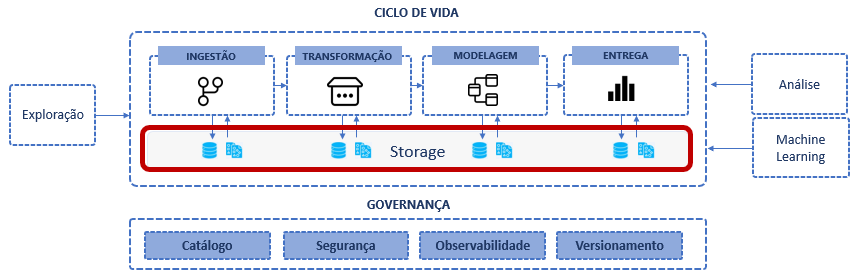

# Fase: Storage
Os storages de dados desempenham um papel central no ciclo de vida de engenharia de dados. Ele é a fundação da arquitetura de uma plataforma, é nele que os dados serão persistidos, transformados e servidos. Os componentes de transformação, as linguagens de consulta irão interagir com o storage o tempo todo para ler e escrever os dados a medida que evoluem no ciclo de vida e ganham novas versões.

# Tipos de Storages de Dados
Os storages de dados podem ser quanto aos sistemas de storage em si e quanto às suas abstrações que facilitam a aplicação prática da tecnologia.

Na prática os engenheiros de dados não acessam diretamente os sistemas de arquivos do storage, eles usam as tecnologias que abstraem e trazem recursos que auxiliam realizar as operações de leitura e escrita de forma mais eficiente.

Criar um datalake ou um lakehouse envolve escolher o sistema de arquivos distribuído por exemplo (hdfs, amazon s3, azure blob storage) com seus respectivos padrões de serialização, formatos de arquivos (parquet, delta, hudi, iceberg) e tipos de compactação.

# Hot Warm Cold
https://www.ctera.com/company/blog/differences-hot-warm-cold-file-storage/

# Object storages
Hoje os principais storages para dados analíticos são os object storages, entre os mais usados estão o Amazon S3, Azure Blob Storage, Google Cloud Storage. Todos eles tem o benefício de serem baratos e muito flexíveis pois antedem vários tipos de caso de uso por serem capaz de armazenar qualquer tipo de arquivo e ao mesmo tempo serem integrados com tecnologias de Lakehouse. 

Além disso, funcionam de forma distribuída e podem ter escalabilidade, características encontradas nas tecnologias de plataformas de dados modernas como spark, e data warehouses modernos baseados em serviço na cloud.

Um object storage funciona como se fosse um sistema de arquivos, que podemos armazenar qualquer tipo de objeto (txt, csv, json, imagens, vídeos, audio.). Uma característica dele é que os objetos armazenados são imutáveis, não podem ser modificados, apenas inseridos, substituídos ou removidos. Pelo fato de serem distribuídos e poderem ser escalados verticalmente e horizontalmente, object storages entregam a capacidade de ler e escrever grandes volumes de dados de forma muito eficiente.

As arquiteruras de dados modermas buscam criar uma separação clara entre o processamento e o armazenamento, e os object storages permitem que os engenheiros de dados usem as mais diversas tecnologias para processar os dados, aproveitando toda a flexibilidade de tipos de arquivos que eles podem armazenar e a performance otimizada. Hoje os object storages vêm provando que sãoideais para as cargas de trabalho com volume e varidade. Ou seja, eles são capazes de acomodar a demanda de armazenamento de tecnologias de big data que processam dados em escala de petabytes com um ótima performance de escrita e leitura em processamentos em batch.

Existe uma questão quanto a cargas de trabalho que envolvem atualizações frequentes. Object storages em geral não são bons com operações em arquivos pequenos. Eles trabalham melhor com arquivos grandes e baixas taxas de operações por segundo.

Mas existem formatos e tecnologias que surgiram para lidar com essas questões de atualização em object storages. 

# Organização em buckets/containers
Apensar de parecer que os arquivos em um object storage estão possui uma estrutura de diretórios na verdade não existe. Todos os metadados incluisive o caminho completo do arquivo está contido nele mesmo, dessa forma não existe dependências que limitam a quantidade de arquivos que podem existir, aliado a isso, o fato de terem uma arquitetura distribuída, os object storage são virtualmente ilimitados.

Um fator muito importante para ter um object stora funcional é a padronização das camadas (exemplo: bronze/raw, silver/enriched, gold/curated) e a nomenclatura das "pastas' para organizar o data lake e não correr o risco de perder o controle sobre onde os dados estão armazenados.

## Hierarquia Lógica:

Crie uma hierarquia lógica de pastas que reflita a estrutura dos dados. Organize as pastas por domínio, projeto, fonte de dados ou qualquer outra categoria relevante. Evite pastas planas com muitos arquivos soltos.

Camanda | Característica | Exemplo
------- | -------------- | -------
Landing | Essa camada em processos de ingestão do tipo push recebe os dados em formato nativo e de imediato são movidos para bronze. Nessa camada as pastas devem ter os nomes das fontes de dados. | landing/sas; landing/sas;lading/bizagi
Bronze/Raw | Nessa camada os dados estão ainda no formato nativo e podem estar organizados por nome das fontes e as datas (ano, mês/ dia). | bronze/sas/ano=2024/mes=jan/dia=20240131
Silver/enriched | Nessa camada os dados estão padronizados com um formato único por tipo mas ainda são classificados pela fonte | silver/sas/csv/ano=2024/mes=jan/dia=20240131; silver/sas/parquet/ano=2024/mes=jan/dia=20240131; 
Gold/curated | Após limpeza e padronização os dados devem estar organizados para consumo e depedendo do projeto os conjuntos de dados devem ter nomes relacionados às áreas de negócio | gold/atendimento/uf=es/ano=2024/mes=jan/dia=20240131

### Exemplo

### Dicas de como gerenciar o storage para não perder a governança?
- Use valores exclusivos nos dados para criar hierarquias de pastas. 
- Particione os dados com base em critérios como data, região ou tipo. Isso facilita a recuperação e o processamento seletivo dos dados. 
- Dê nomes descritivos às pastas para que sua função seja clara. Evite abreviações confusas ou códigos não intuitivos. 
- Estabeleça padrões de nomenclatura para consistência. Por exemplo, use “ano-mês-dia” para pastas de dados diários. Defina permissões adequadas para pastas e arquivos. Garanta que apenas usuários autorizados tenham acesso. 
- Mantenha documentação sobre a estrutura das pastas. Descreva o conteúdo de cada pasta e sua finalidade. 
- Monitore o uso das pastas regularmente. Remova dados obsoletos ou desnecessários para evitar acúmulo. 

# Tabela de Features

Feature | Tipo 1 | Tipo 2 
-------| -------- | -----------
blob | x | x 
object | - | x 

Criar um storage com armazenamento centralizado, remover copias, usar compartilhamento, virturalização para não ter que mover. Ex: OneLake

organizar os dados do storage em domínios

#### o armazenamento deve ser hibrido permitir incorporar dados de storages remotos na solução centralizada 
para evitar a replicação de dados sem controle, devemos avaliar a opão de não mover. Em um modelo federado, cada unidade pode apresentar seus dados como recurso e o repositório central pode incorporar ao storage unificado. Se os dados já existem e estão em outras nuvens, eles devem ser acessados em um modelo hibrido como se eles estivesse no storage (shared datasets/ shortcuts). Isso evita a necessidade de sincronização de pipelines
