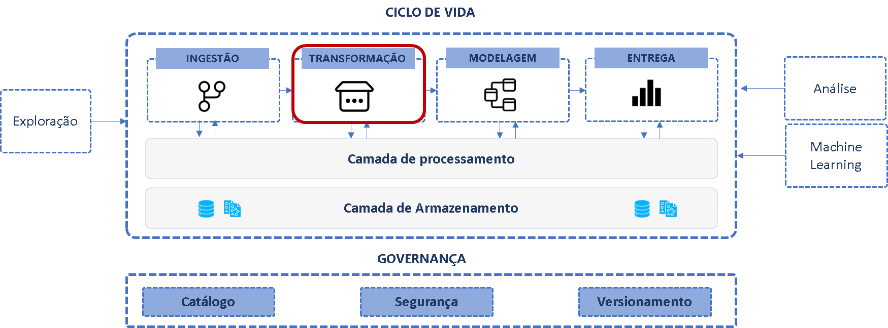
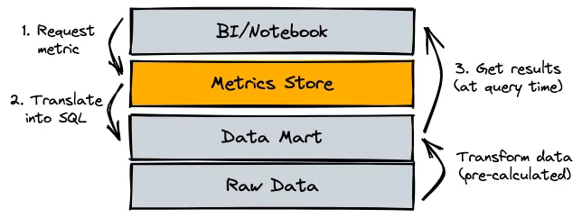

# Fase: Transformação
Até essa fase no ciclo de vida estávamos preocupados unicamente com mover os dados de um lugar para outro e armazenar de forma eficiente. A partir desse momento vamos ver o que é necessário fazer para tranformar os dados em conjuntos de dados fáceis de usar, confiáveis e padronizados.

Começaremos a lapidar os dados brutos para adicionar qualidade. Tudo que foi obtido na fase de ingestão deve passar uma avaliação quanto ao que será necessário (muitas colunas podem ser desconsideradas por não serem necessárias no contexto de análise) ser mantido, dados incompletos, incorretos, duplicados, fora do padrão para consulta serão tratados. É agora, nessa etapa do ciclo de vida que vamos começar a preparação para o consumo. Por exemplo, tabelas que pertencem ao mesmo domínio de dados serão agrupadas em um única tabela tratada. Como uma tabela de produtos cadastrados no CorporeRM, no SAS e no Bizagi.

É importante dizer que na fase de transformação ainda não vamos realizar operações que alterem a granularidade ou modificam significativamente os dados. Ações relacionadas a modelagem como: desnormalização, joins, inclusão de regras de negócio, criação de métricas com colunas calculadas são feitas na etapa seguinte de modelagem. Isso tem uma razão simples, manter as tabelas com os atributos consistentes, permite que sejam usados em projetos diferentes, de formas diferentes e com propósitos diferentes. Um data warehouse modelado com dimensões e fatos geralmente são enviesados para uma análise de negócio específica, enquanto projetos de ciências de dados e machine learning, muitas vezes precisam de dados tratados porém sem o viés de análise. 




# Processamento distribuído
Vamos assumir a partir de agora que os dados estão armazenados e organizados em um storage e que podemos realizar a leitura para iniciar as etapas de processamento para transformação. As tecnologias de processamento de dados entregam uma capacidade de lidar com grandes volumes ao mesmo tempo ser capaz de se adaptar a demanda de processamento.


## Clusters de Spark e Massive Parallel Processing
Nessa fase vamos falar do componente de transformação de dados. Ele é responsável por ler, aplicar transformações e salvar os dados transformados de volta nas camadas do storages (lakehouse ou data warehouses).

Essas tecnologias contam com a capacidade de processamento distribuído e escalável, onde um nó central distribui para os nós de processamento as cargas de trabalho e em seguida coordera e agrupa os resultados. Um dos principais diferenciais dessas engines é a capacidade de lidar com grandes volumes de dados com ótimo custo benefício.

Hoje podemos destacar tecnologias como clusters de Spark, BigQuery, Synapse Analytics. São ferramentas que nos permitem fazer a tranformação dos utilizando linguagens como SQL (SparkSQL), Python (PySpark) em um ambiente integrado.

Os engines de processamento distribuídos distribuen as cargas de transformação entre vários nós, replicando e reunindo os resultados. Isso permite executar de forma simultânea operações e blocos de dados diferentes otimizando muito a performance.


# Tecnologias de qualidade de dados
Garantir que dados precisos e úteis estejam disponíveis para cargas de trabalho downstream BI, analíticas e machine learning .

Manter a qualidade dos dados é uma premissa para o ciclo de vida. A medida que o dado é tratado ele ganha qualidade, o que representa que será validado quanto a consistência dos tipos de acordo com o schema definido, valores nulos, ranges de válidos, outliers, etc. Também são consideradas regras de negócio que caracterizam registro válidos ou não.

As ferramentas de qualidade de dados buscam aumentar eficiência através da automação das regras de verifificação, realizando a checagem de integridade como parte do pipeline de dados.

Essas regras de validação podem estar como cláusulas das tabelas do Lakehouse, que cada registro inserido ou atualizado precisa atender, caso contrário pode ser removido ou marcado automaticamente.

Exemplo usando Delta Live Tables:
<br>
```
#mantém o registro na tabela mas marca como invalido se não atender o critério
@dlt.expect("data valida", "col(“timestamp”) > '2024-01-01'")

#remove o registro da tabelase não atender o critério
@dlt.expect_or_drop("data valida", "col(“timestamp”) > '2024-01-01'")

#várias verificações de qualidade
@dlt.expect_all_or_drop({"total_count": "count > 0", "col(“timestamp”) > '2024-01-01'"})
```

Uma boa prática de arquitetura nessa fase é incluir com uma solução dedicada para transformação de dados como DBT. O DBT traz a possibilidade de reutilizar o código de transformação, aplicar regras de validação de qualidade e documentar e versionar o código.

> falar mais sobre soluções como DBT


# Linguagens de processamento
Para definir qual engine vamos usar para interagir como o lakehouse, temos que considerar os perfis de profissionais e as liguagens mais adequadas para cada tipo de desafio. Os analistas de dados que lidam com a modelagem podem preferir utilizar SQL, SparkSQL. Já cientistas, engenheiros de dos podem ter ncessidade de usar, python, shell.  Saber qual é mais indicada para cada perfil de usuário, ou fase no ciclo de vida é muito importante ao provisionar os componentes nesta fase.


Tabela de linguagem/tipo de tecnologia de transformação para cada perfil

Linguagem | Analista | Cientista | Engenheiro
-------| -------- | --------- | -----------
SQL | ✔️ | ✔️ | -
SparkSQL | ✔️ | ✔️ | -
Python/R | - | ✔️ | ✔️
PySpark | - | ✔️ | ✔️
Bash/Shell | - | - | ✔️
Orquestrador | - | - | ✔️
Data Quality | ✔️ | - | -


## Camada Semântica e Metric Store
A separação da camanda semantica e a criação de uma abstração para as métricas do negócio, permite gerar uma certa independência entre qual ferramenta da analise de dados poderemos usar. Por exemplo. Com soluções de metric store, podemos reduzir a duplicação de regras de negócio em modelos, ou painéis de BI desenvolvidos em ferramentas diferentes. Da mesma forma que a centralização de dados em Lakehouses/Data warehouse busca reduzir a redundância e criar uma única versão da verdade nos dados, os componentes de metric store centralizam a regras de negócio para remover a redundância e permitir que várias tecnologias diferentes de análise de dados possam reutilizar as mesmas regras na camada semântica.

Trabalhar a camada semântica além de ajudar a democratizar o acesso aos dados, facilitar o entendimento de como os dados se relacionam



https://airbyte.com/blog/the-rise-of-the-semantic-layer-metrics-on-the-fly
https://towardsdatascience.com/metrics-store-in-action-76b16a928b97


## Mascaramento de dados 
Uma transformação que deve ser considerada logo no início do pipeline é a ofuscação dos dados sensíveis. O mascaramento deve ser usado somente quando existe a possibilidade de ter que em algum momento usar os dados desmascarados, caso contrário, a anonimização deve ser feita já na ingestão. 

Nas técnicas de mascaramento, as colunas podem ter controle de acesso por usuário onde as permissões permitem ou não ver os dados não mascarados. Esse recurso se chama "dynamic data mask"

## Exemplos códigos comuns de transformação
Listar os comandos mais comuns e as transformações básicas em cada linguagem

Código | SQL | Pandas | PySpark 
------- | --- | ------ | -------
Projeção de atributos de uma tabela | SELECT col1 FROM Tab | df["col1] | df.select(col(col1))
Selecionar todos os atributos da tabela | SELECT * FROM Tab | display(df) | df.show()
Filtragem de dados | SELECT * FROM Tab WHERE Col > 0 | df = df["Col" > 0] | df.filter(df.Col > 0)
Conversão de tipos de dados | SELECT CAST(Col as INT) FROM Tab | df = df.astype({'Col': 'int32'}) | df = df.withColumn("Col", col("Col").cast(IntegerType()))
Renomeando colunas | SELECT Col as Coluna FROM Tab | df.rename(columns={'Col': 'Coluna'}) | df = df.withColumnRenamed("Col", "Coluna")
Agregação de dados | SELECT Col, SUM(Valor) FROM Tab GROUP BY Col | df = df.groupby(['Col']).agg(Valor=('Valor', 'sum')).reset_index() | df = df.select("Col", "Valor").groupby("Col").sum()
Coluna Calculada | SELECT YEAR(Data) as Ano FROM Tab | df['Ano'] = df['Data'].dt.year |  df = df.withColumn("Ano", year(col("Data")))
Junções de tabelas (Joins) | SELECT a.Col, b.Col FROM Tab a INNER JOIN Tab b ON (a.Col = b.Col) | df = pd.merge(df1, df2, on='Col', how='inner') | df = df1.join(df2, on="Col", how="inner")


Como regra geral, para acesso a dados sempre selecione as colunas necessárias e aplique filtros ao rodar uma consulta.

Quanto uma tabela em um Lakehouse é muito grande use sempre estratégias de particionamento para reduzir a quantidade arquivos que são carregados e persistidos. 

Ao ler uma tabela grande no BigQuery, Snowflake ou Spark por exemplo, não temos que se preocupar com o risco de causar o lock do arquivo, pois a leitura é feita em um snapshot enquanto escritas pode ser feitas. Para garantir a consistênca apenas uma escrita pode ser feita ao mesmo tempo.

Updates e deletes em Lakehouses criam arquivos com dados duplicados pois essas tecnologias mantém os arquivos imutáveis, isso faz que com o tempo seja necessário realizar operações de limpeza (vacuum) que removem arquivos com dados versionados. Isso é uma boa prática que libera espaço e economiza recursos. No Snowflake essa operação é automática e não temos controle sobre isso. No Bigquery a limpeza do histórico é feita por padrão em uma janela de 7 dias, já no Databricks os dados são retidos indefinidamente até que manualmente sejam removidos. É importante ficar atentos para criarmos estratégias para manutenção das versões na quantidade correta. Bancos de dados baseados em object storage que são atualizados com operações de upserts com frequência precisam de mais atenção ainda pois podem crescer rapidamente e acumular muitos dados históricos sem necessidade.
