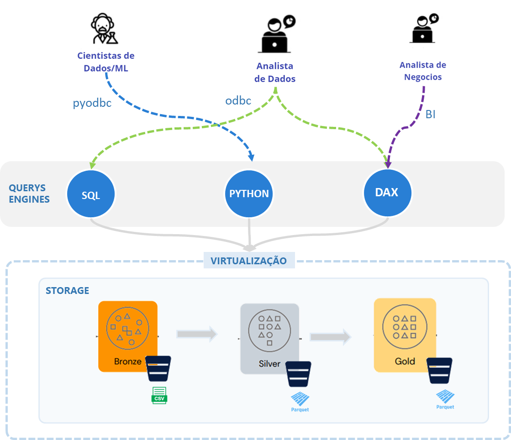

# Fase: Transformação
Até essa fase no ciclo de vida estávamos unicamente com mover os dados de um lugar para outro e armazenar de forma eficiente. A partir desse momento vamos ver o que é necessário fazer para tranformar os dados em conjuntos de dados fáceis de usar, confiáveis e padronizados.

Vamos começar a lapidar os dados brutos para adicionar qualidade. Os dados obtidos na fase de ingestão podem estar incompletos, incorretos, duplicados, fora do padrão para consulta. É agora, nessa etapa do ciclo de vida que vamos começar a preparação para o consumo.

É importante dizer que na fase de transformação ainda não vamos realizar operações que alterem a granularidade ou modificam significativamente os dados. Ações relacionadas a modelagem, desnormalizaçõesm, inclusão de regras de negócio, criação de métricas com colunas calculadas são feitas na etapa seguinte de modelagem. Isso tem uma razão simples. Manter as tabelas com os atributos inalterados, permite que eles sejam usados em projetos diferentes, de formas diferentes e com propósitos diferentes. Um data warehouse modelado com dimensões e fatos geralmente são enviesados para uma análise de negócio enquanto projetos de ciências de dados e machine learning muitas vezes precisam de dados tratados porém sem o viés de análise. 

# Processamento distribuído
Vamos assumir a partir de agora que os dados estão armazenados e organizados em um storage e que podemos realizar a leitura para iniciar as etapas de processamento para transformação...

# Lakehouse Query Engines
Nessa fase vamos falar do componente central que são as query engines, esse é o componente capaz de ler os dados aplicar transformações e salvar os dados transformados de volta nas camadas do storages (lakehouse ou data warehouses).

Essas tecnologias hoje contam com a capacidade de processamento distribuído e escalável, onde um nó central distribui para os nós de processamento as cargas de trabalho e em seguida coordera e agrupa os resultados. Um principais diferenciis das querys engines modernas é essa capacidade de lidar com grandes volumes de dados.

Hoje podemos destacar tecnologias como Spark, BigQuery, Synapse Analytics. São ferramentas que nos permitem fazer a tranformação dos utilizando linguagens como SQL e Python em um ambiente integrado.

# Virtualização de dados e conceito de serverless

 abstraction layer that provides data access across disparate data sources.

> descrever os benefícios como não precisar mover os dados, principalmente em uma arquitetura mesh baseada em domínios, centralizar o acesso aos dados em um unico ponto (oquestrador não precisa ter acesso a todas as fontes, apenas a maquina que virtualiza) 

Integração de bases de dados
SQL executa querys em Oracle, MongoDB, S3 Object storages com usando apenas com T-SQL

Virtualiza a origem
Permitindo o acesso indireto à fonte sem ter que configurar drivers, conectores, regras no client

Simplifica as consultas
Padroniza a linguagem de consulta, independentemente da fonte as querys são em T-SQL

Integração
Permite fazer querys hibridas, com parte do dados externos e parte dos dados no SQL Server

Acesso aos mesmos dados sem necessidade de importar/duplicar para a engine de processamento

Storage unificado de dados agrupados por domínios

# Tecnologias de qualidade de dados
Garantir que dados precisos e úteis estejam disponíveis para cargas de trabalho downstream BI, analíticas e machine learning .

Manter a qualidade dos dados é uma premissa para o ciclo de vida. A medida que o dado é tratado ele ganha qualidade, o que representa que será validado quanto a consistência dos tipos de acordo com o schema definido, valores nulos, ranges de válidos, outliers, etc. Também são consideradas regras de negócio que caracterizam registro válidos ou não.

As ferramentas de qualidade de dados buscam aumentar eficiência através da automação das regras de vefirificação realizando a checagem de integridade como parte do pipeline de dados.

# Linguagens de processamento
Definir qual engine vai interagir como o lakehouse, 
de dados SQL, Python, SparkSQL, quando usar, qual é mais indicada para cada perfil de usuário, ou fase no ciclo de vida

Tabela indicativo de linguagem/ tipo de tecnologia de transformação para cada perfil

Linguagem | Analista | Cientista | Engenheiro
-------| -------- | --------- | -----------
SQL | x | x | x
Python | - | x | x
R | - | x | x
PySpark | - | x | x
SparkSQL | x | x | -
Bash | - | - | -

## Camada Semântica e Metric Store
A separação da camanda semantica e a criação de uma abstração para as métricas permite a independencia de qual ferramenta da analise de dados será usada 

https://airbyte.com/blog/the-rise-of-the-semantic-layer-metrics-on-the-fly
https://towardsdatascience.com/metrics-store-in-action-76b16a928b97

## Mascaramento de dados 
As colunas podem ser consultadas mas em tempo de execução dependendo do usuário e permissões os valores são mascarados. Esse recurso se chama "dynamic data mask"

## Exemplos códigos comuns de transformação
Listar os comandos mais comuns e as transformações básicas em cada linguagem

Código | SQL | Pandas | PySpark 
------- | --- | ------ | -------
Projeção de atributos de uma tabela | SELECT col1 FROM Tab | df["col1] | df.select(col(col1))
Selecionar todos os atributos da tabela | SELECT * FROM Tab | display(df) | df.show()

Como regra geral, para acesso a dados sempre selecione as colunas necessárias e aplique filtros ao rodar uma consulta.

Quanto uma tabela em um Lakehouse é muito grande use sempre estratégias de particionamento para reduzir a quantidade arquivos que são carregados. 

Ao ler uma tabela grande no BigQuery, Snowflake ou Spark por exemplo, não existe o risco de causar o lock do arquivo, pois a leitura é feita em um snapshot enquanto escritas pode ser feitas. Para garantir a consistênca apenas uma escrita pode ser feita ao mesmo tempo.

Updates e deletes em Lakehouses criam arquivos com dados duplicados pois essas tecnologias mantém os arquivos imutáveis, isso faz que com o tempo seja necessário realizar operações de limpeza (vacuum) que removem arquivos com dados versionados. Isso é uma boa prática que libera espaço e economiza recursos. No Snowflake essa operação é automática e não temos controle sobre isso. No Bigquery a limpeza do histórico é feita por padrão em uma janela de 7 dias, já no Databricks os dados são retidos indefinidamente até que manualmente sejam removidos. É importante ficar atentos para criarmos estratégias para manutenção das versões na quantidade correta. Bancos de dados baseados em object storage que são atualizados com operações de upserts com frequência precisam de mais atenção ainda pois podem crescer rapidamente e acumular muitos dados históricos sem necessidade.
