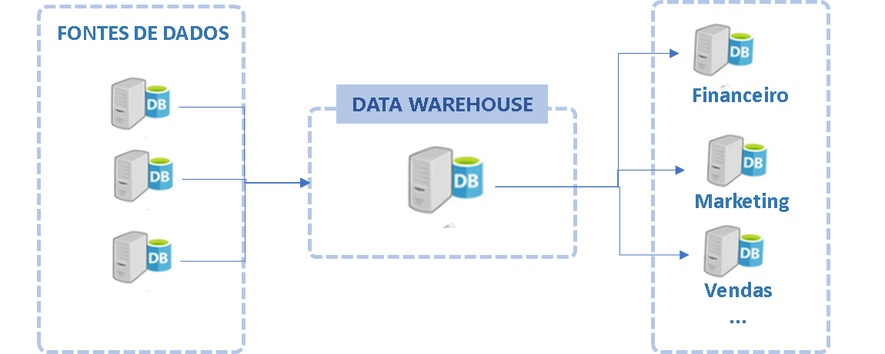

# Fase: Modelagem
Agora é o momento de organizar os dados de forma que seja útil para análise, ou seja, os conjuntos de dados serão modificados para ganhar a nomenclatura do negócio. O objetivo é facilitar ao máximo o consumo. Essa é uma fase crítica para a percepção de valor no ponto de vista do negócio. E agora que o produto de dados começa a ganhar valor para a empresa, pois pode ser consumido por um público maior de analistas de negócio. Um modelo de dados deve estar estruturado para refletir a nomenclatura do negócio e representar os processos da empresa. 

Essa é uma camada onde a lógica que adiciona semântica e simplificação. Os conjuntos de dados são desnormalizados para remover a complexidade do relacionamento entre as tabelas. Nessa fase os dados são mais orientados aos domínios e não matém total relação com a fonte de dados original. Junções entre várias tabelas, concatenação entre atributos, colunas calculadas, agregações, segmentaçõs, novos atributos derivados e muitos outros tipos de processamentos que podem mudar significativamente os dados originais nessa camada.

O objetivo principal agora é preparar os dados para consumo, principalmente por analistas de dados e analistas de negócio. Cientistas de dados também clientes desta camada, mas em geral seus projetos se beneficiam mais de camadas anteriores (bronze, silver) pois os dados estão mais próximos do estado bruto o que possíbilita diferentes combinações e validações de hipóteses não mapeadas. 

Alguns dos motivos para fazer a modelagem dos dados:

Motivo | Descrição
------ | ---------
Semântica | Criar uma camada que faça mais sentido para análise de negócio (as fontes de dados são otimizadas para INSERT e UPDATE)
Fonte única da verdade | Os dados tratados e modelados incorporam as regras e fórmas de cálculos que podem ser usadas por toda a empresa sem gerar duplicidade.
Abstração | Abstrair a complexidade de acesso aos dados. (conectores, drivers, linguagens, etc.) e unir dados de diferentes fontes em um lugar único fácil de acessar
				
São exemplos comuns de operações de modelagem:
Nessa fase são feitos joins com entidades externas podem adicionar features: join de uma localização com as coordenadas, um de-para de uma unidade da empresa uma área de atuação, etc..

Operação | Exemplo de código
-------- | -----------------
Desnornalização | ` df_1 = spark.table("CorporeRM.FLAN") `   ` df_2 = spark.table("CorporeRM.TMOV") `   `df_juncao = df_1.join(df_2, on='IDMOV', how='inner') `   ` df_juncao = df_juncao.elect("COL1", "COl2", "...") `
Dê-para | ` df = df.withColumn("Col1", \ `   ` when(col("Col1") == "Action", "AC") \ `   `.when(col("Col1") == "Adventure", "AD") \ `   `.when(col("Col1").isNull(), "-") \ `   `.otherwise("Genero1_Split")) `
Agregações | ` df = df.groupBy("col1", "col2", "col3", "...") \ `  `.agg(    {"quantidade": "sum", "quantidade": "avg"}) `
Salvar tabela | `df_juncao.write.format("delta").saveAsTable("tabela") `

Diferente da transformação, a modelagem adiciona regras de negócio, semantica para os campos, desnormalização, joins, dê-para, agregações. A modelagem é voltada para simplificação  do schema para a entrega para o negócio.

Um fator importante a ser considerado nessa fase é a granularidade dos dados, em geral trabalhar com uma granularidade mais baixa permite uma análise mais variada, enquanto a escolha de uma granularidade maior pode reduzir o tamanho do conjunto de dados mais pode limitar as possibilidades de análise. Por exemplo, a tabela de atendimentos executados incluindo cada atendimento, com os detalhes do cliente, produto, programa, iniciativa, data. Nesse exemplo a granularidade é o atendimento por dia. 

		

## Escopo
Fronteira entre a camada de qualidade e camada semântica
Filtra qualquer tipo de dados que não precisa ser exposto para análise
A transformação ocorrida na fase anterior não depende de contexto de utilizaçaõ dos dados as transformações buscam trazer integridade e limpeza
Qualidade dos dados
Deduplicação
Parse de atributos
Padronização de formatos
Monitoramento de falhas e incrementos

A fase de modelagem já dependente de caso de uso, altera a essencia do dado de certa forma limita o uso mas enriquece com:
Agregações
Joins / Unions
Dê-para
Métricas e indicadores

# Técnicas e modelagem

### Modelagem dimensional

Os pesquisadores Kimbal e Immon elaboraram padrões de modelagem dimensional que dominam a área de dados a muito tempo. Trata-se dos conceitos de tabelas fato e dimensões.

As tabelas "fato" representam eventos associados a um momento específico no tempo, e um conjunto de medias numéricas que serão analisadas sob várias perspectivas. Geralmente contém um grande número de registros em comparação com as tabelas de dimensão. 

> Uma boa prática recomendada para elaboração de tabelas fato definir a menor granularidade possível.

As tabelas fato não se relacionam diretamente, elas possuem relacionamentos com as tabelas de dimensões, que tem o papel de fornecer contexto, trazer informações detalhadas sobre os eventos das tabelas fato.

Uma boa prática para modelagem de dimensões é buscar o maior grau de desnormalização possível, reunindo todos os atributos relacionados a tabela em uma única tabela, mesmo que isso gere colunas com dados repetidos. 

Por exemplo: uma tabela fato de atendimento, pode ser modelada para armazenar uma linha para cada registro de atendimento, com os códigos de produtos (chave das dimensões) e os repectivos valores (métricas). Já a dimensão de produto pode ser modelada para ter a chave do produto, o nome do produto, e todas as demais características do produto, incluindo as subcategorias e categorias relacionadas.

O sentido do relacionamento entre fato e dimensão é sempre, dimensão propagando filtros na direção das tabelas fato.

As dimensões são formadas muitas vezes por dados consolidados a partir de fontes distindas, por isso outra boa prática importante é sempre usar "surrogate keys", que são as chaves que itendificam o elemento único na dimensão, e as chaves "alternate key" que são as chaves originais do sistema de origem. Com essa técnica podemos compor uma dimensão com elementos de fontes distintas criando o conceito de entidade de domínio que pode ser usada para filtrar dados de várias tabelas fato dando uma visão de difentes processos sob o mesmo ponto de vista. Por exemplo: uma tabela de dimensão de produto ou ter a lista completa de produtos consolidada a partir do sistema ERP, CRM. A mesma tabela pode ser usada para analisar o faturamento e o atendimento na mesma visão consolidada por produto. 

Uma outra forma de modelar os dados, que vem ganhando espaço são as wide-tables (tabelões). As wide-tables são tabelas totalmente desnormalizadas, que reúnem todos os atributos em um único conjunto de dados. Essa técnica facilita o consumo pois remove a necesside de fazer as junções, o que faz com que tenha uma perfornance otimizada em data warehouses e lakehouses modernos. 

### Data Vault
É um método de modelagem com um abordagem diferente, que utiliza as tabelas conhecidas como "tabelas hub", "tabelas link" e "tabelas satelites". A ideia da tabela "hub" é armazenar as chave únicas de negócio das entidades, a "link" manter as chaves que representam os relacionamento entre as "hubs" e as "satelites" aramenar os atributos que descrevem a entidades. 

As tabelas hub devem possuir pelo menos:
- Hash key: a chave primária que é usada para consolidade dados de diferentes sistemas (encriptado usando hash MD5)
- Data de carregamnto: data que o dado foi carregado. As tabelas hub são append-only e essa data serve para identificar a última versão do registro.
- Fonte: Serve para identificar a fonte de origem para rastreamento
- Chave de negócio: identifica de forma única o registro, por exemplo CPF para usuário. Só é possível consolidar diferentes fontes se essa chave for comum, pois ela é usada para criar a hash-key.

As tabelas Link armazenam os relacionamentos entre as chaves de negócio (hash) das tabelas hub. Os relaciomentos entre essas tabelas em geral é de muitos para muitos. Esse tipo de relacionamento traz grande flexibilidade. Para acomodar mudanças no modelo basta adicionar uma nova chave de uma nova hub.

As tabelas satelites são como dimensões, elas presentam os atributos descritovos do modelo. O único atributo obrigatório de uma satélite é a chave de negócio e a data de carregamento, em geral cada satélite possui atributos de uma fonte diferente. Por exemplo. A hub usuário pode ter uma satélite com dados da base "mongodb" com dados do sistema de crm, e outra satélite com dados do MSSQL com dados do sistema de RH. Dessa forma para acomodar novos atributos a uma hub basta incluir uma nova satélite. Essa padrão de modelagem é muito flexível, adaptado para mudanças e ideal para integração de bases entre vários sistemas.

Os pontos negativos são que esse padrão é mais complexo em comparação com dimensional, até mesmo as querys mais simples envolvem mapear vários relacionamentos. Além diso esse é um padrão "append-only", ou seja, os dados são adicionados a cada processamento e nunca é feito merge, isso faz com que a base cresca rapidamente a necessidade de armazenamento e ao longo do tempo pode ser significativa. 

# Camada semântica
Conceito de desacoplamento da camada semantica empresa Transform comprada pelo dbt 
dbt Semantic Layer, Enabling Greater Consistency Across Analytics Tools

https://github.com/dbt-labs/metricflow

https://www.getdbt.com/blog/dbt-acquisition-transform

https://www.prnewswire.com/news-releases/dbt-labs-launches-the-dbt-semantic-layer-enabling-greater-consistency-across-analytics-tools-301652226.html

## Entradas
Os dados transformados, geralmente disponíveis na camada "silver" são usados como entrada nessa etapa. Além disso, é necessário o envolvmento da área de negócio desde o início da modelagem, para que sejam adicionados os viéses de análise e os dados sejam desnormalizados e as métricas seja criadas de acordo com a necessidade.

## Saídas
A simplificação obtida através da modelagem nessa fase do ciclo de vida, transforma os conjuntos de dados tratados em produtos, prontos para o usuário final consumir através de ferramentas de análise de dados. O objetivo dessa fase foi alcançado quando não há necessidade de conhecer os aspactos das fontes de dados originais para conseguir fazer análise dos dados e os dados estão prontos para consumo das ferramentas de visualização.