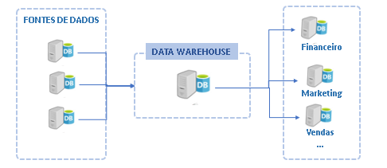

# Fase: Modelagem
Agora é o momento de organizar os dados de forma que seja útil para análise, ou seja, os conjuntos de dados serão modificados para ganhar a nomenclatura do negócio. O objetivo é facilitar ao máximo o consumo. Essa é uma fase crítica para a percepção de valor no ponto de vista do negócio. E agora que o produto de dados começa a ganhar valor para a empresa, pois pode ser consumido por um público maior de analistas de negócio. Um modelo de dados deve estar estruturado para refletir a nomenclatura do negócio e representar os processos da empresa. 

Essa é uma camada onde a lógica que adiciona semântica e simplificação. Os conjuntos de dados são desnormalizados para remover a complexidade do relacionamento entre as tabelas. Nessa fase os dados são mais orientados aos domínios e não matém total relação com a fonte de dados original. Junções entre várias tabelas, concatenação entre atributos, colunas calculadas, agregações, segmentaçõs, novos atributos derivados e muitos outros tipos de processamentos que podem mudar significativamente os dados originais nessa camada.

O objetivo principal agora é preparar os dados para consumo, principalmente por analistas de dados e analistas de negócio. Cientistas de dados também clientes desta camada, mas em geral seus projetos se beneficiam mais de camadas anteriores (bronze, silver) pois os dados estão mais próximos do estado bruto o que possíbilita diferentes combinações e validações de hipóteses não mapeadas. 

Alguns dos motivos para fazer a modelagem dos dados:

Motivo | Descrição
------ | ---------
Semântica | Criar uma camada que faça mais sentido para análise de negócio (as fontes de dados são otimizadas para INSERT e UPDATE)
Fonte única da verdade | Os dados tratados e modelados incorporam as regras e fórmas de cálculos que podem ser usadas por toda a empresa sem gerar duplicidade.
Abstração | Abstrair a complexidade de acesso aos dados. (conectores, drivers, linguagens, etc.) e unir dados de diferentes fontes em um lugar único fácil de acessar
				
São exemplos comuns de operações de modelagem:
Nessa fase são feitos joins com entidades externas podem adicionar features: join de uma localização com as coordenadas, um de-para de uma unidade da empresa uma área de atuação, etc..

Operação | Exemplo de código
-------- | -----------------
Desnornalização | ` df_1 = spark.table("CorporeRM.FLAN") `   ` df_2 = spark.table("CorporeRM.TMOV") `   `df_juncao = df_1.join(df_2, on='IDMOV', how='inner') `   ` df_juncao = df_juncao.elect("COL1", "COl2", "...") `
Dê-para | ` df = df.withColumn("Col1", \ `   ` when(col("Col1") == "Action", "AC") \ `   `.when(col("Col1") == "Adventure", "AD") \ `   `.when(col("Col1").isNull(), "-") \ `   `.otherwise("Genero1_Split")) `
Agregações | ` df = df.groupBy("col1", "col2", "col3", "...") \ `  `.agg(    {"quantidade": "sum", "quantidade": "avg"}) `
Salvar tabela | `df_juncao.write.format("delta").saveAsTable("tabela") `

Diferente da transformação, a modelagem adiciona regras de negócio, semantica para os campos, desnormalização, joins, dê-para, agregações. A modelagem é voltada para simplificação  do schema para a entrega para o negócio.

Um fator importante a ser considerado nessa fase é a granularidade dos dados, em geral trabalhar com uma granularidade mais baixa permite uma análise mais variada, enquanto a escolha de uma granularidade maior pode reduzir o tamanho do conjunto de dados mais pode limitar as possibilidades de análise. Por exemplo, a tabela de atendimentos executados incluindo cada atendimento, com os detalhes do cliente, produto, programa, iniciativa, data. Nesse exemplo a granularidade é o atendimento por dia. 

		

## Escopo
Fronteira entre a camada de qualidade e camada semântica
Filtra qualquer tipo de dados que não precisa ser exposto para análise
A transformação ocorrida na fase anterior não depende de contexto de utilizaçaõ dos dados as transformações buscam trazer integridade e limpeza
Qualidade dos dados
Deduplicação
Parse de atributos
Padronização de formatos
Monitoramento de falhas e incrementos

A fase de modelagem já dependente de caso de uso, altera a essencia do dado de certa forma limita o uso mas enriquece com:
Agregações
Joins / Unions
Dê-para
Métricas e indicadores

# Técnicas de Modelagem
O criador dos conceitos de data warehouse, Kimbal/Immon trouxeram os conceito dos de modelagem dimensional que são muito presentes na maioria das inicitivas de dados. 

O objetivo da modelagem dimensional é separar as fontes de dados originais das bases analíticas e fazer a conciliação de fontes diferentes em um único repositório. Ou seja, realizar a integração de dados.

#### Fatos e Dimensões
Foco na desnormalização das tabelas operacionais deu origem aos conceitos de tabelas fato e dimensões. 

- Data Vault

# Camada semantica
Conceito de desacoplamento da camada semantica empresa Transform comprada pelo dbt 
dbt Semantic Layer, Enabling Greater Consistency Across Analytics Tools

https://github.com/dbt-labs/metricflow

https://www.getdbt.com/blog/dbt-acquisition-transform

https://www.prnewswire.com/news-releases/dbt-labs-launches-the-dbt-semantic-layer-enabling-greater-consistency-across-analytics-tools-301652226.html

## Entradas
Os dados transformados, geralmente disponíveis na camada "silver" são usados como entrada nessa etapa. Além disso, é necessário o envolvmento da área de negócio desde o início da modelagem, para que sejam adicionados os viéses de análise e os dados sejam desnormalizados e as métricas seja criadas de acordo com a necessidade.

## Saídas
A simplificação obtida através da modelagem nessa fase do ciclo de vida, transforma os conjuntos de dados tratados em produtos, prontos para o usuário final consumir através de ferramentas de análise de dados. O objetivo dessa fase foi alcançado quando não há necessidade de conhecer os aspactos das fontes de dados originais para conseguir fazer análise dos dados e os dados estão prontos para consumo das ferramentas de visualização.