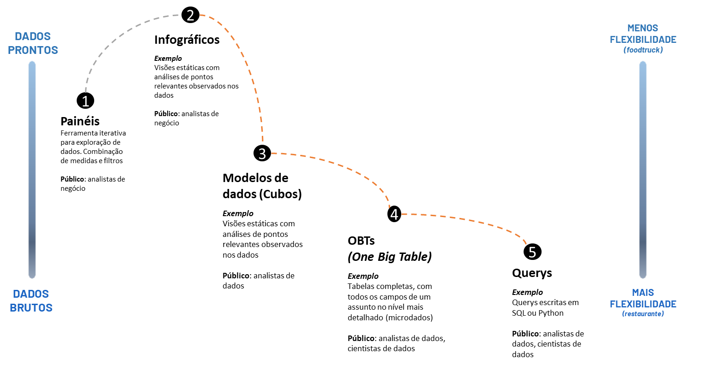

# Fase: Entrega
Essa é a fase final do pipeline de dados, é o momento em que o dado está "pronto" para análise. O mais importante aqui é que os produtos de dados atendam às diferentes necessidades dos usuários e tenham como principal característica a qualidade. Além disso, devemos garantir que o que é entregue seja reutilizável e atenda a vários casos de uso e que a empresa pode confiar.

Produzir dados como produto de alta qualidade é o objetivo principal de qualquer plataforma de dados, portanto essa fase é o final dessa processo de transformação de dados em produto. 

A ideia é que as equipes data engineering apliquem o pensamento do produto aos dados selecionados: os ativos de dados são seus produtos, e o cientista de dados, engenheiros de ML e BI ou quaisquer outras equipes de negócios que consomem dados são seus clientes. Esses clientes devem ser capazes de descobrir, abordar e criar valor a partir desses dados-como-produtos por meio de uma experiência de autoatendimento sem a intervenção das equipes de dados especializadas.

Publique produtos de dados semanticamente consistentes em toda a empresa
Um data lake geralmente contém dados de diferentes sistemas de origem. Às vezes, esses sistemas nomeiam o mesmo conceito de maneira diferente (como cliente x account) ou significam conceitos diferentes pelo mesmo identificador. Para que os usuários de negócios combinem facilmente esses conjuntos de dados de maneira significativa, os dados devem ser homogêneos em todas as fontes para serem semanticamente consistentes. Além disso, para que alguns dados sejam valiosos para análise, as regras internas de negócios devem ser aplicadas corretamente, como o reconhecimento de receita. Para garantir que todos os usuários estejam usando os dados interpretados corretamente,

Nem só de dashboard vide a análise de dados, o analista de dados pode e deve ir muito além de criar gráficos, ele deve contar histórias, contextualizar, identificar correlações, fazer análise de impacto. 

Pode utilizar modelos treinandos ou treinar seu próprios modelos. É importante a arquitetura estar preparada para se integrar com soluções de gestão de modelos como mlflow que gerencia os experimentos e registro dos modelos de forma que o analista possa usar como parte dos scritps sql, usando um conjunto de colunas para submentar a inferencia de um modelo.

- a descoberta de onde os dados estão e  quais os assuntos
- metadados que auxiliam a definição de contexto

# Tipos de entrega

Podemos classificar de acordo com o grau de flexibilidade e complexidade. Entregas em que os dados estão mais preparados, onde foram manipulados para obter a visão específica atender um caso de uso específo são classificadas como menos flexível porém mais pronto (menor esforço e necessidade de manipulação). Já os produtos que são entregues com alto grau de flexibilidade, podem ser usados com um propósito mais geral, podem atender a mais casos de uso (análise descritiva, prescritiva, preditiva) porém demandam mais esforço e preparação para resolver o problema. É como a analogia de um foodtruck vs um restaurante, no foodtruck os ingredientes (dados) estão pré-processados, e são apenas aqueles contidos nas poucas possibilidades de preparação planejadas. Já em um restaurante os ingredientes estão em seu estado mais bruto, há disponibilidade de realizar combinações não planejadas, que podem vir de um pedido de um cliente.

Caso de uso | Siver | Gold | DW | Cubo | Painel | Obs
------------| ----- | ---- | -- | ---- | ------ | ---
Investigação de hipótese e correlação | x | x | x | - | - | -
Desenvolvimento de modelo estatísco | x | x | x | - | - | Dados nas camadas integração frameworks de ml
Análise ad-hoc | - | - | x | x | - | Dados modelados ideal para consulta SQL e ferramentas de viz
Acompanhamento de indicadores | - | - | - | - | x | -

# Boas práticas
Dados brutos ou modelados, com catálogo e segurança, dados sensíveis separados, alternativas para consumo direto do data lake ou através de data warehouse dependendo do caso de uso. Ambiente para publicação e monitoramento de modelos estatísticos de ML

3-Entrega: Painéis de BI com modelos OLAP criados para cada painel

3-Entrega: Dados modelados que podem ser usados por diferentes tipos de tecnologias de análise ou ML

3-Entrega: Dados brutos ou modelados, com catálogo e segurança, dados sensíveis separados, alternativas para consumo direto do data lake ou através de data warehouse dependendo do caso de uso. Ambiente para publicação e monitoramento de modelos estatísticos de ML

# para analise
Nem só de dashbord vive um empresa 
não criar paineis com filtros implicitos
prototipar no excel antes de criar dashboards
principios gestapo

# para ml
Cientista de dados deve pegar da camada limpa de Gold 

> Também é importante fornecer dados  consistentes com significados para que os consumidores possam entender facilmente e combinar corretamente diferentes conjuntos de dados. Além disso, todos os dados devem ser facilmente descobertos e acessíveis aos consumidores por meio de um catálogo central com metadados e linhagem de dados devidamente selecionados.

# storytelling
gestalt

# Recomendações do guia
Código | Recomendação | Descrição
------ | ------------ | ---------
R01-Entrega | A empresa deve ter uma infraestrutura de dados sólida e madura antes de focar em iniciativas de ML | A produtividade de cientistas de dados depende da disponibilidade de dados, da qualidade, da capacidade de lidar com volumes grandes, da infraestrutura de orquestração de pipelines para produtizar os modelos estatísticos. Tudo isso depende de infraestrutura previamente estabelecida.
R02-Entrega | Exponha apenas os dados gerados pelas fontes originais | Caso haja sobreposição de fontes de dados, identifique a aplicação responsável pelo dado original, não gere sobreposições.
R03-Entrega | Evite criar dê-para na fase de entrega para contornar deficiências na modelagem | Qualquer dê-para que não possa ser feito usando os dados das fontes oficiais deve ser feito na camada de modelagem. Ao utilizar em um painel, dê transparência. Em geral, evite pois dê-para são fontes de dúvidas pois são difíceis de ser validados na fontes de dados originais.
R04-Entrega | Todos os dados expostos como produto devem ter um proprietário identificado | Saber quem é a pessoal que responde pela qualidade de um conjunto de dados adiciona valor, confiabilidade e contexto para quem consome.
R05-Entrega | Controle de acesso em níveis (workspace, tabela, coluna, linha) | Os dados devem ser expostos com diferentes níveis de acordo com a necessidade. Teve ser possível ter um controle mult-tenant de acesso.
R06-Modelagem | os consumidores nunca podem ter permissões para inserir ou alterar os dados | Os consumidores pode usar os dados alterados mas devem exportá-los para outros contexto. No caso de ETL reverso, onde uma aplicação consome dados analíticos como entreda, as mudanças estão fora do escopo da arquitetura.
R07-Entrega | Substitua os dados confidenciais por tokens e aplique máscaramento em tempo de execução [dynamic data masking](https://oreil.ly/sZ371)
R08-Entrega | Organize os ativos de dados um catálogo unificado orientado a domínios e permita que seja possível rastrear a linhagem dos dados até a origem, dando visibilidade de onde os dados estão vindo, quais outros conjuntos de dados foram usados para criá-lo, quem o criou e quando, quais transformações foram executadas. | Isso traz transparência, auxilia na descoberta e democratização dos dados e auxilia na solução de problemas e análise de impacto de mudanças.
R09-Entrega | Como gerenciar os acessos e compartilhamento de dados em um modelo descentralizado/federado? | Centralizar o controle de acesso: Mesmo que os dados estejam em arquiteturas separadas, em um modelo federado, busque usar padrões de armazenamento abertos de forma que seja possível criar catálogos com controle de acceso centralizado mantendo uma governança unificada.
R10-Entrega | Fornecer dados semanticamente consistentes para que os consumidores possam entender facilmente e combinar corretamente diferentes conjuntos de dados. Além disso, todos os dados devem ser facilmente descobertos e acessíveis aos consumidores por meio de um catálogo central com metadados e linhagem de dados devidamente selecionados.
R11-Entrega | Busque sempre criar experiências de autoatendimento para solicitação de acessos aos produtos de dados