Exemplo End-to-End de como transformar dados brutos bruto em um modelo semântico pronto para consumo.

## 1: Mapear o problema de negócio
Ter clareza da necessidade que o projeto de dados vai atecar e o valor que irá gerar.

**Objetivo**: obter o histórico da base da receita para monitorar as mudanças de porte e a evolução da base de empresas de subconjuntos específicos de CNAEs para comprovar a hipótese de impacto na atuação do Sebrae

## 2: Fazer a ingestão
A ingestão dos dados é realizada através do mapeamento da tabela da fonte de dados o Lakehouse no destino no ambiente de dados e da escolha de qual é o método. Neste momento podem escolher a estratégia e como vamos lidar com a questão da evolução do schemma para acomodar de forma dinamica as alterações

Os dados são importando com arquivos parquet tabelas gerenciadas no formato Delta no Lakehouse da camada Bronze através de uma aplicação com conectores específicos para a fonte de dados de origem SQL Server. Nesse exemplo foi usado o Azure Data Factory.

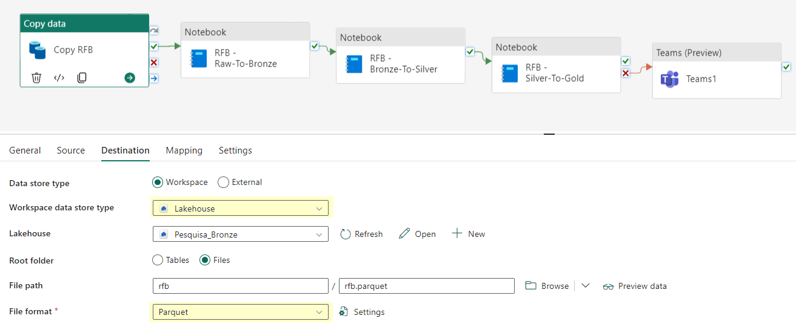

Após fazer a ingestão os dados são transfomados no formato delta para termos performance e controle de transação nas etapas subsequentes.

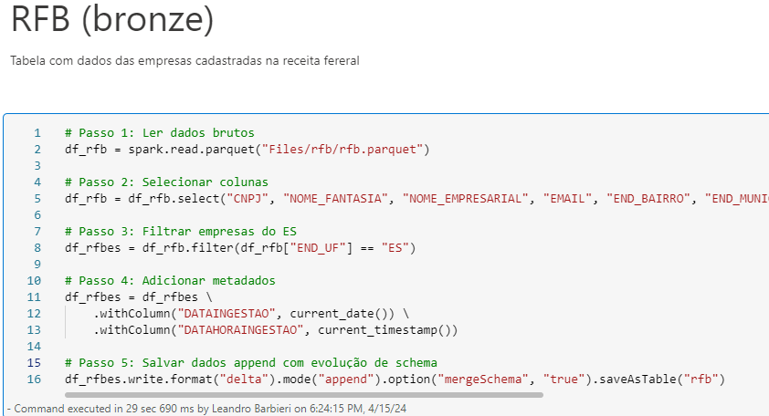

Nessa camada a ingestão está sendo feita com o método de append-only e com a evolução de schema para acomodar mudanças de schema ao longo do tempo sem comprometer a ingestão futura

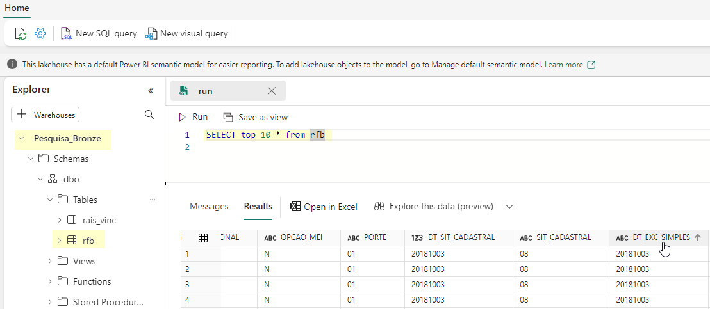

## 3: Tranformar os dados 

A primeira fase do ciclo de vida que envolve transformação é a camada silver, nesse momento vamos nos concentrar em preparar os dados das tabelas da camada bronze adicionando qualidade sem alterar as características da tabela. O objetivo é deixar a tabela pronta para ser usada em multiplos casos de uso sem alterar a granularidade.

Camada Silver

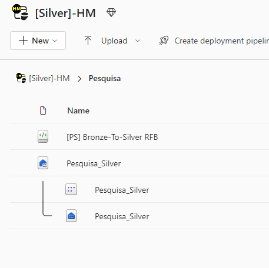

- Definir schema padrão para os campos e salvar em delta gerenciados;
- Aplicar validação de valores nulos ou inconsistentes para aumentar a qualidade
- Fazer transformações, tratamentos, dê-para com regras de negócios genéricas e válidas em vários contextos (não fazer joins ou alterar novas de campos)
- Deduplicar registros repetidos, mascarar quando tiver necessidade ou remover colunas sem utilidade para análise

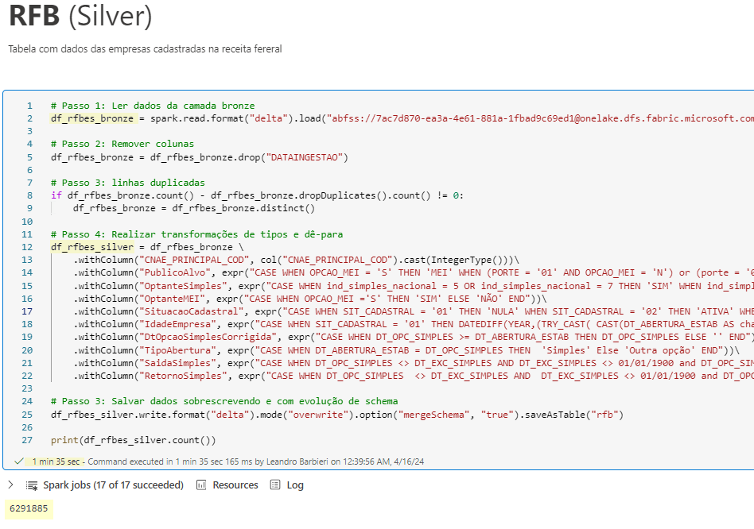

Dados tratados na camada silver

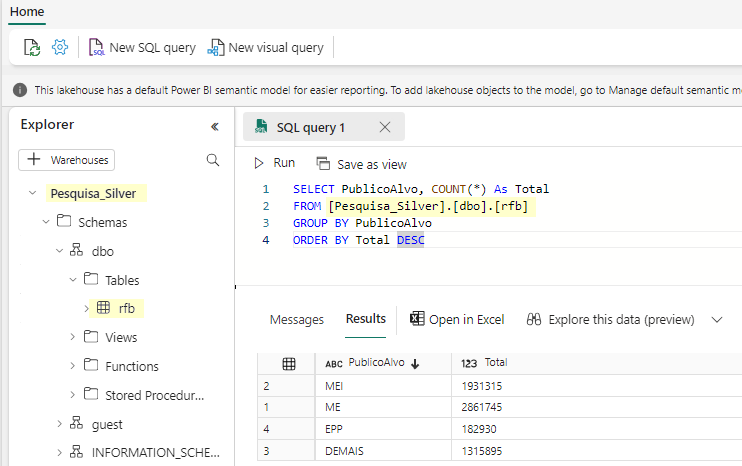

Agora vamos fazer as manipulações necessárias para fazer a entrega. Nessa camada são possível alterações na granularidade, joins e qualquer adaptação que altere a entidade com o objetivo de atender uma necessidade de negócio

Lakehouse camada gold

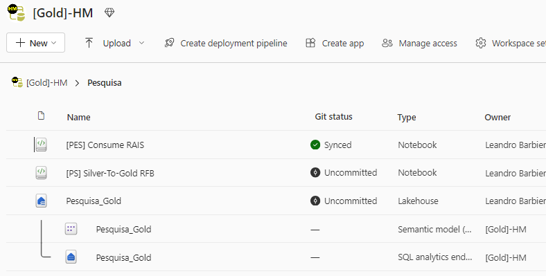

Agora a linguagem de consulta SQL passa a fazer ter uma função presente pois é mais declarativa e mais familiar aos analistas de dados que são os principais usuários dos dados nessa camada

Uma das características das plataformas modernas que trabalham com engine spark é a capacidade de ter no mesmo notebook várias linguagens diferentes. Essa independência de liguagem atribui grande flexibilidade. Veja no exemplo. Os dados são obtidos usando pyspark e modelados usando SparkSQL

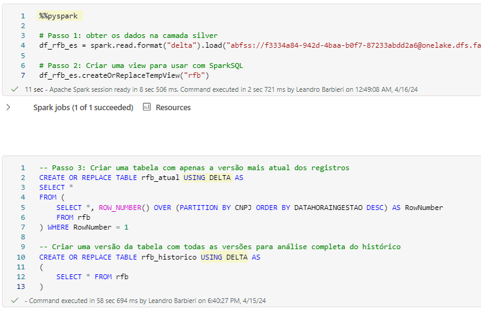

Dados persistidos no lakehouse da camada gold. De acordo com o caso de uso as dados podem ser produzidos a partir da bronze de várias formas diferentes. É importante lembra que mesmo que não haja mudanças entre a tabela da silver para a gold, a silver nunca pode ser acessada diretamente. Crie uma cópia na gold se for preciso. Isso é importante pois sempre que precisar vc pode alterar a silver sem afetar os consumidores que acessar a gold.

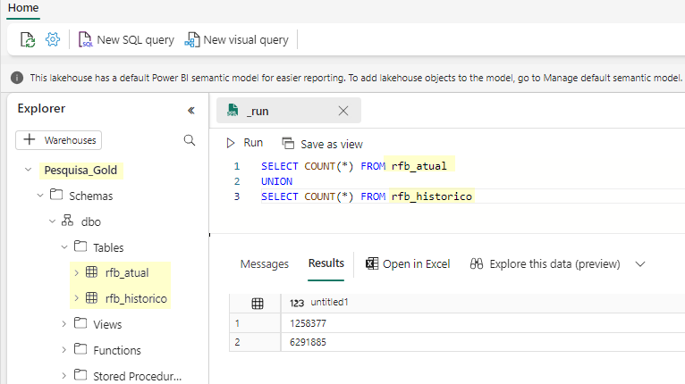

Na camada gold os dados estão prontos para vários tipos de consumo. Analisando os dados com ferramentas de visualização.

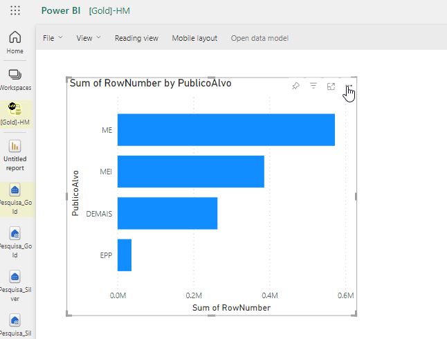

# Pipeline e orquestração
Após a criação de todas as etapas é necessário orquestrar a execução dos diversos compomentes para criar um pipeline automatizado.

Nesse exemplo a ingestão (raw > bronze), transformação (bronze > silver) e a modelagem (silver > gold) estão sendo executadas pelo Data Factory

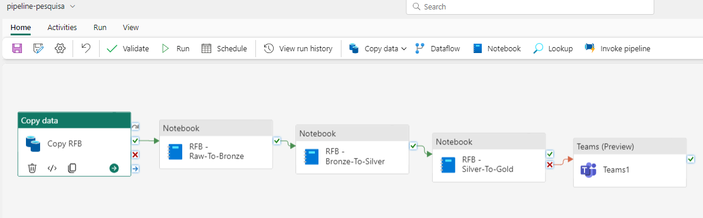

