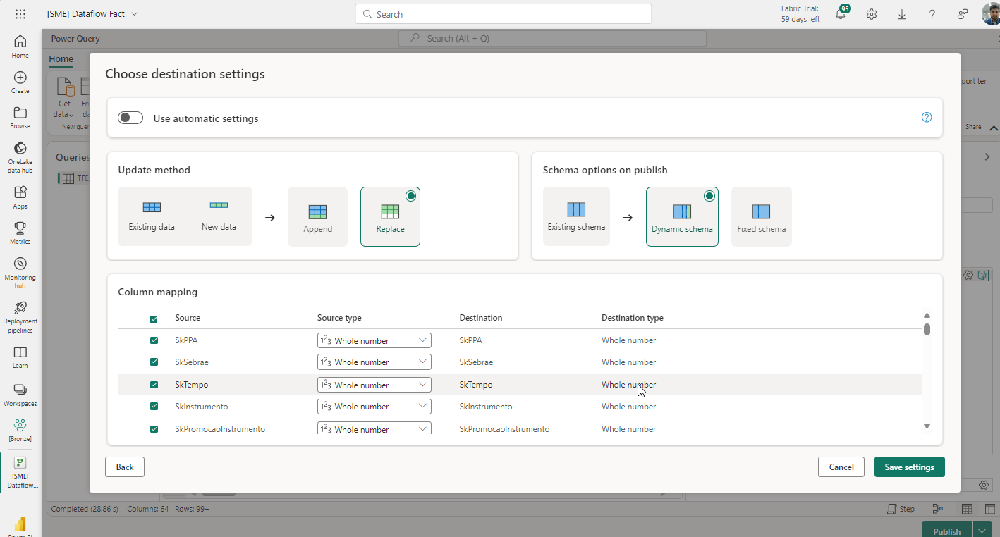
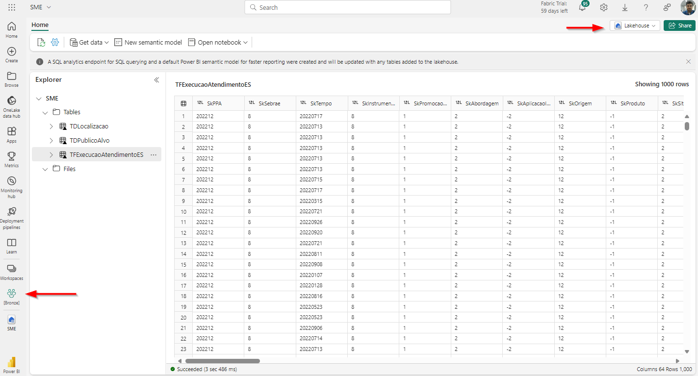

# Pipeline e orquestração
Estudos de Caso e Exemplos: Exemplos práticos que ilustrem como as boas práticas de arquitetura de dados podem ser aplicadas em cenários reais.

# Exemplo
End-to-End: Usar um dataset como exemplo transformar o dados em estado bruto em um modelo semântico.

## 1: Mapear o problema de negócio

## 2: Fazer a ingestão
A ingestão dos dados é realizada através do mapeamento da tabela da fonte de dados o Lakehouse no destino no ambiente de dados e da escolha de qual é o método. Neste momento podem escolher a estratégia e como vamos lidar com a questão da evolução do schemma para acomodar de forma dinamica as alterações



Os dados são importando como tabelas gerenciadas no formato Delta no Lakehouse da camada Bronze




## 3: Tranformar os dados 

A primeira fase do ciclo de vida que envolve transformação é a camada silver, nesse momento vamos nos concentrar em preparar os dados das tabelas da camada bronze adicionando qualidade sem alterar as características da tabela. O objetivo é deixar a tabela pronta para ser usada em multiplos casos de uso sem alterar a granularidade.

- Definir schema padrão para os campos e salvar em delta gerenciados;
- Aplicar validação de valores nulos ou inconsistentes para aumentar a qualidade
- Fazer transformações, tratamentos, dê-para com regras de negócios genéricas e válidas em vários contextos (não fazer joins ou alterar novas de campos)
- Deduplicar registros repetidos, mascarar quando tiver necessidade ou remover colunas sem utilidade para análise

Exemplo:

```
from pyspark.sql.types import *
from pyspark.sql.functions import *

schema_movies = StructType([
    StructField("movieId", IntegerType(), nullable=True),
    StructField("title", StringType(), nullable=True),
    StructField("genres", StringType(), nullable=True)
])


df = spark.read.format("delta") \
    .schema(schema_movies) \
    .load(path="abfss://bronze@storageaccountsebraees.dfs.core.windows.net/movies/*.parquet")

df_transformado = df \
    .withColumn("movieId", col("movieId").cast(IntegerType())) \
    .withColumn("genres1", trim(split(df.genres, "[|]").getItem(0))) \
    .withColumn("genres2", trim(split(df.genres, "[|]").getItem(1))) \
    .withColumnRenamed("genres", "genreslist") \
    .drop("movieId")

# gravando no lakehouse
delta_movies_path = "abfss://silver@storageaccountsebraees.dfs.core.windows.net/movies"
df_transformado.write.format("delta").mode("overwrite").save(delta_movies_path)
df_transformado.head(10)

display(df_transformado.head(3))
```

# Resumo

Pergunda | Exploração | Ingestão | Storage | Transformação | Modelagem | Entrega
---------- | -------- | ------- | ------------- | --------- | ------- | --------
O que acontece em cada fase? | - | - | - | - | - | -
Qual tipo de tec. usar? | - | - | - | - | - | -
Qual perfil de profissional? | - | - | - | - | - | -
Entradas | - | - | - | - | - | -
Saídas | - | - | - | - | - | -

Fazer Passo a passo usando esse exemplo so que com tipos de tecnologias

https://aws.amazon.com/pt/solutions/guidance/customer-data-platform-on-aws/