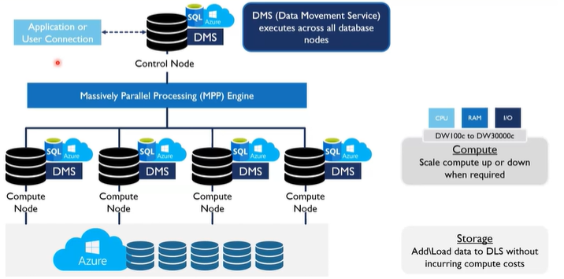

# Tipos de arquitetura e padrões

## Data warehouses modernos (MDW)
Os DW em nuvem representam uma evolução significativa das alternativas on-premise pois trazem uma arquitetura distribuida que permite adaptar a infraestrutura de acordo com a demanda, provionando ou desabilitando nós dos clusters. Atualmete suportam processamento em escala de petabytes, armazenam dados semi-estruturados e se integram com tecnologias de processamento como Spark. 

Em DW tradicionais essa infra de dados teria que ser previamente dimensionada para atender a demanda atual e futura. Exemplos de soluções que se destacam atualmente estão Azure Synapse dedicated poll, BigQuery, Snowflake, Amazon Redshift. Além dessa flexibilidade os MDW trazem na prática a ideia de separação da camada de processamento da estrurura de armazenamento, que em geral está sustentada por object storages

### Arquiteturas MPP

Descrever como essa arquitetura entrega processamento distribuído

Possio um nó principal e compute notes
Divide entre os compute note
Temos que fazer a forma de distribuição correta para aproveitar os benefícios do paralelismo

Tipos de distribuição entre os nós

Round-robin: distribuição aleatória entre as partições, definida por tabela. Para carga costuma ser mais o método mais rápido. Método de distribuição recomendado para carga de tabelas stage

Hash-distributed: passa uma coluna que será usada para realizar a distribuição de forma determinística atribuindo cada linha a uma distribuição. Recomendado para querys em tabelas fato. Alta performance na leitura
É importante escolher uma coluna de forma certa para a distribuição não ficar desbalanceada. As colunas usadas precisam conseguir identificar de forma bem granular (identificação única)

Replicated: uma cópia completa em cada nó. Funciona bem para dimensões pois são pequenas. 

Partições dentro das distribuições

São divisões dentro da própria distribuição. Só faz sentido começar a particionar quando tipos mais de 100 milhões de registros em uma tabela.
Criada em geral em colunas de data
Performance nas querys pois facilita a busca e filtragem dos dados

Recomendações

## Data Lakes
Uma das arquiteturas mais populares nos ultimos anos da area de engenharia de dados, ganhou destaque por trazer a liberdade de trabalhar com dados semi-estruturado e permitir armazenamento em escala a qualquer tipo de objeto de dados ao mesmo tempo ser de fácil integração com engines de processamento diversas. Porém, apesar do hipe, essa tecnologia apresentou vários desafios de governança, controle de transações, catálogos de metadados para descoberta. Mas o maior problema foi que essa arquitetura foi concebida para ser somente leitura e enfrenta dificuldade de atender requisitos de leis como LGPD que obriga a empresa a deletar dados de um usário específico.

## Data Lakehouses (papper)
Os problemas experimentados pelos data lakes foram abordados pela empresa Databricks que criou o conceito e a solução Lakehouse. O Lakehouse aplica uma camada de abstração (Delta Lake) que traz aos dados armazenados em object storages muitas das funcionalidades presentes em bancos relacionais utilizados como DW como transações atômicas, consistencia, isolamento e durabilidade (ACID). É a convergencia entre Data Warehouses e Data Lakes. 

De fato é a arquitetira que se tornou predominante nas stacks de plataformas de dados modernas e os data warehouse modernos e os Lakehouse terão diferenças cada vez menores e convergentes nas plataformas Databricks, Azure, Google, Snowflake

A perpectiva de avançar na realização de análises preditivas através da modelagem estatística faz com que os Lakehouses ganhem ainda mais importância pois trazem a possibilidade de trabalhar com dados não-estruturados em conjunto com dados tabulares. Além disso os formatos de armazenamento abertos facilitam muito a integração com os principais frameworks de machine learning

## Comparativo

Característica | Data Warehouse | Data Lake | Lakehouse 
---- | ---- | ----- | ---- |
Tipo de dado | Estruturado apenas | Todos | Todos |
Formato | proprietário | csv, parquet, delta | parquet, delta, hudi, iceberg |
Usuários | analistas de dados | cientistas de dados | analistas e cientistas de dados |
Caso de uso | Análise descritiva | Análise e modelagem estatística | Análise e modelagem estatística |
Consumo | ---- | ----- | ---- |

## Quando usar MDW ou LH?
É dificil escolher, a infraestrutura de dados que armazena os dados de ambos estão padronizadas na mesma tecnologia, geralmente parquet (delta, hudi, iceberg)

Então a escolha tem que ser baseada em outros critérios, pois os usuários da plaforma podem anternar entre o uso de um MDW e um LH, ou armazenar dados que vem de um no outro.

Cenário | Escolha
------- | --------
Funcionalidades |Para direcionar a escolha, se você vai trabalhar com os dados usando um linguagem de programação como Python/R em notebooks em projetos de ciência de dados escolha Lakehouse, mas se precisa de funcionalidades de um banco relacional, como views, procedures e os dados possuem um schema mais estável escolha Data Warehouse.
Tipos de dados | Se você vai usar apenas dados estruturados escolha Data Warehouse, mas se no projeto de dados serão analisados dados em csv, json, parquet ou dados como texto ou imagem, vá com Lakehouse

O importante é a arquitetura permitir migrar de um para o outro de uma forma tranquila para atender os cenários dos projetos de dados

## Plataforma de Dados Moderna
Essa nova geração de soluções de dados que trazem uma plataforma integrada com soluções de orquestração de pipelines, processamento distribuido, object storage, Lakehouse, virtualização, ambiente de desenvolvimento para ciência de dados e BI, sendo oferecida como PaaS nas principais clouds implusiona e traz agilidade para empresas de todos os tamanhos conseguirem extrair valor dos seus dados. Essas plataformas se caracterizam por serem altamente modularizadas, o que permite criar arquiteturas mais simples ou mais complexas dependendo da realidade da empresa. 

Se pesarmos em níveis complexidade poderiamos ter por exemplo:

Nível | Componentes
----- | -----------
Nível 1: Basico | Fontes de dados -> Ferramenta de ETL -> Datawarouse/Lakehouse -> Ferramentas de BI
Nível 2: Médio | Fontes de dados -> Orquestradores -> Ferramentas de ETL -> Datawarehouse/Lakehouse -> Ferramentas de BI
Nível 3: Avançado | Fontes de dados -> Orquestradores -> Bancos de dados de streaming -> Ferramentas de ETL/streaming -> Bancos Datawarehouse/Lakehouse -> Ferramentas de BI > Plataforma de ML e deploy de modelos > Versionamento e CI/CD.

REDSHIFT
BIGQUERY
SYNAPSE

snowflake roda em  todos bom pra evoluirmos multcloud

## Data Mesh
Este novo padrão de arquitetura surgiu como resposta as arquiteturas centralizadasd e data lakes e data warehouses, invertendo o lógica e descentralizando o armazenamento e responsabilidade através do conceito de domínios de dados orientados a maneira que os dados são consumidos.

Os conceitos principais da arquitetura data mesh são:

- Domínios descentralizados

- Dados como produto

- Infraestrutura como plataforma self-service

- Governança federada

#### dominios
Domínio é uma representação de um assunto no mundo real ele representa um conjunto de serviços relacionados que podem ou não fazerem parte de outro domínio mas em outro contexto.  

Exemplo domínio atendimento 
Atendimento - produção/registro  
Domínio processo 
Atendimento - operação/execução 
Venda 

Domínio financeiro 
Venda  

Melhor forma de identificação dos domínios e funções é conversa com especialista no negócio  

# Outros Exmplos de Padrões de Arquitetura

Existe outras variações de padrões de arquitetura como "Data Fabric", "Data Vault"