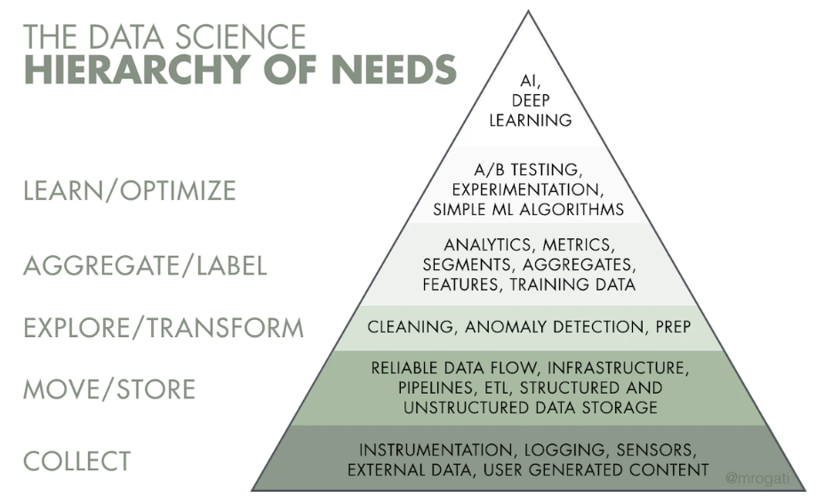

# necessidades
https://hackernoon.com/the-ai-hierarchy-of-needs-18f111fcc007

# dominios
Domínio é uma representação de um assunto no mundo real ele representa um conjunto de serviços relacionados que podem ou não fazerem parte de outro domínio mas em outro contexto.  

Exemplo domínio atendimento 
Atendimento - produção/registro  
Domínio processo 
Atendimento - operação/execução 
Venda 

Domínio financeiro 
Venda  

Melhor forma de identificação dos domínios e funções é conversa com especialista no negócio  

# sistemas distribuido
A escalabilidade e elasticidade de uma arquitetura são princípios desejáveis e podem ser obtidas de forma vertical aumentado recursos como cpu, memória e disco ou de forma distribuída/horizontal da inclusão de novos nós que atuam de forma orquestrada. O problema da escalabilidade vertical são os limites rígidos impostos pó próprio hardware e a continuidade em caso de falhas. Já arquitetura distribuída são virtualmente infinitamente escalaveis ao mesmo tempo mais confiáveis por um ou vários nós podem ser perdidos se afetar o processo. Basicamente um nós central distribui a tarefa para os worknodes eles executam e retornam ao no central ia resultados. Atualmente as soluções de data warehouse modernas MPP, object storages, spark funcionam dessa forma  

# tamanho do time e maturidade da empresa

# onpremise, cloud, hibrido

# decisões de comprar ou desenvolver