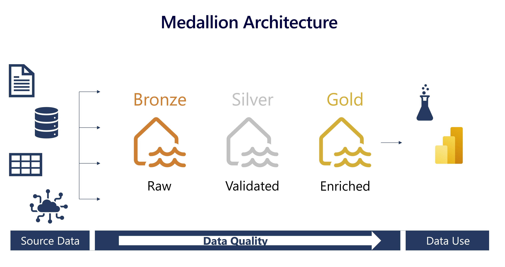
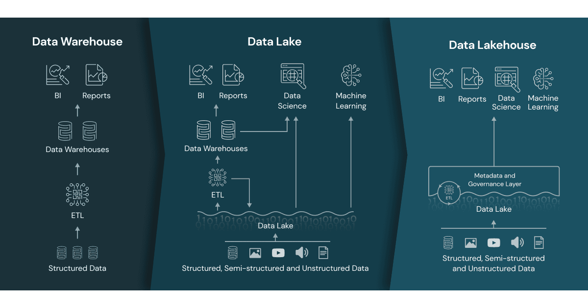

# Tipos de arquitetura e padrões

## Medallion
O padrão medallion vem se tornando uma especie método para organização, limpeza e padronização de dados em lakehouses. Recomendado para organizar os dados, adicionando qualidade a medida que é movido entre as camadas.

As camadas buscam adicioanar consistencia, através de checagens, qualidade através de validações, enriquecimento através de regras de negócio, além de performance e segurança no acesso.

### Bronze
Essa é a camada da dados brutos, é o ponte de entrada dos dados que vêm das fontes originais. Todo tipo de dado deve ser possível armazenar aqui, estruturado, semi-estruturado, não estruturado. Não são feitas transformações e o formato original é mantido. Essa camada tem o objetivo de receber os dados ingeridos os mais rápido possível para liberar a fonte de dados original do fluxo de dados de consumo.

### Silver
Essa é uma camada de validação. As primeiras checagens de qualidade são feitas. Os dados são refinados, transformações como deduplicação, limpeza de valores nulos, ofuscação entre outras. Nesta camada a preocupação principal deve estar em deixar o dado consistente e completo. Regras de negócio que modificam as representação dos dados não devem ser incluídas aqui. Essa camada pode ser muito consumida por cientistas de dados e busca de validação de hipóteses, pois os dados ainda não foram alterados para atender casos de usos específos.

### Gold
Aqui os dados estão sendo preparados para consumo. Agora os dados são modificados para atender casos de uso específicos. Entre ações que ocorrem nesta camada estão, agregações, dê-paras com dados externos, expressões com cálculos, joins, unions, e vários outras operações que modificam e preparam para responder questões de negócio. Pode haver mais de uma camada gold por exemplo, otimizada para ciêntistas de dados, ou a camada gold pode estar fora do datalake e ser entregue através de um data warehouse.

### Canadas adicionais
Não há problema em ter camadas adicionais, isso sempre vai depender do projeto, pode haver situaçõe que uma camada adicional raw ou landing precisa ser criada para receber os dados para depois ingerir na bronze. Pode haver necessidade de uma camada para dados sensíveis ou para um caso de uso muito específico. O importante é manter a filosofia do padrão, e separar as reponsabilidades e e adicionar qualidade aos dados.

Separar em diferentes camadas otimiza o processamento de dados e permite atender diferentes casos de uso, onde cada camada esteja alinhada com as necessidades de um perfild de usuário

As camadas também servem como contexto de segurança

### Checklist
Antes de mover os dados veja:
- Qual é o volume de dados que será movido?
- Qual é a complexidade das transformações?
- Qual é a frenquência?

Fazer essas perguntas te ajudará a selecionar as melhores alternativas de ferramentas e abodagens. Por exemplo, para mover sem transformação podemos usar um orquestrador, para mover e aplicar regras de negócio e checagens podemos usar um engine de processamento.

https://learn.microsoft.com/en-us/training/modules/describe-medallion-architecture/3-implement-medallion-archecture-fabric

https://aws.amazon.com/pt/blogs/architecture/overview-and-architecture-building-customer-data-platform-on-aws/

# dw
- uma opção melhor para projetos com dados estruturados e desenvolvedores com skill de SQL
- os dados não devem ester em formato proprietario. O DW deve armazenar os dados em formato aberto ao mesmo tempo garantir a ACID

# dl

# lakehouse

Os dados estão armazenados no datalake mas organizados em camadas e com propriedades ACID.

Tendências de migração: o melhor data warehouse é o Lakehouse 

Uma conclusão interessante é que cerca de metade das empresas que se mudam para o Lakehouse vêm de data warehouses. Isso inclui os 22% que estão migrando de data warehouses em nuvem. Também demonstra um foco crescente na execução de cargas de trabalho de data warehousing em um Lakehouse e a unificação de plataformas de dados para reduzir custos. 

Nos últimos 2 anos, as empresas aumentaram muito o uso de data warehousing na Plataforma Lakehouse. Isso é demonstrado principalmente pelo uso do Databricks SQL — o data warehouse serverless no Lakehouse — que mostra um crescimento de 144% em relação ao ano anterior. Isso sugere que as organizações estão abandonando cada vez mais os data warehouses tradicionais e são capazes de realizar todo o seu BI e análises em um Lakehouse. 
 

Embora o produto de IA e dados mais popular seja o Microsoft Power BI, estamos entusiasmados com o fato de que as empresas estão progredindo para casos de uso de ML e IA mais avançados, e a pilha moderna de dados e IA está evoluindo para acompanhar. Junto com o rápido crescimento das ferramentas de integração de dados incluindo nosso DBT de crescimento mais rápido 

https://www.databricks.com/blog/2020/01/30/what-is-a-data-lakehouse.html
https://acrobat.adobe.com/link/review?uri=urn:aaid:scds:US:cf3f19a7-7854-3697-ab92-14750190f021 

he Databricks Lakehouse Platform has the architectural features of a lakehouse. Microsoft's Azure Synapse Analytics service, which integrates with Azure Databricks, enables a similar lakehouse pattern. Other managed services such as BigQuery

# Comparativo

Característica | Data Warehouse | Data Lake | Lakehouse 
---- | ---- | ----- | ---- |
Tipo de dado | ---- | ----- | ---- |
Formato | ---- | ----- | ---- |
Usuários | ---- | ----- | ---- |
Caso de uso | ---- | ----- | ---- |
Consumo | ---- | ----- | ---- |

## Quando usar MDW ou LH?
É dificil escolher, a infraestrutura de dados que armazena os dados de ambos estão padronizadas na mesma tecnologia, geralmente parquet (delta, hudi, iceberg)

Então a escolha tem que ser baseada em outros critérios, pois os usuários da plaforma podem anternar entre o uso de um MDW e um LH, ou armazenar dados que vem de um no outro.

Cenário | Escolha
------- | --------
Funcionalidades |Para direcionar a escolha, se você vai trabalhar com os dados usando um linguagem de programação como Python/R em notebooks em projetos de ciência de dados, mas se precisa de funcionalidades de um banco relacional, como views, procedures e os dados possuem um schema mais estável escolha NDW.
Tipos de dados | Se você vai usar apenas dados estruturados escolha MDW, mas se no projeto de dados serão analisados dados em csv, json, parquet ou dados como texto ou imagem, vá com Lakehouse

O importante é a arquitetura permitir migrar de um para o outro de uma forma tranquila para atender os cenários dos projetos de dados

# data mesh
- Contexto do sebrae

