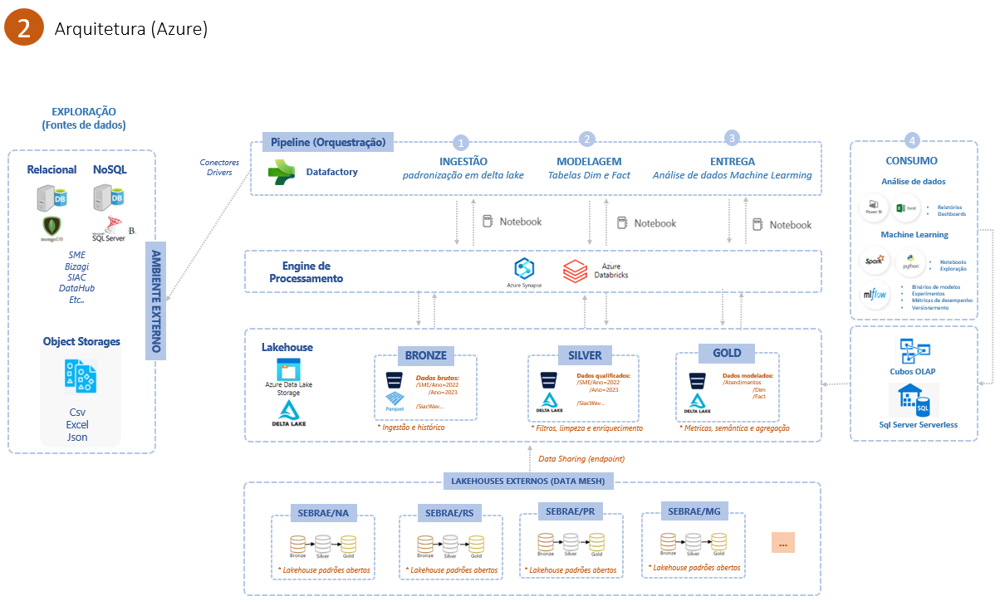
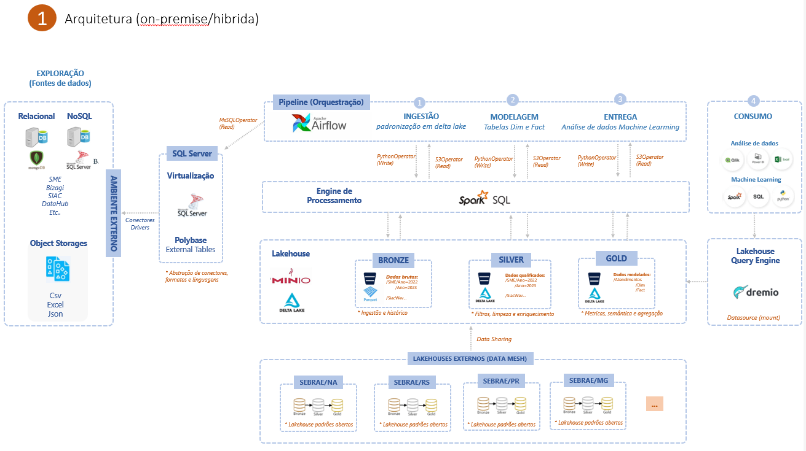

# Tecnologias maduras
Muitas das soluções gerenciadas pelas nuvens públicas são projetos open-source acelerados pela comunidade ou abertas pela própria fabricante para serem aprimorados (airflow, delta, mlflow, spark, kafka, minio, dremio, dbt). Normalemnte há uma solução correspondente ao serviço pago, que seja open em cada um dos componentes, esse modelo de código aberto, alidado ao serviço gerenciado pago se tornou o padrão, cabe avaliar a capacidade de gerenciar o modelo onpremise ou hibrido, versus contratar o serviço gerenciado pela nuvem pública. Portanto é possível criar uma plataforma de dados moderna totalmente open-source. É como uma decisão ser você vai com o seu carro ou chamar vai o motorista por aplicativo, ambos vão te levar ao destino, mas um você terá que manter o outro, você terá apenas que pagar, algumas vezes mais caro.

# Arquitetura de Referência

A implementação de uma arquitetura de dados deve ser feita de forma gradual de acordo com o cenário atual da empresa. A tabela abaixo serve  de referência para as possíveis fazes de implantação dos principais componentes.

Fases | Cenário atual | Tecnologias implantadas
----- | --------- | -----------
Fase 0| Acessa os dados do banco de produção; Aplica as regras de negócio direto no relatório, Compartilha o arquivo do relatório com os dados importados | Banco relacional, csv, planilhas, ferramenta de BI
Fase 1 | Faz ingestão de dados para análise em repositório separado de apoio, aplica regras de negócio usando procedures em sql, não faz modelagem dos dados, cria views sob demanda para cada novo relatório | SQL, banco relacional, ferramenta de ETL low-code
Fase 2 | Faz modelagem multidimensional dos dados em banco relacional, utiliza os dados para vários casos de uso sem gerar duplicação de transformações | Data warehouse, ferramentas de ETL, ferramentas de BI, compartilha relatórios em arquivos
Fase 3 | Faz ingestão de dados automatizada, monitora falhas, modelagem multidimensional, modelagem semântica (cubos), compartilha relatórios em portal, controla acessos | Ferramenta de orquestração e monitoramento, Data warehouse, Ferramenta de ETL, Cubos OLAP, Portal Web
Fase 4 | Trabalha com dados semi-estruturados, armazena em object storage e banco relacional, abstrai as fontes com virtualização, utiliza processamento distribuido, particionamento, faz projetos com volumes grandes de dados (TB), usa frameworks de ML e cria modelos que processam em batch em notebooks locais, usa | Orquestração, ELT, DW, OLAP, Portal Web, Jupyter, SparkSQL, ObjectStorage
Fase 5 | Além da fase 4, gerencia entidades mestre, possui pipelines com fases de verificação de qualidade dos dados, usa catálogo para descoberta e democratização, extrai valor de dados não estruturados como imagens, publica modelos adiciona aos pipelines inferências preditivas | todas

# Diagramas de Arquitetura

## Azure

## Google

## Híbrido

